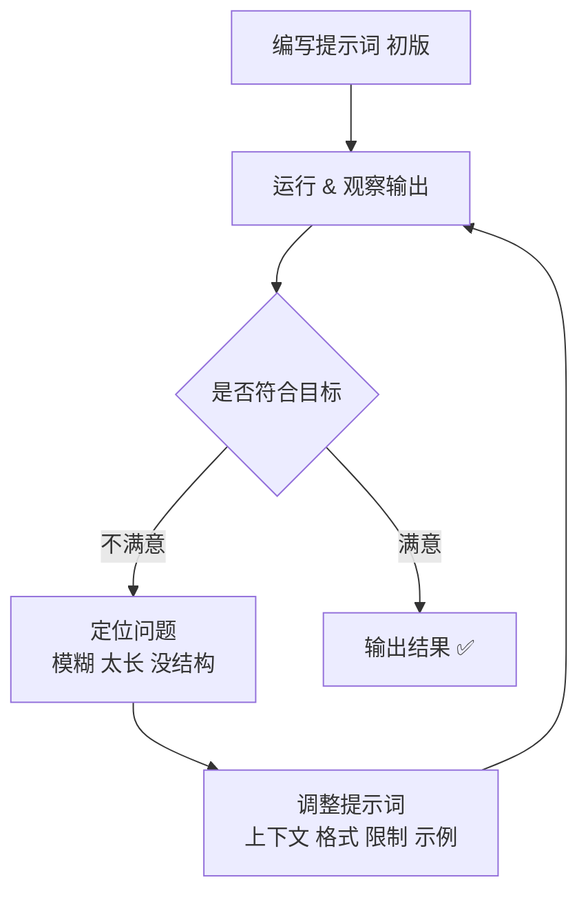

复杂任务里，一次就写出完美提示词几乎不可能。所以真正的做法是把提示词当成需要 **多轮打磨** 的东西，通过 ==反馈== 不断修改。反馈主要有两种手段：人工迭代和智能迭代两类

## 人工迭代

人工迭代的核心是一个闭环：从 **人观察输出 → 找出不足 → 改提示词 → 再生成 → 循环**，特别适合对风格、重点、结构有明确要求的任务。以产品介绍为例：

:::table full-width

| 版本 | 提示词 | 输出问题 |
| --- | --- | --- |
| V1 | 请写一段学习机产品介绍 | 又长又正式，不符合 "轻松有趣" 的目标 |
| V2 | 用轻松有趣的语气，给大学生写一段产品介绍，不超过 100 字 | 补上了 **受众 + 语气 + 长度**，一次到位 |

:::

> [!IMPORTANT] 改动的方向以对着这张 checklist 逐项核对
>
> - 是否明确了任务目标（做什么）
> - 是否指定了输出形式（列表 / 段落 / 表格）
> - 是否说明了输出对象（面向谁）
> - 是否控制了输出范围（字数 / 限制条件）
> - 是否给了示例或格式引导（few-shot）
> - 是否补充了上下文或背景信息
> - 是否消除了歧义（如 "总结" 要说清从什么角度提取）
> - 是否鼓励模型思考（如 "分步骤"）

:::details 整个过程就是一个反馈回路



:::

## 智能迭代

人工迭代靠人给反馈，智能迭代则是 **把反馈机制内置进模型**：让一个或多个模型自动提出提示词的改进方案。常见做法是让几个角色分工协作

:::table full-width

| 角色 | 职责 |
| --- | --- |
| 审查者 Reviewer | 给原始提示词打分、评价，指出不足 |
| 提问者 Asker | 基于审查意见，向用户提澄清性问题，补齐上下文 |
| 生成者 Prompt Generator | 综合原始提示词 + 审查意见 + 用户回答，产出优化版 |

:::

举个例子，用户最初只写了 "请阅读以下技术文章，并总结其中的关键点"。这条提示词跑一遍三个角色

:::steps

1. **审查者** 打分 2/5

   ```txt
   提示词过于宽泛：没定义 "关键点" 的标准，没指定输出格式，也没说受众是谁。
   ```

2. **提问者** 向用户发问

   ```txt
   什么算 "关键点"？技术原理、流程步骤，还是创新亮点？
   要清单、摘要段落，还是表格？这份总结是写给谁看的？
   ```

3. **生成者** 结合用户的回答，产出优化版

   ```txt
   你是一名资深技术内容编辑，请阅读以下技术文章，用条列方式总结：
   1) 主要技术原理；2) 解决了什么问题；3) 创新亮点。
   控制在 200 字以内，面向产品经理。文章内容：【XXXX】
   ```

:::

只有这条优化后的提示词才会真正发给模型执行；不满意就再迭代一轮

> [!TIP] 补充知识
> 这套 "自己发现问题、自己提问、自己改写" 的多角色协作，本质上是把人类的反馈循环搬进了模型对话里。它也是 Agent 系统中 **自我反思（self-reflection）** 能力的雏形 —— 让模型评估并修正自己的输出，而不是一条道走到黑
