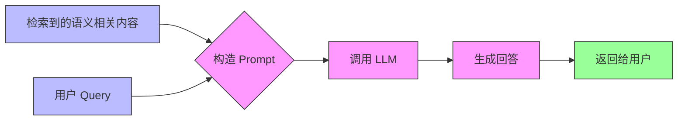
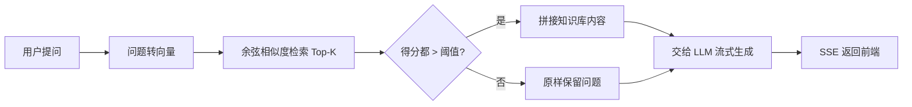

RAG 全称 Retrieval-Augmented Generation，检索增强生成。核心思想是 **为大模型补充来自外部的相关数据与上下文**，帮它生成更丰富、更准确、更可靠的内容——说白了就是 ==临时给大模型外挂一个知识库==


它解决的是大模型两个绕不开的痛点：

- 受限于已有训练语料，无法快速新增语料信息
- 重新训练大模型代价极高、周期极长

## 一个例子

假设要开发一个在线自助产品咨询工具，让客户用自然语言交互式地问答产品信息，产品是 **香蕉手机**：

```txt
请介绍一下你们这款香蕉手机与 XX 产品的不同之处
```

如果直接甩给通用大模型，结果通常是两种：

- 大模型直接摆手：我不知道什么是香蕉手机
- 大模型一本正经地胡编乱造（[大模型幻觉](/AI/llm/992b34f2/)）

因为 "香蕉手机" 这种私有、垂直的信息根本不在它的训练语料里

:::details RAG 之前的解决方案：把资料塞进提示词

最朴素的思路是把公司资料整段拼进提示词，连同问题一起发给模型：


问题在于：如果外挂知识库内容非常多（例如一本几十万字的手册），全塞进提示词既超出上下文窗口，模型也没法从一大堆无关内容里精确定位到答案，效果反而更差

:::

RAG 的破局点就在这：不再把整个知识库一股脑塞给模型，而是 **先按语义检索出最相关的几段，再只把这几段喂给模型**

## 经典架构

一个简单的 RAG 应用整体分为两个阶段：

- **数据索引（Data Indexing）**：离线准备，把知识库处理成可检索的向量
- **数据查询（Query）**：在线响应，又拆成 **检索（Retrieval）** 和 **生成（Generation）** 两步

### 数据索引

数据索引通常分四步：加载文档 → 切分成 chunks → 转成向量嵌入 → 存入向量数据库


**切分成 chunks** 是把文档分割成一个个知识块，为后续嵌入做准备。切分要同时兼顾两个维度：

:::table full-width

| 维度 | 关注点 | 常见做法 |
| --- | --- | --- |
| 语义结构 | 保证语义完整，别让模型拿到断句、不完整的上下文 | 按句子粒度切，用句号、问号、叹号等标点分割 |
| 实现策略 | 满足向量模型的最大词元限制（如 OpenAI embedding 约 8192 词元） | 固定长度字符切分 / 按词元数切分 |

:::

以语义切分为例，一段话会按标点拆成独立知识块：

```txt
原文：
ChatGPT 是由 OpenAI 开发的大语言模型。它基于 Transformer 架构，具有强大的语言理解和生成能力。

切割后：
① ChatGPT 是由 OpenAI 开发的大语言模型。
② 它基于 Transformer 架构，具有强大的语言理解和生成能力。
```

实际中两个维度常组合使用：先按语义切句，再受词元上限约束做合并或二次切分

**转为向量** 是把每个 chunk 转换成一个高维向量来表达语义，向量通常是长度 1536 或 768 的浮点数组：

```js
[0.112, -0.045, 0.203, ..., 0.087]  // 一个 chunk 的语义向量
```

**存入向量数据库**，由它提供向量检索算法与管理接口，方便后续对输入问题做语义检索。常见的向量库：

:::table full-width

| 向量库 | 特点 |
| --- | --- |
| Supabase | PostgreSQL + pgvector 扩展 |
| Weaviate | 云服务 + 本地部署均可 |
| Pinecone | 高性能、易接入 |
| Milvus | 海量数据、高性能搜索 |
| MemoryVectorStore | 纯 JS 内存向量库（测试用） |

:::

### 数据查询

查询阶段的两大核心是 **检索** 与 **生成**：


**检索阶段** 分三步：

1. 将 Query（用户问题）转化为向量
2. 在向量数据库中做相似度检索（语义检索），常见算法有 ==余弦相似度==、欧氏距离、点积
3. 为生成阶段准备检索结果（Top-K chunks）

**生成阶段** 把检索到的相关内容和用户问题拼成一个提示词，再交给 LLM：



构造出来的提示词大致长这样：

```txt
[系统提示]：
你是一个智能客服助手，请基于以下资料回答用户的问题。

[资料内容]：
1. 本产品支持 7 天无理由退货。
2. 如存在质量问题，可申请退换货。
3. ...

[用户问题]：
我买的这个产品坏了还能退吗？

[你的回答]：
```

把两个阶段串起来，就是完整的 RAG 流程：


上面的经典架构是纯理论，下面用 Node.js 把它一步步落地。

## 实践

用 Node.js 做一个能回答「香蕉手机」私有资料的问答后端，整体仍是经典架构那两个阶段：

- **数据索引**：把 PDF 语料切分、嵌入、缓存成向量（离线只做一次）
- **数据查询**：用户提问时做相似度检索，按阈值决定是否外挂知识库，再交给大模型生成

用到两个模型：在线的 **DeepSeek** 负责对话生成，本地的 **nomic-embed-text**（通过 Ollama 跑在 `11434` 端口）负责把文本转成向量嵌入

### 文本转向量与索引

**文本转向量** 是索引的核心动作，封装成 `getEmbedding`，调用本地 `nomic-embed-text` 把一段文本转成向量：

```js
// utils/LLM.js
async function getEmbedding(text) {
  const res = await fetch("http://localhost:11434/api/embeddings", {
    method: "POST",
    headers: { "Content-Type": "application/json" },
    body: JSON.stringify({
      model: "nomic-embed-text",
      prompt: text,
    }),
  });
  const result = await res.json();
  return result.embedding;
}
```

语料库是一个 PDF 文件（`香蕉手机参数配置.pdf`），读取它需要额外依赖 `pdf-parse`。索引的四步——加载、切分、嵌入、存储——全在 `generateEmbeddings` 里：

```js
// utils/rag.js
const fs = require("fs");
const pdfParse = require("pdf-parse");
const { getEmbedding } = require("./LLM.js");

// 生产环境会写入向量数据库，这里简化为一个本地 JSON 文件
const EMBEDDING_PATH = "./embeddings.json";

async function generateEmbeddings() {
  // 1. 加载外挂知识库
  const buffer = fs.readFileSync("./香蕉手机参数配置.pdf");
  const data = await pdfParse(buffer);

  // 2. 切分成 chunks：按空行分段，过滤掉过短的碎片
  const paragraphs = data.text
    .split(/\n\s*\n/)
    .map((text, idx) => ({
      id: `chunk-${idx}`,
      content: text.trim(),
    }))
    .filter((p) => p.content.length > 20);

  // 3. 逐块转成向量
  const withEmbedding = [];
  for (const p of paragraphs) {
    const embedding = await getEmbedding(p.content);
    withEmbedding.push({ ...p, embedding });
  }

  // 4. 存入「向量数据库」（这里就是写进 embeddings.json）
  fs.writeFileSync(EMBEDDING_PATH, JSON.stringify(withEmbedding, null, 2), "utf8");
  console.log(`生成了 ${withEmbedding.length} 条段落嵌入，已缓存到 ${EMBEDDING_PATH}`);
  return withEmbedding;
}
```

嵌入是耗时操作，没必要每次启动都重算。用 `loadCachedEmbeddings` 做一层缓存——有缓存直接读，没有才生成：

```js
// utils/rag.js
async function loadCachedEmbeddings() {
  if (fs.existsSync(EMBEDDING_PATH)) {
    // 已经生成过，直接读缓存
    const raw = fs.readFileSync(EMBEDDING_PATH, "utf8");
    return JSON.parse(raw);
  } else {
    // 还没生成过，现算一遍
    return await generateEmbeddings();
  }
}
```

> [!NOTE] 为什么用 JSON 文件代替向量数据库
> 案例里把向量直接 `JSON.stringify` 存进 `embeddings.json`，是为了聚焦 RAG 主流程。企业开发中这一步会换成专门的 [向量数据库](#数据索引)（Pinecone、Milvus 等），由它提供高性能的向量检索算法和管理接口

### 相似度检索

检索的核心是比较两个向量有多接近，这里用 ==余弦相似度==——两个向量夹角越小，值越接近 1，语义越相关：

```js
// utils/rag.js
function cosineSimilarity(vecA, vecB) {
  const dot = vecA.reduce((sum, val, i) => sum + val * vecB[i], 0);
  const normA = Math.sqrt(vecA.reduce((sum, val) => sum + val * val, 0));
  const normB = Math.sqrt(vecB.reduce((sum, val) => sum + val * val, 0));
  return dot / (normA * normB);
}
```

`searchByEmbedding` 把用户问题也转成向量，跟每个 chunk 逐一算相似度，排序后取前 K 条：

```js
// utils/rag.js
async function searchByEmbedding(query, embeddedDocs, topK = 3) {
  // 1. 用户问题转向量
  const queryEmbedding = await getEmbedding(query);

  // 2. 和每个 chunk 算相似度得分
  const scored = embeddedDocs.map((chunk) => {
    const score = cosineSimilarity(queryEmbedding, chunk.embedding);
    return { ...chunk, score };
  });

  // 3. 按得分降序，取前 K 条
  return scored.sort((a, b) => b.score - a.score).slice(0, topK);
}

module.exports = { loadCachedEmbeddings, searchByEmbedding };
```

### 阈值判断

关键一点：**不是每次都要外挂知识库**。如果用户只是闲聊，硬塞产品资料反而干扰回答。所以用一个相似度阈值来判断问题跟知识库到底相不相关：

```js
// routes/index.js
const RELEVANCE_THRESHOLD = 0.54;

router.post("/ask", async (req, res) => {
  // 准备好向量化的知识库
  const embeddedDocs = await loadCachedEmbeddings();
  const question = req.body.question || "";

  // 检索出 Top-K 相关块
  const relevantDocs = await searchByEmbedding(question, embeddedDocs);

  let userMessage = question;

  // 严格判断：要求所有检索到的块得分都超过阈值，才算相关
  const allDocsRelevant =
    relevantDocs.length > 0 &&
    relevantDocs.every((doc) => doc.score > RELEVANCE_THRESHOLD);

  if (allDocsRelevant) {
    // 相关：把知识库内容拼进问题
    const relevantContent = relevantDocs
      .filter((doc) => doc.score > RELEVANCE_THRESHOLD)
      .map((doc) => doc.content)
      .join("\n\n");

    userMessage = `参考以下资料回答问题：

${relevantContent}

问题：${question}`;
  } else {
    // 不相关：正常回答，不外挂知识库
    console.log("❌ 知识库不相关，走通用回答");
  }

  const messages = [...conversations, { role: "user", content: userMessage }];
  // ...后续把 messages 交给 callLLM 流式生成
});
```

> [!IMPORTANT] 阈值是把双刃剑
> `RELEVANCE_THRESHOLD` 定得太高，稍微换个说法就检索不到，召回率低；定得太低，无关内容也被塞进上下文，精确率低。这里 `0.54` 是针对该语料和 `nomic-embed-text` 调出来的经验值，换模型、换语料都需要重新校准——这也正是 [架构演进](/AI/llm/0e2874fe/#advanced-rag) 里 **召回率与精确率** 权衡的现实体现

### 交给大模型生成

拼好的 `userMessage` 连同历史会话一起发给 `callLLM`，走 SSE 流式返回。这一步复用了对话链路已有的 [Function Calling](/AI/llm/98b8d529/) 和流式逻辑，RAG 只是在 `messages` 进入模型之前，动态改写了 `user` 那条消息的内容

至此，一条完整的 RAG 链路就跑通了：


