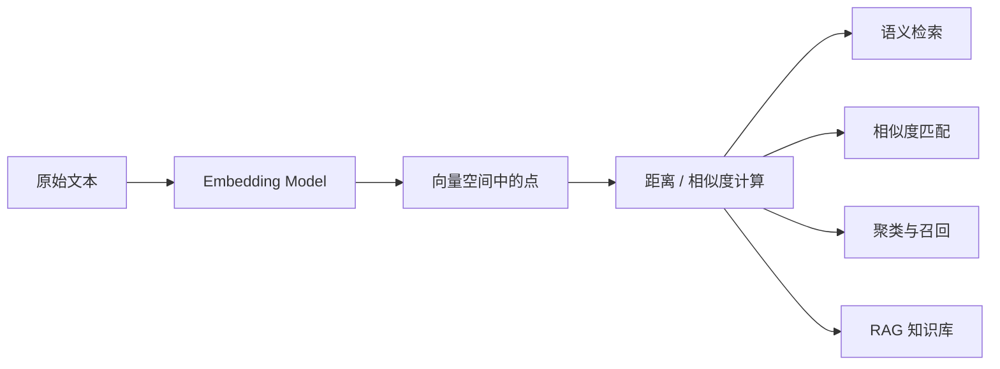
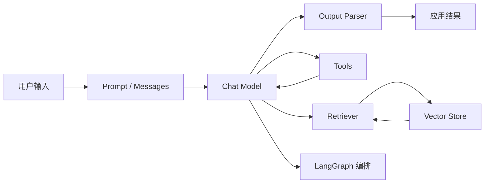

很多人一开始接触 LangChain，会把它和“大模型能力”混在一起。

但这两者其实不是一回事：

1. 大模型负责生成、理解、推理。
2. LangChain 负责把模型、提示词、工具、知识库和执行流程组织起来。
3. 真正落地时，问题通常不在“能不能调模型”，而在“怎么把调用过程变成稳定的软件能力”。

## 先把几个核心概念拆开

### 模型

模型是能力提供者，比如 `gpt-4o-mini`、`deepseek-chat`、本地 Ollama 模型。

如果你的需求只是“发一段 prompt，拿一段回复”，直接调用官方 SDK 就够了，甚至不一定需要 LangChain。

### 聊天模型

聊天模型本质上还是文本生成模型，只不过它输入的不是一个大字符串，而是一组带角色的消息：

- `system`：约束模型行为。
- `human`：用户输入。
- `ai`：模型历史回复。
- `tool`：工具执行结果。

LangChain 对这套消息协议做了统一抽象，所以不同模型供应商切换时，业务代码不需要全部重写。

### 嵌入模型

嵌入模型不负责“回答问题”，而是把文本转换成向量。

它更适合做这些事：

- 语义检索
- 相似度匹配
- 聚类与召回
- RAG 知识库构建

但如果只停在“把文本转成向量”这句话，嵌入模型还是会显得很抽象。

真正要理解它，至少要先搞清楚三件事：

1. 向量到底是什么。
2. 文本为什么能被表示成向量。
3. 向量之间怎么比较“像不像”。

#### 什么是向量表示

你可以把嵌入向量理解成一串高维数字：

```text
"我想买一台轻薄笔记本" -> [0.12, -0.37, 0.81, ..., 0.05]
"推荐一款便携电脑"     -> [0.09, -0.35, 0.79, ..., 0.08]
```

这两个句子字面上不一样，但语义接近，所以它们在向量空间里的位置通常也比较接近。

嵌入模型训练出来的目标之一，就是让“语义接近的文本，在空间中距离更近”。

#### 为什么向量能表示语义

因为模型不是在记关键词，而是在学习文本在大量上下文中的共现关系、上下位关系和使用模式。

所以嵌入模型学到的不是：

- “苹果” 这两个字长什么样

而更像是：

- 它和手机、品牌、设备、发布会这些词是否常一起出现
- 它和水果、食物、口味这些词是否也存在另一组上下文关系

最后，文本会被投影到一个高维空间里。空间里彼此靠近的点，通常语义也更接近。

#### 向量比较的核心：距离和相似度

向量有了，下一步就要解决一个问题：

怎么判断两个向量是不是“足够像”？

最常见的两种方式就是：

- 欧氏距离
- 余弦相似度

##### 欧氏距离

欧氏距离衡量的是两个点在空间中的“直线距离”：

```text
d(a, b) = sqrt((a1-b1)^2 + (a2-b2)^2 + ... + (an-bn)^2)
```

它的直觉很简单：

- 距离越小，两个向量越接近。
- 距离越大，两个向量越远。

如果把文本嵌入想成地图上的坐标点，欧氏距离就是在问：

这两个点离得有多远。

##### 余弦相似度

余弦相似度更关心“方向是否一致”，而不是绝对长度：

```text
cos(a, b) = (a · b) / (|a| * |b|)
```

它的直觉是：

- 越接近 `1`，方向越一致，语义越相近。
- 越接近 `0`，说明相关性弱。
- 如果是负数，说明方向相反。

在文本检索里，余弦相似度非常常见，因为我们往往更关心“语义方向是否一致”，而不希望向量长度本身带来太大干扰。

##### 两者怎么选

可以先记一个很实用的判断：

1. 如果你的向量做过归一化，欧氏距离和余弦相似度的排序结果通常会比较接近。
2. 如果你更关心方向相似性，通常优先看余弦相似度。
3. 如果你的向量库底层指定了 `cosine`、`l2`、`dot product` 等度量方式，实际检索时要和索引配置保持一致。

#### 为什么这些能力都能由“向量 + 距离”完成

很多看起来不同的 AI 功能，底层其实都是同一套套路：



差别不在“要不要向量”，而在“你拿向量去做什么”。

#### 语义检索是怎么做的

语义检索的流程通常是：

1. 把文档切成多个片段。
2. 每个片段生成一个向量。
3. 用户提问时，把问题也生成一个向量。
4. 用余弦相似度或欧氏距离，计算问题向量和文档向量的接近程度。
5. 取最接近的 Top K 文档返回。

也就是说，语义检索不是在比关键词，而是在比“问题和文档在语义空间里是否靠近”。

#### 相似度匹配是怎么做的

相似度匹配本质更简单，就是把两个对象都编码成向量后直接比较。

比如这些场景都能这样做：

- 两段文本是否表达同一个意思
- 用户问题和 FAQ 中哪一条最接近
- 一份简历和岗位描述是否匹配

它底层通常就是一句话：

把两边都嵌入，再算相似度。

#### 聚类与召回是怎么做的

聚类和召回看起来比检索复杂，但底层仍然依赖“谁和谁更近”。

聚类：

- 先把大量文本都映射成向量。
- 再把空间里彼此靠近的点分到同一组。
- 最后得到主题簇、意图簇或内容簇。

召回：

- 先把候选集合全部向量化。
- 查询来了之后，找到距离最近的一批候选。
- 再把这些候选交给后续排序模型或生成模型处理。

所以“召回”本质上就是最近邻搜索。

#### RAG 知识库构建是怎么做的

RAG 只是把这套向量检索机制接到了生成模型前面。

流程可以压缩成一句话：

先根据问题在向量空间里找到最相关的知识片段，再把这些片段拼进 prompt，最后让聊天模型作答。

也就是说：

- 嵌入模型负责“找相关资料”
- 聊天模型负责“组织最终答案”

这两类模型在 RAG 里职责完全不同，不能混着理解。

### 框架

框架的价值，不是让模型更聪明，而是让工程更可维护。

LangChain 的主要作用有三件事：

1. 统一模型、提示词、解析器、工具、检索器的接口。
2. 通过链式组合把流程拆成可复用组件。
3. 让“调用一次模型”进化成“构建一条可扩展的 AI 工作流”。

## LLM 项目真正难的地方

课件里提到的大模型问题，本质上都指向工程化难题：

- 幻觉：模型会一本正经地说错话。
- 上下文窗口有限：对话越长，成本和噪声越高。
- 非确定性：同一个输入，不一定每次都给完全一样的输出。
- 外部知识缺失：模型参数不是实时数据库。
- 工具依赖：一旦接入搜索、数据库、代码执行，流程复杂度会明显上升。

所以 AI 应用通常不是“一个 prompt 解决所有问题”，而是“模型 + 检索 + 工具 + 状态管理 + 观测”的组合系统。

## LangChain 在生态里的位置



这个图可以把 LangChain 的职责看得很清楚：

- 模型不是全部。
- 工具和检索是让模型接入外部世界的桥。
- 输出解析器负责把“自然语言”收敛成“程序能处理的数据”。
- LangGraph 更适合处理多步骤、分支、循环和状态驱动的复杂 Agent 流程。

## 为什么很多项目最后都会走向框架化

不用框架时，代码通常长这样：

1. 拼字符串 prompt。
2. 调模型。
3. 手写解析结果。
4. 条件分支里再调一次模型。
5. 继续拼更多上下文。

刚开始很快，但迭代几轮后会出现几个问题：

- prompt 到处散落，不容易统一维护。
- 模型切换要改很多地方。
- 工具调用和结果回填没有统一协议。
- 多轮对话上下文容易失控。
- RAG、结构化输出、流式返回接进来后，流程会变得很乱。

LangChain 解决的就是这类“从 demo 走向系统”的阶段性问题。

## 什么时候适合用 LangChain

适合：

- 需要频繁切换模型供应商。
- 需要提示词模板化管理。
- 需要工具调用、结构化输出或 RAG。
- 需要把多个步骤串成统一执行链。

不一定适合：

- 只有一次简单文本生成。
- 业务逻辑很轻，直接 SDK 更短更清晰。
- 你当前只是验证模型效果，而不是搭系统。

## 一条实用的学习顺序

如果你是第一次系统学 LangChain，建议按下面顺序推进：

1. 先理解消息模型、提示词模板和基础调用。
2. 再学工具调用、结构化输出和流式返回。
3. 然后进入文档加载、文本分割、嵌入和向量库。
4. 最后再看 RAG 编排、状态管理和 LangGraph。

这个顺序的核心原因是：

你要先掌握“模型怎么用”，再掌握“模型如何接入外部能力”。

## 小结

LangChain 不是模型，也不是 Agent 本身。

它更像一层 AI 应用开发框架，帮助你把零散的模型调用、提示词、工具和知识库组织成一套可维护的工程结构。

真正写业务时，最重要的不是记住多少 API，而是建立这套心智模型：

1. 模型负责生成。
2. 提示词负责约束。
3. 工具负责行动。
4. 检索负责补知识。
5. 框架负责把这些能力组合起来。
