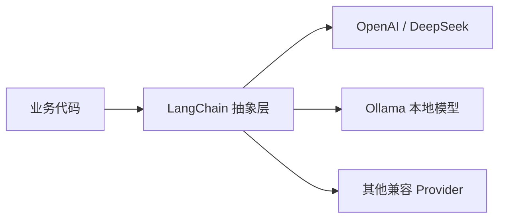

LangChain 的入门门槛其实不在语法，而在“包拆分”和“模型接入方式”。

如果你照着旧资料装一个 `langchain` 就想直接跑全部示例，通常会先踩到这几个坑：

1. 模型供应商包已经拆分，不同 provider 要单独安装。
2. 本地模型、OpenAI、兼容 OpenAI 协议的服务，初始化方式不完全一样。
3. 环境变量和 `base_url` 没处理好时，代码看起来没问题，调用却一直失败。

## 先理解现在的包结构

Python 生态里，LangChain 已经不是“一个包包打天下”的形态了。

常见依赖一般会拆成这些：

```bash
pip install -U langchain langchain-core langchain-openai langchain-ollama
```

如果你接下来还要做 RAG，通常还会再补：

```bash
pip install -U langchain-community langchain-text-splitters
```

如果你要接 Redis、Chroma、Pinecone 这类向量库，再按需安装对应 provider 包。

## 一个更实用的接入视角



这层抽象的价值在于：

- 上层业务尽量依赖统一接口。
- 下层具体模型供应商可以替换。
- 提示词模板、输出解析、工具绑定这些能力不必跟着模型代码一起重写。

## 方式一：直接初始化聊天模型

课件里的快速上手，核心就是先把聊天模型跑通。

```python
from langchain_core.messages import HumanMessage, SystemMessage
from langchain_openai import ChatOpenAI

model = ChatOpenAI(
    model="gpt-4o-mini",
    temperature=0.2,
)

messages = [
    SystemMessage(content="你是一个简洁的翻译助手。"),
    HumanMessage(content="Please translate this sentence into Chinese."),
]

result = model.invoke(messages)
print(result.content)
```

这里有两个容易忽略的点：

1. LangChain 传给模型的通常不是一个字符串，而是一组消息。
2. `invoke()` 返回的是消息对象，不只是纯文本字符串。

## 方式二：接入兼容 OpenAI 协议的服务

像 DeepSeek 这类兼容 OpenAI 协议的服务，思路并不复杂，本质上就是换模型名和接口地址。

```python
import os

from langchain_openai import ChatOpenAI

model = ChatOpenAI(
    model="deepseek-chat",
    api_key=os.getenv("DEEPSEEK_API_KEY"),
    base_url="https://api.deepseek.com/v1",
)

print(model.invoke("用三句话解释什么是 LangChain。").content)
```

这里不要把真实密钥直接写进代码。

课件示例里为了演示方便会把参数展开写出来，但真正落地时，`api_key` 必须放环境变量。

## 方式三：用 `init_chat_model` 做更高层封装

如果你不想每次都显式选择具体类，可以用更统一的初始化方式：

```python
from langchain.chat_models import init_chat_model

model = init_chat_model(
    model="gpt-4o-mini",
    model_provider="openai",
    temperature=0.3,
)

print(model.invoke("一句话解释什么是提示词模板。").content)
```

这层封装的优势是统一，适合做平台化代码。

缺点也很明确：

- 你还是得清楚底层 provider 是谁。
- 某些供应商特有参数，最终还是要回到底层类里处理。

## 方式四：接本地模型

如果你走本地部署路线，常见方式是通过 Ollama 接入。

```python
from langchain_ollama import ChatOllama

model = ChatOllama(
    model="deepseek-r1:1.5b",
    base_url="http://127.0.0.1:11434",
)

print(model.invoke("你是谁？").content)
```

本地模型的优点是可控、私有化、成本低。

但也要接受它的现实边界：

- 响应速度未必更快。
- 小模型推理能力可能明显弱于在线商用模型。
- 工程问题会从“接口调用”转移到“部署与资源管理”。

## 真正的快速上手，不是只会 `invoke`

LangChain 的基础用法，最好从“链式调用”开始理解。

```python
from langchain_core.messages import HumanMessage, SystemMessage
from langchain_core.output_parsers import StrOutputParser
from langchain_openai import ChatOpenAI

model = ChatOpenAI(model="gpt-4o-mini")
parser = StrOutputParser()

messages = [
    SystemMessage(content="请把英文翻译成中文。"),
    HumanMessage(content="my name is xiaoming"),
]

chain = model | parser
result = chain.invoke(messages)

print(result)
```

这段代码的重点不在翻译，而在于你已经把流程拆成两个组件：

1. 模型负责生成消息。
2. 解析器负责把消息转换成字符串。

后面你再往链上加提示词模板、检索器、工具，都可以沿着这个思路扩展。

## 初始化阶段最常见的几个问题

### 问题一：把所有配置都写死在代码里

推荐拆分方式：

- `OPENAI_API_KEY`
- `OPENAI_BASE_URL`
- `MODEL_NAME`

这样你切模型时，不需要全局搜代码。

### 问题二：把“模型接入成功”当成“项目已经跑通”

模型能返回内容，只说明最底层调用没问题。

真正的项目还要继续解决：

- Prompt 如何模板化。
- 输出怎么约束成结构化数据。
- 多轮对话怎么记忆。
- 工具调用结果怎么回填。
- RAG 数据怎么构建和召回。

### 问题三：一开始就上复杂 Agent

更稳的顺序是：

1. 先跑通普通聊天模型。
2. 再加提示词模板。
3. 再接结构化输出和工具调用。
4. 最后再进入 RAG 与 Agent 编排。

## 小结

LangChain 的安装和接入阶段，最重要的不是记住多少包名，而是建立两个习惯：

1. 按 provider 拆分依赖。
2. 把模型初始化写成可切换、可配置的形式。

只要这一步做对，后面的提示词、工具、RAG 和多轮对话，都会顺很多。
