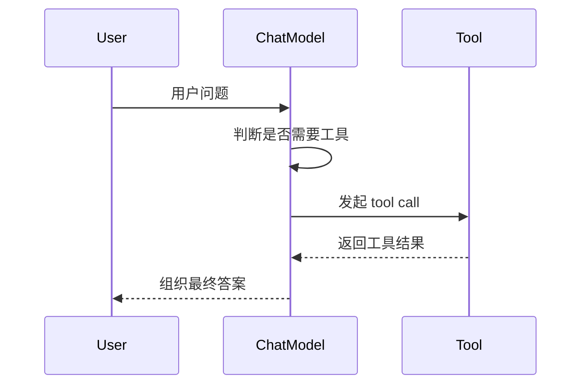
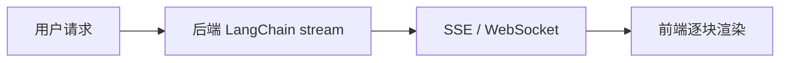

很多 LangChain 教程的分水岭，就出现在这里：

前面还是“调模型”，从这一节开始，才真正进入“让模型参与程序执行”。

因为一旦接入工具调用、结构化输出和流式返回，模型就不再只是一个聊天窗口，而是逐渐变成软件系统里的执行节点。

## 工具调用到底解决什么问题

模型本身只能基于上下文生成文本，它并不能直接：

- 查天气
- 查数据库
- 访问搜索引擎
- 调你自己的业务函数

工具调用的本质，就是把“模型会说”扩展成“模型知道该调用什么能力”。



## 定义工具的基本方式

课件里展示了 `@tool` 和 `StructuredTool` 两种思路。

如果只是快速定义工具，`@tool` 更直接：

```python
from langchain_core.tools import tool
from typing_extensions import Annotated

@tool
def add(
    a: Annotated[int, ..., "第一个整数"],
    b: Annotated[int, ..., "第二个整数"],
) -> int:
    """两数相加"""
    return a + b
```

这里最关键的不是装饰器，而是参数描述。

模型并不会“猜”出你的函数怎么调用，它主要靠这些信息理解：

- 工具名
- docstring
- 参数名
- 参数描述
- 参数类型

描述越准确，工具调用越稳定。

## 把工具绑定给模型

```python
from langchain_core.messages import HumanMessage
from langchain_openai import ChatOpenAI

model = ChatOpenAI(model="gpt-4o-mini")
model_with_tools = model.bind_tools([add])

messages = [HumanMessage(content="请帮我计算 12 + 35")]
ai_message = model_with_tools.invoke(messages)

print(ai_message.tool_calls)
```

调用结果通常不是“最终答案”，而是一条带 `tool_calls` 的 AI 消息。

也就是说，第一步只是让模型决定“该调用哪个工具、传什么参数”。

## 执行工具并把结果喂回去

```python
messages.append(ai_message)

for tool_call in ai_message.tool_calls:
    tool_message = add.invoke(tool_call)
    messages.append(tool_message)

final_answer = model.invoke(messages)
print(final_answer.content)
```

这一步非常像一个闭环：

1. 模型做决策。
2. 程序执行工具。
3. 工具结果回填上下文。
4. 模型基于结果生成最终回复。

这也是很多 Agent 框架的最小工作单元。

## 第三方工具和自定义工具的区别

课件里还用了 `TavilySearch` 做搜索工具。

从模型角度看，第三方工具和你自己定义的工具没有本质区别，差别只在于：

- 谁来实现执行逻辑。
- 返回数据长什么样。
- 调用成本和稳定性如何。

所以实战里要注意两件事：

1. 工具返回值别太脏，最好能提前做清洗。
2. 工具描述不要写虚，要明确功能边界。

## 结构化输出为什么重要

如果你只让模型返回自然语言，后续程序通常很难稳定消费。

比如你要做这些场景时，最好都用结构化输出：

- 信息抽取
- 意图识别
- 表单补全
- 审核结果判定
- 路由分发

### 使用 Pydantic 约束输出

```python
from typing import Optional

from langchain_openai import ChatOpenAI
from pydantic import BaseModel, Field

model = ChatOpenAI(model="gpt-4o-mini")

class Person(BaseModel):
    name: Optional[str] = Field(default=None, description="这个人的名字")
    hair_color: Optional[str] = Field(default=None, description="头发颜色")
    height_in_meters: Optional[str] = Field(default=None, description="身高，单位米")

structured_model = model.with_structured_output(Person)

result = structured_model.invoke("史密斯身高 1.82 米，金发。")
print(result)
```

这里有一个很实用的经验：

如果字段允许缺失，就把它定义成 `Optional`。

否则模型在缺信息时更容易胡乱补值，而不是老老实实返回 `None`。

## 结构化输出和工具调用的关系

这两者很像，但目标不同：

- 工具调用：让模型决定“做什么动作”。
- 结构化输出：让模型决定“按什么数据结构返回结果”。

你可以把它们理解成两种不同的约束层：

1. 对外部能力的约束。
2. 对输出格式的约束。

很多项目里，这两个能力会一起用。

例如：

- 先调用搜索工具。
- 再把结果组织成结构化字段。

## 流式返回的重点，不是“边打字边显示”

课件里有流式输出和 SSE 的内容，这里要分清楚两层：

1. LangChain 的 `stream()` / `astream()`，解决的是模型输出分块。
2. SSE / WebSocket，解决的是这些分块如何传给前端。

也就是说：

LangChain 负责“产出 chunk”，SSE 负责“传输 chunk”。

### 最基础的流式消费方式

```python
from langchain_openai import ChatOpenAI

model = ChatOpenAI(model="gpt-4o-mini")

for chunk in model.stream("写一段关于春天的短文"):
    print(chunk.content, end="", flush=True)
```

### 一个更适合前端理解的传输关系



所以如果你要做前端实时渲染，不要把流式输出和 SSE 混成一个概念。

## 实战中的三个注意点

### 工具不是越多越好

工具数量一多，模型做选择的难度会迅速上升。

更稳的做法是：

- 按场景分组工具。
- 给每组工具更明确的描述。
- 只把当前任务需要的工具绑定给模型。

### 结构化字段说明要写人话

`description` 不是给程序看的，是给模型看的。

写得越像人类说明书，抽取质量通常越高。

### 流式输出要考虑中途失败

如果你已经把 chunk 一路推给前端，就要接受一个现实：

中途失败时，前端拿到的是半截结果。

所以真正上线时，最好补上：

- 错误事件
- 结束事件
- 超时处理
- 前端重试或兜底策略

## 小结

从这一节开始，LangChain 的价值才真正显现出来：

1. 工具调用让模型能“行动”。
2. 结构化输出让模型结果能被程序稳定消费。
3. 流式输出让模型响应更像实时系统，而不是一次性黑盒返回。

把这三块吃透之后，你就已经不只是“会调模型”，而是开始具备构建 AI 应用流程的能力了。
