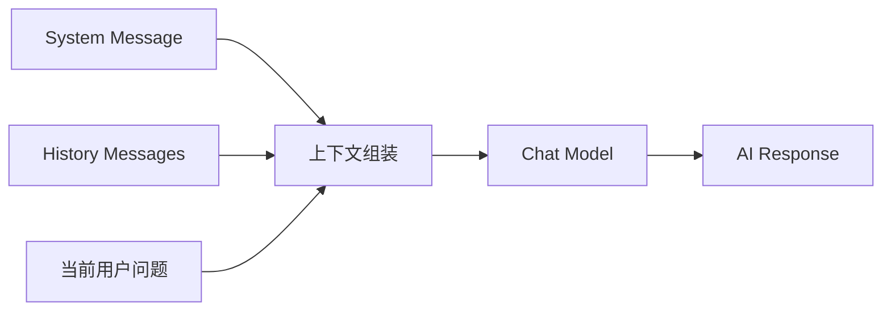
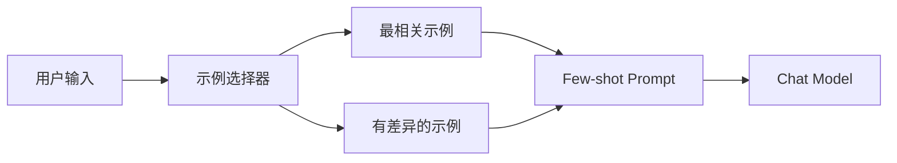

做 AI 应用时，很多人把注意力都放在模型本身，却低估了“上下文组织”这件事。

但真正决定效果稳定性的，通常不是模型名字，而是这几件事：

1. 消息列表怎么组织。
2. 历史上下文怎么裁剪。
3. 提示词模板怎么复用。
4. 少样本示例怎么选。

这一节看起来不像“高级能力”，但它其实是后续 RAG 和 Agent 的地基。

## 消息不是日志，而是模型的输入协议

在 LangChain 里，多轮对话本质上就是一组消息。



你可以把消息列表理解成：

- `system` 负责设定规则。
- `history` 负责保留上下文。
- `human` 负责当前问题。
- `ai` 负责历史回答。

模型并不知道“这是第几轮对话”，它只是在读一串按顺序排列的消息。

## 多轮对话的第一性原理

所谓“记忆”，很多时候并不神秘，它最原始的实现就是：把上一次对话一起再发给模型。

```python
from langchain_core.messages import HumanMessage, AIMessage
from langchain_openai import ChatOpenAI

model = ChatOpenAI(model="gpt-4o-mini")

messages = [
    HumanMessage(content="我是小明，你好！"),
    AIMessage(content="你好，小明！"),
    HumanMessage(content="你知道我是谁吗？"),
]

result = model.invoke(messages)
print(result.content)
```

它能回答出来，并不是因为“模型记住了你”，而是因为你把前文又喂了一次。

## 用 `RunnableWithMessageHistory` 管理会话

手动拼消息当然能跑，但实战里更推荐把历史管理封装起来。

```python
from langchain_core.chat_history import InMemoryChatMessageHistory
from langchain_core.runnables import RunnableWithMessageHistory
from langchain_openai import ChatOpenAI

model = ChatOpenAI(model="gpt-4o-mini")
store = {}

def get_session_history(session_id: str):
    if session_id not in store:
        store[session_id] = InMemoryChatMessageHistory()
    return store[session_id]

with_history = RunnableWithMessageHistory(
    model,
    get_session_history,
)

result = with_history.invoke(
    "我是小明，你好！",
    config={"configurable": {"session_id": "user-1"}},
)
print(result.content)
```

这个封装的意义是把“会话维度”从业务代码里抽离出来。

当你以后把内存存储换成 Redis、数据库或者其他持久层时，整体调用方式不需要大改。

## 历史消息越多越好吗

并不是。

对话历史越长，会同时带来三个副作用：

- token 成本更高
- 延迟更大
- 噪声更多

所以课件里才会引入 `trim_messages`、`filter_messages`、`merge_message_runs` 这类能力。

### 一条实战原则

不要想着“永远保留全部历史”，而要考虑：

1. 哪些消息对当前任务真的有用。
2. 哪些消息只是闲聊噪声。
3. 哪些系统指令必须一直保留。

如果你把上下文管理当成“可裁剪资源”，后面的对话质量通常会更稳。

## 提示词模板的价值，不是少写几行字符串

很多人第一次看到 `PromptTemplate` 会觉得只是语法糖。

其实它真正解决的是：

- 提示词复用
- 参数注入
- 团队协作
- 测试与评审

### 文本模板

```python
from langchain_core.prompts import PromptTemplate

prompt = PromptTemplate.from_template("请介绍 {city} 的历史")

print(prompt.invoke({"city": "西安"}).text)
```

### 聊天模板

```python
from langchain_core.prompts import ChatPromptTemplate

prompt = ChatPromptTemplate(
    [
        ("system", "你是一个翻译助手，把 {language_from} 翻译成 {language_to}"),
        ("human", "{text}"),
    ]
)
```

聊天模板更适合真实项目，因为它天然贴近消息模型。

## 用 `MessagesPlaceholder` 把历史插进模板

当你的提示词既要有固定规则，又要接历史消息时，`MessagesPlaceholder` 很有用。

```python
from langchain_core.prompts import ChatPromptTemplate, MessagesPlaceholder

prompt = ChatPromptTemplate(
    [
        ("system", "你是一个简洁的技术助手。"),
        MessagesPlaceholder("history"),
        ("human", "{question}"),
    ]
)
```

这样做的好处是：

- 系统提示固定。
- 历史上下文可替换。
- 当前问题单独传入。

这比手写消息拼接更清楚，也更容易复用。

## 少样本提示，本质上是在“给模型做上下文示范”

少样本提示不是微调，它更像是在 prompt 里先给模型几个样例，让它照着学格式和风格。

```python
from langchain_core.prompts import ChatPromptTemplate, FewShotChatMessagePromptTemplate

examples = [
    {"text": "hi, what is your name?", "output": "你好，你叫什么名字？"},
    {"text": "hi, what is your age?", "output": "你好，你多大了？"},
]

example_prompt = ChatPromptTemplate(
    [
        ("human", "{text}"),
        ("ai", "{output}"),
    ]
)

few_shot_prompt = FewShotChatMessagePromptTemplate(
    examples=examples,
    example_prompt=example_prompt,
)
```

它特别适合这些场景：

- 固定输出格式
- 风格对齐
- 分类映射
- 抽取规则示范
- 简单推理演示

## 示例不是越多越好，关键在选得准

课件里提到的示例选择器，本质是在回答一个问题：

当前输入来了，到底该放哪几个示例进 prompt？

常见思路有：

- 按长度选
- 按语义相似度选
- 用 MMR 做相似性与多样性的平衡
- 用 NGram 这种更偏词面匹配的方式选



这一步做得好，少样本提示的性价比会高很多。

## 一个容易忽略的经验

如果你的任务是信息抽取或格式生成，示例最好满足两点：

1. 结构非常稳定。
2. 边界条件尽量覆盖到。

否则模型学到的不是规则，而只是你示例里的表面句式。

## 小结

消息机制、提示词模板和少样本提示，看起来都是“输入侧”的能力，但它们决定了模型看到的世界是什么样的。

你可以把这一节总结成一句话：

不要只想着“问模型什么”，更要想着“用什么结构把上下文交给模型”。

一旦这层上下文组织能力建立起来，后面的 RAG、Agent 和工作流编排都会顺很多。
