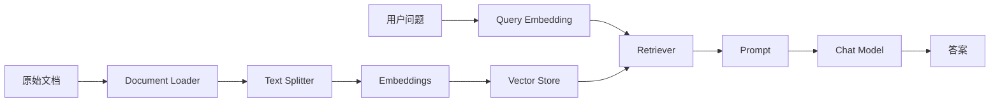

RAG 是大多数 LangChain 课程里的核心转折点。

因为从这里开始，模型不再只依赖自身参数，而是会在回答前先去“找资料”。

这也是 AI 应用从“像聊天”走向“像系统”的关键一步。

## RAG 到底解决什么问题

如果模型不知道你的私有文档、最新业务数据、产品说明或内部规范，它再聪明也只能猜。

RAG 的基本思路就是：

1. 先把文档切块。
2. 再把文档块转成向量。
3. 用户提问时，把问题也转成向量。
4. 检索最相关的文档块。
5. 把检索结果连同问题一起交给模型生成答案。



## 第一步：加载文档

课件里演示了手动构造 `Document`、加载 Markdown、加载 PDF 等几种方式。

这一步的重点不是“能不能读文件”，而是把原始资料转换成 LangChain 统一的 `Document` 结构。

```python
from langchain_community.document_loaders import UnstructuredMarkdownLoader

loader = UnstructuredMarkdownLoader("./Docs/markdown/脚手架级微服务租房平台Q&A.md")
docs = loader.load()
```

每个 `Document` 一般会包含：

- `page_content`：正文内容
- `metadata`：来源、页码、分类等元数据

元数据不是附属品，它在后续过滤检索、结果追踪里很有价值。

## 第二步：文本分割

很多人第一次做 RAG 会直接把整篇文档塞进向量库，这通常效果不太好。

原因很简单：

- 块太大，召回不精确。
- 块太小，上下文不完整。

所以文本分割器的作用，就是在“可检索性”和“语义完整性”之间找平衡。

```python
from langchain_text_splitters import RecursiveCharacterTextSplitter

text_splitter = RecursiveCharacterTextSplitter(
    chunk_size=400,
    chunk_overlap=50,
)

split_docs = text_splitter.split_documents(docs)
```

### 该怎么选分割器

常见选择思路：

- 普通文本：优先 `RecursiveCharacterTextSplitter`
- 代码：用 `PythonCodeTextSplitter` 这类按语言结构分割
- 特定格式文档：按标题、段落、章节语义做自定义切分

实践里最重要的不是“哪个类最先进”，而是：

你的切块是否符合文档自身结构。

## 第三步：嵌入模型

嵌入模型负责把文本转换成向量表示。

课件里提到了两类向量：

1. `query` 向量：把用户问题转成向量。
2. `document` 向量：把文档块转成向量。

```python
from langchain_openai import OpenAIEmbeddings

embeddings = OpenAIEmbeddings(model="text-embedding-3-large")

query_vector = embeddings.embed_query("租房平台支持哪些角色？")
print(len(query_vector))
```

如果你理解了这一层，就会知道：

RAG 的检索不是关键词搜索，而是语义相似度匹配。

这一部分的理论基础，包括：

- 向量表示
- 欧氏距离
- 余弦相似度
- 语义检索、匹配、聚类、召回为什么都能落到向量空间里处理

我已经统一收到了《大模型基础》里。这里先直接站在工程链路视角理解：

RAG 的检索阶段，本质上就是把问题和文档块都向量化，然后在向量库里做最近邻搜索，取回 Top K 结果，再交给后面的 Prompt 和聊天模型使用。

## 第四步：向量存储

向量存储是把文档向量保存下来，并支持相似检索的地方。

课件覆盖了几种常见方案：

- 内存向量库：适合本地实验和教学演示
- Redis：适合已有 Redis 基础设施的业务
- Pinecone：托管式云向量库

### 本地验证可以先用轻量方案

先把链路打通，再考虑生产级存储，这是更稳的节奏。

### Redis 方案示意

```python
from langchain_openai import OpenAIEmbeddings
from langchain_redis import RedisConfig, RedisVectorStore

embeddings = OpenAIEmbeddings(model="text-embedding-3-large")

config = RedisConfig(
    index_name="qa",
    redis_url="redis://127.0.0.1:6379",
    metadata_schema=[
        {"name": "category", "type": "tag"},
        {"name": "num", "type": "numeric"},
    ],
)

vector_store = RedisVectorStore(
    embeddings=embeddings,
    config=config,
)
```

这里的 `metadata_schema` 很重要，因为它决定了你后续是否能做更细粒度的过滤检索。

## 第五步：检索器

向量库只是存储层，真正给链使用的通常是 `retriever`。

```python
retriever = vector_store.as_retriever()
```

检索器的职责很明确：

- 接收用户问题
- 完成检索
- 返回相关文档块

如果你把它展开看，检索器底层一般做的是这些事：

1. 把输入问题转成向量。
2. 去向量库里执行最近邻检索。
3. 按相似度返回 Top K 文档。
4. 可选叠加 metadata 过滤、阈值过滤或重排。

从工程边界看，它比“直接操作向量库”更适合作为业务链中的标准组件。

## 最后一步：把检索和模型串起来

```python
from langchain_core.output_parsers import StrOutputParser
from langchain_core.prompts import ChatPromptTemplate
from langchain_core.runnables import RunnablePassthrough
from langchain_openai import ChatOpenAI

model = ChatOpenAI(model="gpt-4o-mini")

def format_docs(documents):
    return "\n\n".join(doc.page_content for doc in documents)

prompt = ChatPromptTemplate.from_template(
    "你是一个问答助手，只能基于以下上下文回答问题。\n\n"
    "上下文：\n{context}\n\n"
    "问题：{question}"
)

chain = (
    {
        "context": retriever | format_docs,
        "question": RunnablePassthrough(),
    }
    | prompt
    | model
    | StrOutputParser()
)

print(chain.invoke("租房平台的常见问题有哪些？"))
```

这段链已经完整体现了一个最小 RAG：

1. 问题先去检索。
2. 检索结果被格式化成上下文。
3. 模型基于上下文回答。

### 用一句话把检索和生成分开

RAG 里最容易混淆的是嵌入模型和聊天模型的职责。

可以直接这样记：

- 嵌入模型负责“在向量空间里找到相关内容”。
- 聊天模型负责“基于检索结果组织自然语言答案”。

前者解决的是“找什么”，后者解决的是“怎么说”。

## RAG 不是“接上向量库就结束了”

真正影响效果的，通常是下面这些细节：

- 切块大小是否合理
- 重叠长度是否足够
- 文档清洗是否干净
- 元数据是否完整
- 检索条数是否过多
- Prompt 是否明确要求“仅基于上下文回答”

也就是说，RAG 的质量很少由某一个单点决定，而是整条链路共同决定。

## 一个很实用的排查顺序

如果你的 RAG 效果不好，不要一上来就怪模型。

先按这个顺序排查：

1. 检索到的文档是否本来就不对。
2. 文档切块是否破坏了语义。
3. 嵌入模型是否适合当前任务。
4. Prompt 是否允许模型自由发挥过多。
5. 最终生成阶段是否有足够的上下文约束。

## 小结

RAG 的核心不是“向量库”四个字，而是这条完整链路：

文档加载、文本分割、嵌入表示、向量存储、检索召回、提示词组织、模型生成。

只盯着某一个环节，效果通常很难稳定。

把整条链路跑顺之后，你才真正具备了构建知识库问答系统的基础能力。
