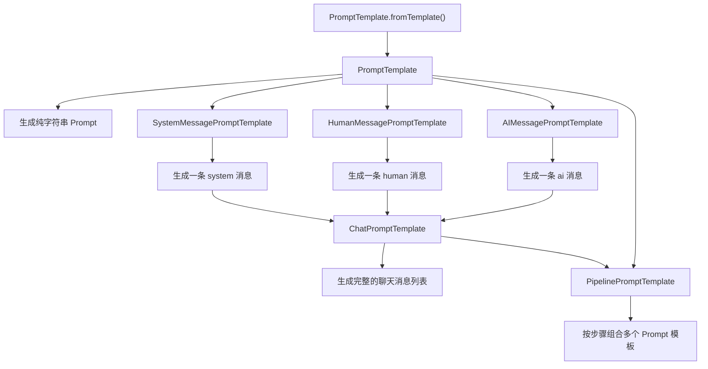
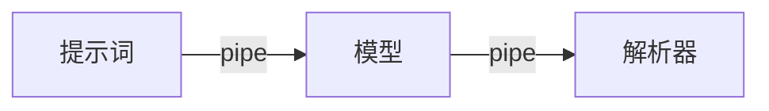

LangChain 是一个帮助开发者快速构建 "智能应用" 的工具框架。==把大模型、工具、记忆能力、链式调用等模块串联起来，组成一个可交互、可记忆、有逻辑的智能体==

:::table title="LangChain 提供的模块" full-width

| 模块 | 说明 |
| --- | --- |
| Models | 支持 OpenAI、Anthropic、Llama 等多种模型，封装调用细节与响应结构 |
| Prompts | 提供模板引擎和变量插值机制，让提示词更易复用 |
| Indexes | 索引与检索接口，构建企业级知识库的核心能力 |
| Memory | 支持对话中记忆上下文（短期 + 长期），提升交互连贯性 |
| Chains | 串联多个步骤形成逻辑工作流，是 LangChain 的“灵魂” |
| Agents | 构建“能自己调用工具”的大模型智能体，实现真正的自主行为 |

:::

:::details LangChain 包的架构
整个 LangChain 生态系统由多个模块化包组成，各自承担不同职责，协同构建完整的智能应用开发框架：

- `@langchain/core`：LangChain 的 "内核"，提供**最基础的抽象能力**，比如 `Runnable`（可执行单元）、`Prompt`（提示词模板）、`OutputParser`（输出解析器）等。同时还包含 LangChain Expression Language，用于编排复杂的链式逻辑
- `@langchain/community`：社区维护的扩展包
- `langchain`：核心能力基础上的**高阶封装**，内置了常见的链式组件（Chains）、智能体模块（Agents）、工具调度（Tools）等，是大多数 LangChain 应用的默认入口包

:::

## 模型接口

LangChain 支撑两类主流语言模型：文本补全模型 与 对话模型

### 文本补全模型（Text Completion Models）

这类模型以**一段纯文本**作为**输入**，输出结果是**一段连续生成的文字**（这里的输出文本其实就是对前面输入文本的一个补全），**不区分说话角色**，也**不会自动记录上下文**。通常用于单轮任务，如：段落续写、摘要生成、内容润色等

```ts
import { Ollama } from "@langchain/ollama";

const model = new Ollama({
  model: "llama3",
});

const res = await model.invoke("你是谁？");

console.log(res);
```

这里面的 `invoke` 方法就是调用模型接口的核心方法，输入一个字符串，输出一个字符串。对于文本补全模型来说，这个输入字符串就是一个提示词（prompt），模型会根据这个提示词生成一段新的文本作为输出

:::note 文本补全模型的特征

1. 输入格式：接收的是 **普通文本字符串**
2. 输出格式：返回的同样是 **一段纯文本**，**不含结构化角色信息**
3. 适用场景：更适合非对话类任务，例如：摘要提取、句子改写、文本分类、代码生成等
4. 与聊天模型区别：不支持 `HumanMessage` / `AIMessage` 角色区分，也不保留上下文

:::

### 对话模型（Chat Completion Models）

[+身份标识]: 例如 `system`、`user`、`assistant`

对话模型在能力上更进一步，它们支持**多轮上下文**和**角色区分**，输入格式为一组带有身份标签的消息**数组**[+身份标识]，模型能够根据对话历史生成更加自然且连续的回复

代表性模型有 GPT-4、Claude 3、Gemini、Mistral Chat 等，常用于聊天机器人、Agent 推理流程等复杂交互场景

使用对话模型需要额外安装 `@langchain/core`

```bash
pnpm add @langchain/core
```

```ts
// 引入的是 ChatOllama
import { ChatOllama } from "@langchain/ollama";
import {
  SystemMessagePromptTemplate,
  HumanMessagePromptTemplate,
  ChatPromptTemplate,
} from "@langchain/core/prompts";

const model = new ChatOllama({
  model: "llama3",
  temperature: 0.7,
  stream: true,
});

// 创建多角色的提示词模板

// 1. 创建系统提示词
const sysPrompt = SystemMessagePromptTemplate.fromTemplate(
  "你是一个翻译助理 ,请将用户输入的内容由{input_language}直接翻译为{output_language}."
);

// 2. 创建用户提示词
const humanPrompt = HumanMessagePromptTemplate.fromTemplate("{text}");

// 3. 合成提示词
const chatPrompt = ChatPromptTemplate.fromMessages([sysPrompt, humanPrompt]);

// 4. 填充变量
const messages = await chatPrompt.formatMessages({
  input_language: "中文",
  output_language: "英语",
  text: "今天天气真好，我们去游泳吧",
});

const res = await model.stream(messages);

for await (const chunk of res) {
  process.stdout.write(chunk.content);
}
```

::::note `Ollama` 与 `ChatOllama` 的区别

:::table full-width

| 对比维度 | `Ollama`（文本补全模型） | `ChatOllama`（对话模型） |
| --- | --- | --- |
| 所属包 | 同为 `@langchain/ollama` | 同为 `@langchain/ollama` |
| 继承体系 | 基于 `LLM` 抽象类 | 基于 `BaseChatModel` 抽象类 |
| 输入类型 | 接收 **纯文本字符串** 作为 prompt | 接收 **消息对象数组**（含 `system`、`user`、`assistant`） |
| Prompt 模板支持 | 支持文本模板（单角色） | 支持多角色模板（含系统提示 + 用户消息） |
| 系统提示能力 | 不支持 `SystemMessage`，需手动写入 prompt 中 | 原生支持系统消息（如使用 `SystemMessagePromptTemplate`） |
| 上下文记忆 | 不具备上下文感知能力，每次调用是独立的 | 支持对话上下文，可构建多轮逻辑 |
| 使用方式 | 适合执行 `model.invoke("文本")` 类型的**单轮任务** | 可通过 `chatModel.invoke(messages)` 处理**多轮对话** |
| 推荐场景 | 适用于摘要、问答、标题生成等**单轮文本生成任务** | 适用于翻译、聊天机器人、角色扮演等**多轮交互任务** |

:::

::::

## 缓存

缓存机制是为了解决在实际场景下，遇到的**重复输入**问题，例如：同一用户可能多次询问相同的问题；刷新页面或误触按钮触发了相同请求。如果每次都让大模型重新生成响应，不仅**效率低下**，还会带来**不必要的计算成本**

在 LangChain 中启用缓存只需在实例化模型时设置 `cache: true`，它会自动将输入和输出进行哈希存储，下次遇到相同输入时直接返回缓存结果，无需再次调用模型接口

```ts
import { Ollama } from "@langchain/ollama";

const model = new Ollama({
  model: "llama3",
  cache: true, // 启用缓存机制
});
```

:::details 启用缓存的好处

1. 提升响应速度：重复问题无需重新调用模型，直接命中缓存结果
2. 降低调用成本：尤其对于调用远程 LLM（如 GPT-4），可节省大量费用
3. 避免冗余请求：减少系统负担，提升整体并发性能

:::

> [!IMPORTANT]
> LangChain 内建响应缓存主要挂在==非流式==生成路径上，如 `.invoke()`、`.predict()`，最终会走到 `generate()`，其中会执行缓存查询和写入

对于流模式下 `.stream()` 走的是流式迭代路径，返回的是一个异步迭代器，LangChain 会直接逐块消费底层流并向外产出 token，不会自动复用 `generate()` 那套响应缓存逻辑

:::info 实现思路

1. 第一次请求时一边流式输出，一边把完整结果累积起来
2. 请求结束后把完整结果写入你自己的缓存
3. 第二次命中缓存时，再把缓存内容切片回放成一个 "伪流"

:::

:::code-tabs

@tab utils.ts

```ts
import { createHash } from "node:crypto";

/**
 * 流式输出缓存
 *
 * 注意：
 * 这里缓存的是“完整响应文本”，不是 LangChain 内建的 Generation 缓存。
 * 这样做的目的是：
 * 1. 第一次请求时正常走模型流式输出
 * 2. 第二次请求时直接命中缓存
 * 3. 命中缓存后仍然可以模拟流式输出体验
 */
export class SecureCache {
  private store = new Map<string, string>();

  /**
   * 使用 SHA-256 生成稳定缓存 key
   *
   * 为什么要把 model 和 input 一起编码：
   * 同样的问题发给不同模型，结果可能不同，不能共用一个缓存 key。
   */
  private makeKey(model: string, input: string): string {
    return createHash("sha256")
      .update(`${model}::${input}`)
      .digest("hex");
  }

  /**
   * 读取缓存
   */
  get(model: string, input: string): string | null {
    return this.store.get(this.makeKey(model, input)) ?? null;
  }

  /**
   * 写入缓存
   */
  set(model: string, input: string, output: string): void {
    this.store.set(this.makeKey(model, input), output);
  }

  /**
   * 将完整文本切片，模拟成流式输出
   *
   * 命中缓存时我们拿到的是完整字符串，不是真实的模型流。
   * 所以这里把字符串按固定块大小拆开，再逐块 yield 给调用方。
   */
  async *replay(text: string, chunkSize = 24): AsyncGenerator<string> {
    for (let i = 0; i < text.length; i += chunkSize) {
      yield text.slice(i, i + chunkSize);
    }
  }
}
```

@tab main.ts

```ts
import { Ollama } from "@langchain/ollama";
import { SecureCache } from "./utils.js";

// 这里定义模型名称，后面生成缓存 key 时也会用到
const modelName = "llama3";

// 这里不再依赖 model.cache
// 因为 LangChain 内建缓存默认并不会覆盖 .stream() 这条路径
const model = new Ollama({
  model: modelName,
});

// 创建自定义安全缓存实例
const secureCache = new SecureCache();

/**
 * 获取“可流式消费”的输出
 *
 * 逻辑分两种情况：
 * 1. 命中缓存：直接回放缓存内容
 * 2. 未命中缓存：真实调用模型，并把完整结果写入缓存
 */
async function* getStreamWithCache(inputText: string): AsyncGenerator<string> {
  // 先查缓存
  const cached = secureCache.get(modelName, inputText);

  // 命中缓存时，直接把缓存文本模拟成流输出
  if (cached !== null) {
    yield* secureCache.replay(cached);
    return;
  }

  // 未命中缓存时，真实调用模型流
  const stream = await model.stream(inputText);
  let fullResponse = "";

  for await (const chunk of stream) {
    // 一边向外输出，一边累积完整结果，供后面写入缓存
    fullResponse += chunk;
    yield chunk;
  }

  // 第一次真实流结束后，把完整结果缓存起来
  secureCache.set(modelName, inputText, fullResponse);
}

/**
 * 对外暴露的调用函数
 *
 * 这里仍然保持“边输出边打印”的使用体验。
 */
async function streamWithCache(inputText: string): Promise<string> {
  const start = Date.now();
  let fullResponse = "";

  for await (const chunk of getStreamWithCache(inputText)) {
    process.stdout.write(chunk); // 实时打印
    fullResponse += chunk; // 同时拼接完整结果，方便后续使用
  }

  const end = Date.now();
  console.log(`\n⏱️ 本次耗时：${end - start}ms`);

  return fullResponse;
}

// 第一次调用（无缓存）
console.log("\n🎯 第一次调用（无缓存）：");
await streamWithCache("请用中文介绍一下AI的影响");

// 第二次调用（应命中缓存）
console.log("\n\n🎯 第二次调用（命中缓存）：");
await streamWithCache("请用中文介绍一下AI的影响");
```

:::

## 提示词

LangChain 提供了 Prompt Template 专门用于语言模型的提示词模板工具，简单理解就是 ==支持变量注入的字符串模板工具==

在实际使用时主要有两个部分：`template` 和 `inputVariables`，前者是一个带有占位符的字符串模板，后者是一个字符串数组，列出了模板中所有需要填充的变量名

:::code-tabs

@tab 无变量

```ts
import { PromptTemplate } from "@langchain/core/prompts";

const prompt = new PromptTemplate({
  inputVariables: [], // 没有变量需要填充
  template: "请用一句话介绍一下人工智能", // 纯文本模板
})

const res = await prompt.format();
console.log(res);  // 请用一句话介绍一下人工智能

```

@tab 有变量嵌入到字符串模版

```ts
import { PromptTemplate } from "@langchain/core/prompts";

const prompt = new PromptTemplate({
  inputVariables: ["period", "user"], // 在这个数组里面，声明有哪些变量
  template: "Good {period}, {user}!", // 使用了 {} 作为变量名的容器
});

const output = await prompt.format({
  period: "evening",
  user: "Alex",
});

console.log(output); // Good evening, Alex!
```

:::

:::tip
如果想在最终结果中保留 `{}` 那么需要使用 `{{}}` 进行转移
:::

### 静态方法

使用 `PromptTemplate.fromTemplate()` 用来快速创建模板，这样就无需手动声明 `inputVariables`，LangChain 会自动从模板字符串中识别 `{}` 包裹的变量

```ts
import { PromptTemplate } from "@langchain/core/prompts";

const pt = PromptTemplate.fromTemplate(
  "你是一位精通{subject}的专家，请用{language}来回答用户的问题"
);

const res = await pt.format({
  subject: "生物学",
  language: "中文",
})
```

### 部分填充

如果不想要一次性拿到所有变量的数据，就可以先传入一部分变量，生成一个 "部分填充" 的模板，后续再补全

```ts
import { PromptTemplate } from "@langchain/core/prompts";

const pt = PromptTemplate.fromTemplate(
  "你是一位精通{subject}的专家，请用{language}来回答用户的问题：{info}"
);
const pt2 = await pt.partial({
  subject: "生物学",
});
const pt3 = await pt2.partial({
  language: "中文",
});
const result = await pt3.format({
  info: "大象的鼻子为什么那么长",
});
console.log(result);
```

### 动态生成变量值

在某些场景下，希望**在模板格式化时动态生成变量值**，比如当前时间、随机数或用户上下文。此时可以在 `partial` 方法中传入一个**函数**，而不是固定的值，之后在调用 `.format()` 时，函数会自动执行，生成实际变量内容

```ts
import { PromptTemplate } from "@langchain/core/prompts";

// 定义一个函数，获取当前的日期
const getToday = () => new Date().toLocaleDateString();

const pt = PromptTemplate.fromTemplate("今天是{date}，今天的活动是：{event}");

const pt2 = await pt.partial({
  date: getToday,
});

// 部分填充
const result = await pt2.format({
  event: "出去郊游",
});

console.log(result);
```

### 结构化提示词

和聊天模型交互时，输入给模型的内容不只是 "几段纯文本"，每一条消息除了内容本身，还要带上它的 ==角色==，这种结构化的消息输入有助于模型更好地理解对话的上下文和流程，从而生成更准确、更自然的回应

:::table full-width

| 类名 | 用途 |
| --- | --- |
| `ChatPromptTemplate` | 构造整个多轮提示词结构 |
| `SystemMessagePromptTemplate` | 设置系统规则 / 行为模式 |
| `HumanMessagePromptTemplate` | 模拟用户输入 |
| `AIMessagePromptTemplate` | 模拟模型输出（上下文中使用） |

:::

> [!IMPORTANT]
> 角色的概念对 LLM 理解和构建整个对话流程非常重要，相同的内容由不同的 role 发送出来的意义是不同的
>
> - `system` 角色的消息通常用于设置对话的上下文或指定模型采取特定的行为模式。这些消息不会直接显示在对话中，但它们 **对模型的行为有指导作用**，权重非常高，在这里有效的构建 prompt 能取得非常好的效果
> - `user` 角色代表真实用户在对话中的发言。这些消息通常是问题、指令或者评论，反映了用户的意图和需求
> - `assistant` 角色的消息代表 AI 模型的回复。这些消息是模型根据 system 的指示和 user 的输入生成的

:::code-tabs

@tab 基本使用

```ts
import {
  ChatPromptTemplate,
  SystemMessagePromptTemplate,
  HumanMessagePromptTemplate,
} from "@langchain/core/prompts";

// 构建系统提示
const systemPrompt = SystemMessagePromptTemplate.fromTemplate(
  "你是一位专业导游，负责用中文向游客介绍北京特产。"
);

// 构建用户提示
const humanPrompt = HumanMessagePromptTemplate.fromTemplate("{question}");

// 组合为 ChatPromptTemplate
const chatPrompt = ChatPromptTemplate.fromMessages([systemPrompt, humanPrompt]);

// 填充变量，生成最终结构
const messages = await chatPrompt.formatMessages({
  question: "北京有哪些值得推荐的特产？",
});

console.log("生成的消息结构：", messages);
```

@tab 输出结果

```ts
[
  SystemMessage {
    "content": "你是一位中国的专业导游，请使用中文向游客介绍中国的某些地区的特产",
    "additional_kwargs": {},
    "response_metadata": {}
  },
  HumanMessage {
    "content": "我想问：北京的特产有哪些",
    "additional_kwargs": {},
    "response_metadata": {}
  }
]
```

:::

::::details 聊天消息对象结构字段

:::table full-width

| 字段名 | 类型 | 含义与作用 |
| --- | --- | --- |
| `SystemMessage\HumanMessage` | 类实例 | 表示消息的角色类型 |
| `content` | string | 消息正文 |
| `additional_kwargs` | object | 额外的模型参数（可选），如工具调用、函数定义、引用等 |
| `response_metadata` | object | 模型生成时的元信息（可选），如 token 计数、生成时间等 |

:::

::::

:::details 案例

```ts
import {
  SystemMessagePromptTemplate,
  HumanMessagePromptTemplate,
  ChatPromptTemplate,
} from "@langchain/core/prompts";
import { ChatOllama } from "@langchain/ollama";

function buildPrompt(sysTemplate, humanTemplate) {
  const sysPt = SystemMessagePromptTemplate(sysTemplate);
  const hPt = HumanMessagePromptTemplate(humanTemplate);

  return ChatPromptTemplate.fromMessages([sysPt, hPt]);
}

// 1 创建系统提示词
const sysTemplate =
  "你是一位中国的专业导游，请一定使用中文向游客介绍{location}的{topic}。记住：一定要使用中文来介绍";

// 2 用户输入提示词
const userTemplate = "当前用户的问题：{question}";

// 3 最终组合的提示词模板
const pt = buildPrompt(sysTemplate, userTemplate);

// 4 填充变量
const res = await pt.formatMessages({
  location: "北京",
  topic: "特产",
  question: "北京有哪些值得推荐的特产？",
});

const model = new ChatOllama({
  model: "llama3",
  stream: true,
  temperature: 0.7,
});

const stream = await model.stream(result);

for await (const chunk of stream) {
  process.stdout.write(chunk.content);
}

```

:::

### 组合多个提示词

在实际工程中，常常需要根据多个变量、多个上下文来源，动态拼接出一个结构复杂、逻辑清晰的 Prompt。此时，如果把所有逻辑都写在一个大模板里，会让 Prompt 难以维护、难以复用

这就是 `PipelinePromptTemplate` 的用武之地，它允许将多个小的 Prompt 模板，**按顺序** 组合成一个 "流水线式" 的大模板，既能 **模块化构建**，又能 **复用逻辑片段**

:::table title="PipelinePromptTemplate 的组成" full-width

| 组成 | 用途 |
| --- | --- |
| `pipelinePrompts` | 一个数组，每一项都是一个小模板（Prompt），执行后会产出一个变量，供后续模板使用 |
| `finalPrompt` | 最终的主模板，引用前面生成的变量，拼装成完整 Prompt |

:::

```ts
import {
  PromptTemplate,
  PipelinePromptTemplate,
} from "@langchain/core/prompts";

const getDate = () => new Date().toLocaleDateString();

// 1 创建主模版
const mainPt = PromptTemplate.fromTemplate(
  `你是一个智能助理，今天是 {date}，主人的信息是 {userInfo}，
  请根据上下文完成以下任务：
  {todo}`
)

// 2 子模板
const timePll = PromptTemplate.fromTemplate("{date}，现在是 {time}");
const filledTimePl = await timePl.partial({
  date: getDate,
});

const userTpl = PromptTemplate.fromTemplate("姓名：{name}，性别：{gender}");
const taskTpl = PromptTemplate.fromTemplate(`
    我想吃 {time} 的 {dish}。
    请再次确认我的信息：{userInfo}
    `);

const finalPt = PipelinePromptTemplate.fromPrompts({
  pipelinePrompts: [
    {
      name: "date",
      prompt: filledTimePl,
    },
    {
      name: "userInfo",
      prompt: userTpl,
    },
    {
      name: "todo",
      prompt: taskTpl,
    },
  ],
  finalPrompt: mainPt,
});

const result = await finalPt.format({
  time: "12:01",
  name: "张三",
  gender: "男",
  dish: "煎蛋",
});

```



## LCEL

LangChain Expression Language（LCEL）是 LangChain 提供的一种==声明式构建链式调用流程==的方式。它允许开发者用 `.pipe()` 操作符将不同的模块（如提示模板、模型、解析器等）连接起来，形成一个完整的 "链（Chain）"



### invoke

常用的同步执行方式，该方法会执行整条链，返回完整结果

```ts
import { ChatOllama } from "@langchain/ollama";
import { PromptTemplate } from "@langchain/core/prompts";
import { StringOutputParser } from "@langchain/core/output_parsers";

// 创建模块
const prompt = PromptTemplate.fromTemplate("请使用中文解释：{topic}");
const llm = new ChatOllama({ model: "llama3", temperature: 0.7 });
const parser = new StringOutputParser();

// 构建链式流程
const chain = prompt.pipe(llm).pipe(parser);

// 执行链式调用
const result = await chain.invoke({ topic: "闭包（closure）是什么？" });

console.log("LLM 输出：", result);
```

### pipe

用于组合模块，将输出内容 "接入" 下一个模块

```ts
const chain = prompt.pipe(llm).pipe(parser);
```

> [!IMPORTANT]
> 本质上 `pipe` 会返回一个新的 `Runnable` 实例，因此可以无限拼接

### stream

用于获取流式结果，逐块返回 LLM 输出

```ts
import { ChatOllama } from "@langchain/ollama";
import { PromptTemplate } from "@langchain/core/prompts";
import { StringOutputParser } from "@langchain/core/output_parsers";

// 1 创建提示词
const pt = PromptTemplate.fromTemplate("请严格使用中文解释:{question}");

// 2 创建模型
const model = new ChatOllama({
  model: "llama3",
  temperature: 0.7,
});

// 3 创建一个解析器
const parser = new StringOutputParser();

// 4 将上面的 3 个模块连接起来：pipe
const chain = pt.pipe(model).pipe(parser);

// 5 使用 chain 这个链条
const res = await chain.stream({
  question: "什么是闭包",
});

for await (const chunk of res) {
  process.stdout.write(chunk);
}
```

### batch

用于同时处理多个==输入==，适合批量问答、摘要等场景，返回一个**结果数组**

```ts
import { ChatOllama } from "@langchain/ollama";
import { PromptTemplate } from "@langchain/core/prompts";
import { StringOutputParser } from "@langchain/core/output_parsers";

const pt = PromptTemplate.fromTemplate("请严格使用中文解释:{question}");

const model = new ChatOllama({
  model: "llama3",
  temperature: 0.7,
});

const parser = new StringOutputParser();
const chain = pt.pipe(model).pipe(parser);

// 多条输入
const inputs = [
  { question: "闭包" },
  { question: "原型链" },
  { question: "事件循环" },
];

const res = await chain.batch(inputs);

res.forEach((r, idx) => {
  console.log(`第${idx + 1}条结果：`, r);
});
```

:::info

`chain.batch()` 和 `chain.stream()` 不是同一套返回范式，因此不能一边批量处理多个输入，同时一边使用流式输出，逐条显示结果

- `batch()` 返回的是 "多个完整结果" 的 `Promise<string[]>`
- `stream()` 返回的是 "单输入" 的异步迭代器（token 流）

:::
