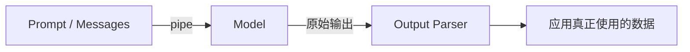
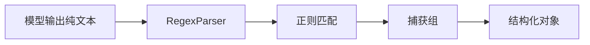

在 LangChain 里，模型输出并不总是我们最终想直接使用的结果。很多时候，大模型返回的是一个包含文本、token 统计、响应元信息、工具调用信息的复杂对象。对于调试和观测来说，这些信息当然很有价值；但如果你的目标只是拿到一段字符串、一个 JSON 对象，或者一个字段清晰的结构化结果，那么这些额外内容反而会让后续处理变得啰嗦

```ts
import { ChatOllama } from "@langchain/ollama";
import { HumanMessage } from "@langchain/core/messages";

const chatModel = new ChatOllama({
  model: "llama3",
  temperature: 0.7,
});

const response = await chatModel.invoke([new HumanMessage("Tell me a joke")]);

/**
 * 通常会包含
 * - content: 模型真正生成的文本
 * - response_metadata：模型名称、生成时间、耗时等元信息
 * - usage_metadata：token 使用情况
 * - tool_calls`：工具调用相关信息
 */
console.log(response);
```

上述的这些信息当然有用，但如果业务只是想显示一段文本给用户看，那么真正关心的其实往往只有 `content`，如果每次都手动写：`response.content`，那么当切换模型、切换链路、或者输出结果变成 JSON / 列表 / 正则匹配文本时，处理逻辑就会越来越散

这就是解析器存在的意义：==把模型的原始输出，转换成应用真正需要的数据形态==



## 字符串解析器

在实际开发中，最常见的需求其实很朴素：==只想拿到模型生成的那段文本==。这时最适合的就是 `StringOutputParser`

它的作用非常直接：把模型返回的复杂消息对象，解析成纯字符串

:::code-tabs

@tab 基础用法

```ts
import { ChatOllama } from "@langchain/ollama";
import { HumanMessage } from "@langchain/core/messages";
import { StringOutputParser } from "@langchain/core/output_parsers";

const chatModel = new ChatOllama({
  model: "llama3",
  temperature: 0.7,
});

// 创建字符串解析器
const parser = new StringOutputParser();

// 通过 pipe() 把模型输出交给解析器处理
const chain = chatModel.pipe(parser);

// 最终拿到的直接就是字符串
const response = await chain.invoke([
  new HumanMessage("用中文给我讲一个笑话"),
]);

console.log(response);
```

@tab 流式输出

```ts
import { ChatOllama } from "@langchain/ollama";
import { HumanMessage } from "@langchain/core/messages";
import { StringOutputParser } from "@langchain/core/output_parsers";

const chatModel = new ChatOllama({
  model: "llama3",
  temperature: 0.7,
});

const parser = new StringOutputParser();
const chain = chatModel.pipe(parser);

const stream = await chain.stream([
  new HumanMessage("用中文给我讲一个笑话"),
]);

for await (const chunk of stream) {
  process.stdout.write(chunk);
}
```

:::

:::note 字符串解析器适用于

- 只显示模型回复正文
- 流式输出到终端或前端
- 不关心 token 统计、元信息、工具调用细节
:::

## 结构化输出解析器

结构化输出解析器就是提前告诉 LLM 想要用 "某个格式" 来输出结果，那就需要 `StructuredOutputParser`。

它的核心思路是：==先定义想要的字段结构，再告诉大模型严格按这个结构输出==

> [!IMPORTANT]
> `StructuredOutputParser` 不支持流式解析，它只能在模型输出完整字符串之后再 `parse`

:::code-tabs

@tab 基础用法

```ts
import { StructuredOutputParser } from "@langchain/core/output_parsers";
import { PromptTemplate } from "@langchain/core/prompts";
import { ChatOllama } from "@langchain/ollama";

// 声明一个输出协议
const parser = StructuredOutputParser.fromNamesAndDescriptions({
  answer: "用户问题的答案",
  evidence: "你回答用户问题所依据的内容",
  confidence: "答案可信度评分，格式为百分数",
});

const prompt = PromptTemplate.fromTemplate(
  "请回答问题：\n{instructions}\n\n问题：{question}"
);

const model = new ChatOllama({
  model: "llama3",
  temperature: 0.7,
});

const chain = prompt.pipe(model).pipe(parser);

const res = await chain.invoke({
  question: "蒙娜丽莎的作者是谁？是什么时候绘制的？",
  instructions: parser.getFormatInstructions(),
});

console.log(res);
```

@tab 流式处理思路

```ts
import { StructuredOutputParser } from "@langchain/core/output_parsers";
import { PromptTemplate } from "@langchain/core/prompts";
import { ChatOllama } from "@langchain/ollama";

const parser = StructuredOutputParser.fromNamesAndDescriptions({
  answer: "用户问题的答案",
  evidence: "你回答用户问题所依据的内容",
  confidence: "答案可信度评分，格式为百分数",
});

const prompt = PromptTemplate.fromTemplate(
  "请回答问题：\n{instructions}\n\n问题：{question}"
);

const model = new ChatOllama({
  model: "llama3",
  temperature: 0.7,
});

// 先只做模型流式输出  // [!code hightlight]
const chain = prompt.pipe(model);
const stream = await chain.stream({
  question: "蒙娜丽莎的作者是谁？是什么时候绘制的？",
  instructions: parser.getFormatInstructions(),
});

let output = "";
for await (const chunk of stream) {
  process.stdout.write(chunk.content);
  output += chunk.content;
}

// 流结束后，再手动交给 parser 解析  // [!code hightlight]
const result = await parser.invoke(output);
console.log("\n结构化结果：", result);
```

:::

:::note `getFormatInstructions()`
它会自动生成一段非常强的格式约束提示词，里面通常包含：

- 输出必须遵循某种 JSON Schema
- 合法与不合法示例
- 不要遗漏字段
- 不要添加多余字段
- 不要写出无法解析的格式细节

:::

## 列表输出解析器

有时候我们既不需要完整对象，也不需要复杂 JSON。

我们只是想要一个简单列表，例如：

- 列出 3 个中国的互联网公司
- 给我 5 个前端性能优化关键词
- 输出 4 个适合做标题的候选词

这时更适合使用 `CommaSeparatedListOutputParser`。

它的思路很轻量：要求模型输出一个由逗号分隔的字符串，然后自动解析成数组。

### 基础使用

```ts
import { CommaSeparatedListOutputParser } from "@langchain/core/output_parsers";
import { ChatOllama } from "@langchain/ollama";
import { PromptTemplate } from "@langchain/core/prompts";

const parser = new CommaSeparatedListOutputParser();

const prompt = PromptTemplate.fromTemplate(
  "{instructions}\n列出 3 个 {country} 的著名互联网公司。"
);

const model = new ChatOllama({
  model: "llama3",
  temperature: 0.7,
});

const chain = prompt.pipe(model).pipe(parser);

const res = await chain.invoke({
  country: "中国",
  instructions: parser.getFormatInstructions(),
});

console.log(res);
```

`parser.getFormatInstructions()` 一般会生成类似这样的要求：

```text
Your response should be a list of comma separated values, eg: `foo, bar, baz`
```

也就是说，它会明确告诉模型：请不要写成散文解释，不要写成大段自然语言，而是给我一个规范的逗号分隔列表。

### 适合场景

- 标签抽取
- 关键词生成
- 候选项列举
- 简单枚举型输出

相比 `StructuredOutputParser`，它更轻量，也更适合快速原型。

## JSON 解析器

`StructuredOutputParser` 更强调“字段结构必须符合指定规范”。

而 `JsonOutputParser` 的心智会更松一点：==我不一定关心 schema 多严格，我只是想拿到一段合法 JSON==。

这类 parser 特别适合：

- 原型验证
- 快速抽取对象
- 字段结构相对灵活的场景

### 使用示例

```ts
import { JsonOutputParser } from "@langchain/core/output_parsers";
import { PromptTemplate } from "@langchain/core/prompts";
import { ChatOllama } from "@langchain/ollama";

const parser = new JsonOutputParser();

const prompt = PromptTemplate.fromTemplate(
  "请提供以下城市的信息，并以 JSON 格式输出：城市：{city}，需要字段：name、country、location、population"
);

const model = new ChatOllama({
  model: "llama3",
  temperature: 0.3,
});

const chain = prompt.pipe(model).pipe(parser);

const res = await chain.invoke({
  city: "北京",
});

console.log(res);
```

### 和 `StructuredOutputParser` 的区别

:::table full-width

| 对比点 | `StructuredOutputParser` | `JsonOutputParser` |
| --- | --- | --- |
| 约束强度 | 强，字段结构明确 | 相对弱，只要求合法 JSON |
| 适合场景 | 生产级字段抽取 | 快速原型、灵活抽取 |
| 是否强调字段描述 | 是 | 可选 |
| 输出目标 | 满足指定 schema 的对象 | 能被成功解析的 JSON |

:::

所以可以简单记成：

- 想要“严格字段协议”，用 `StructuredOutputParser`
- 想要“只要是合法 JSON 就行”，用 `JsonOutputParser`

## 正则解析器

前面几种 parser 大多都在 `@langchain/core/output_parsers` 里。

但 `RegexParser` 稍微特殊一点，它来自 `langchain/output_parsers`。

它的思路也和前几种不一样：

==不是让模型直接输出 JSON，而是先让模型输出满足某种文本格式，再用正则去提取字段。==

也就是说，它更像“文本抽取器”。

### 使用前先安装

```bash
pnpm add langchain
```

### 核心思路

你需要提供三样东西：

1. 正则表达式
2. 捕获组对应的字段名
3. 匹配失败时的兜底字段名（可选）



### 使用示例

```ts
import { ChatOllama } from "@langchain/ollama";
import { PromptTemplate } from "@langchain/core/prompts";
import { RegexParser } from "langchain/output_parsers";

const parser = new RegexParser(
  /Title:\s*(.+)\nScore:\s*(\d{1,3})/,
  ["title", "score"],
  "raw"
);

const prompt = PromptTemplate.fromTemplate(`
请严格按下面格式输出：
{format_instructions}

问题：{question}
`);

const model = new ChatOllama({
  model: "llama3",
  temperature: 0,
});

const chain = prompt.pipe(model).pipe(parser);

const text =
  "苹果是一种营养丰富的水果，被誉为全方位的健康水果。它富含维生素、膳食纤维和多酚类物质。";

const res = await chain.invoke({
  question: `帮我为${text}写个标题并给出信心分数(0-100)。`,
  format_instructions: parser.getFormatInstructions(),
});

console.log(res);
```

### 什么时候适合用正则解析器

- 输出格式非常固定
- 你已经有成熟的正则规则
- 只想从文本中摘取几个字段
- 不想引入完整 JSON 结构约束

不过它也有明显边界：

- 对输出格式依赖很强
- 正则一旦写得太死，模型稍微偏一点就可能匹配失败

所以它更适合“格式稳定”的文本提取场景，而不是复杂的开放式生成任务。
