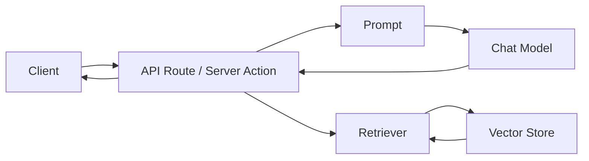

如果你的主栈是 Node.js 或 TypeScript，那就没必要先绕到 Python 再回来。

LangChain.js 的核心心智和 Python 基本一致：

1. 也是模型、提示词、解析器、工具、检索器这几类组件。
2. 也是通过链式组合来组织执行流程。
3. 只是包名、运行环境和类型约束更贴近前端/Node 生态。

这一节不在原课件里，但如果你的应用本来就是 Next.js、Node 服务或 Electron 后端，LangChain.js 往往更顺手。

## 先明确一个边界

大多数 `langchain.js` 代码应该运行在服务端，而不是浏览器客户端。

原因很直接：

- 模型密钥不能暴露给前端。
- 检索、向量库、工具调用本来就更适合在后端执行。
- 复杂链路放在服务端更容易观测和限流。



## 安装方式

如果只是做基础能力，通常先装这些就够了：

```bash
pnpm add langchain @langchain/core @langchain/openai zod
```

如果要做文档加载、向量库或社区集成，再按需安装额外包。

## 一个最小可跑的调用

```ts
import { ChatOpenAI } from "@langchain/openai"

const model = new ChatOpenAI({
  model: "gpt-4o-mini",
  temperature: 0.2,
})

const result = await model.invoke("用三句话解释什么是 LangChain。")
console.log(result.content)
```

这和 Python 版几乎是同一个思路。

差别主要只有两点：

- 你会更频繁地直接拿到 TypeScript 类型提示。
- 代码通常放在 API 路由、服务层或 worker 里，而不是 notebook 风格脚本里。

## 用提示词模板和解析器组链

```ts
import { ChatPromptTemplate } from "@langchain/core/prompts"
import { StringOutputParser } from "@langchain/core/output_parsers"
import { ChatOpenAI } from "@langchain/openai"

const model = new ChatOpenAI({
  model: "gpt-4o-mini",
  temperature: 0.2,
})

const prompt = ChatPromptTemplate.fromMessages([
  ["system", "你是一个简洁的技术助手。"],
  ["human", "把 {topic} 用三句话讲清楚。"],
])

const chain = prompt.pipe(model).pipe(new StringOutputParser())

const result = await chain.invoke({
  topic: "LangChain 的 Runnable 机制",
})

console.log(result)
```

这就是 JS 版最值得掌握的基本功：

把 prompt、model、parser 都当成独立组件，再用 `pipe()` 串起来。

## 用 Zod 做结构化输出

TypeScript 场景下，结构化输出最好配合 Zod 使用。

```ts
import { z } from "zod"
import { ChatOpenAI } from "@langchain/openai"

const model = new ChatOpenAI({
  model: "gpt-4o-mini",
})

const PersonSchema = z.object({
  name: z.string().nullable().describe("名字"),
  role: z.string().nullable().describe("角色"),
  city: z.string().nullable().describe("城市"),
})

const structuredModel = model.withStructuredOutput(PersonSchema)

const result = await structuredModel.invoke(
  "张三在上海工作，是后端工程师。"
)

console.log(result)
```

这类写法很适合：

- 表单抽取
- 页面信息结构化
- 意图识别
- 后续要继续交给业务代码处理的场景

## 在 JS 里做 RAG 的一个推荐分层

如果你打算在 Node 服务里做知识库问答，建议把职责拆开：

1. `loader` 负责读文档。
2. `splitter` 负责切块。
3. `vector store` 负责索引和检索。
4. `service` 负责拼装 RAG 链。
5. `route` 负责接收请求和返回响应。

这样做有两个明显好处：

- AI 流程不会和 HTTP 细节搅在一起。
- 后续切换模型或向量库时，影响范围更可控。

## 一个很实用的 Next.js 思路

如果你用的是 Next.js，可以把 LangChain.js 放在：

- Route Handler
- Server Action
- 独立 service 层

不要把模型初始化写进客户端组件，也不要把 API Key 放进 `NEXT_PUBLIC_*`。

## 什么时候更推荐 LangChain.js

更适合 JS/TS 的情况通常有这些：

- 整个项目本来就是前后端 TypeScript 一体化。
- 你希望服务端 AI 逻辑和 Web 工程共用一套语言。
- 你需要更强的类型约束和接口联动。
- 你的部署环境本来就是 Node Runtime。

如果你已经有成熟的 Python AI 基础设施，那 Python 版也完全没问题。

关键不是“哪种语言更强”，而是：

让 AI 能力以最自然的方式接进你现有系统。

## 小结

`langchain.js` 并不是 Python 版的弱化替代，而是 Node/TypeScript 生态下的第一选择。

它最适合做的事情，不是写一个孤立 demo，而是把模型调用、结构化输出、RAG 和业务服务自然接到同一套 TS 工程里。

如果你的主栈就是 Web 工程，这条路线通常比“先学 Python 再回到 JS”更直接。
