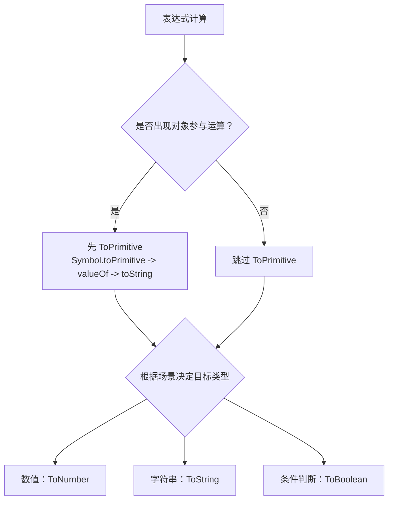

隐式类型转换不是 "随机行为"。大多数表达式都可以归结成两步：

1. 如果是对象，先做 `ToPrimitive`
2. 再根据运算场景转成目标类型（`Number` / `String` / `Boolean`）

:::details 具体流程如下：



:::

## 1.ToPrimitive

当对象参与运算时，JavaScript 会按顺序尝试：`Symbol.toPrimitive` -> `valueOf()` -> `toString()`，只要某一步拿到原始值（字符串、数字、布尔等），就停止继续往后走

:::note `Symbol.toPrimitive` 是什么
它是对象到原始值转换时的最高优先级钩子。当 JavaScript 需要把对象转成原始值时，会先调用它，并传入 `hint`：

- `number`：场景偏向数值（如 `Number(obj)`、`+obj`）
- `string`：场景偏向字符串（如 `String(obj)`）
- `default`：默认场景（如 `obj + ''`、`obj == 1`）

如果这里已经返回原始值，`valueOf()` 和 `toString()` 就不会再执行
:::

:::code-tabs
@tab Symbol.toPrimitive 命中

```js
const obj = {
  [Symbol.toPrimitive](hint) {
    if (hint === 'number') {
      return 100
    }
    return 'fallback'
  },
  valueOf() {
    return 2
  },
  toString() {
    return '1'
  },
}

console.log(Number(obj)) // 100
```

@tab valueOf 命中

```js
const obj = {
  valueOf() {
    return 2
  },
  toString() {
    return 1
  },
}

console.log(Number(obj)) // 2
```

@tab toString 命中

```js
const obj = {
  valueOf() {
    return {}
  },
  toString() {
    return 1
  },
}

console.log(Number(obj)) // 1
```

:::

:::table full-width

| 类型 | 默认 `valueOf()` 返回值 | 是否原始值 | 后续行为 |
| --- | --- | --- | --- |
| 普通对象 `{}` | 对象自身 | 否 | 继续走 `toString()` |
| 数组 `[]` | 数组自身 | 否 | 继续走 `toString()` |

:::

## 2.运算场景

这一部分才是隐式转换的关键，不是 "写了 `Number()`"，而是 =="运算符要求这个值必须是数字/字符串/布尔值"==

> [!IMPORTANT]
> `==` 会做额外转换，且规则多。核心为以下 4 条
>
> 1. `null == undefined` 为 `true`，它俩和其他值比较通常都不是这条规则
> 2. 字符串和数字比较：字符串先转数字
> 3. 布尔和其他类型比较：布尔先转数字（`false -> 0`，`true -> 1`）
> 4. 对象和原始值比较：对象先 `ToPrimitive`

### 数值场景（ToNumber）

:::details 常见触发位置：

- 一元 `+x`
- `-` `*` `/` `%`
- 比较运算中需要数值比较时（如 `'2' > 1`）
:::

:::code-tabs
@tab 基本例子

```js
console.log('5' - 2) // 3
console.log('5' * 2) // 10
console.log(+true) // 1
console.log(+null) // 0
console.log(+undefined) // NaN
```

@tab 对象与数组

```js
// valueOf 返回 { a: 1 } 依然为引用值
// 继续走 toString() { a: 1 }.toString() 得到 '[object Object]'
// 最终 Number('[object Object]') 得到 NaN
console.log(Number({ a: 1 }))

// valueOf 返回 [10] 依然为引用值
// 继续走 toString() [10].toString() 得到 '10'
// 最终 Number('10') 得到 10
console.log(Number([10]))

// valueOf 返回 [1, 2] 依然为引用值
// 继续走 toString() [1, 2].toString() 得到 '1,2'
// 最终 Number('1,2') 得到 NaN
console.log(Number([1, 2]))

// valueOf 返回 [] 依然为引用值
// 继续走 toString() [].toString() 得到 ''
// 最终 Number('') 得到 0
console.log(Number([]))
```

:::

### 字符串场景（ToString）

:::details 常见触发位置：

- `+` 的任一侧已经是字符串
- 模板字符串 `` `${x}` ``
:::

```js
console.log('5' + 2) // '52'
console.log('a' + true) // 'atrue'
console.log(`${null}`) // 'null'
console.log(`${undefined}`) // 'undefined'
```

### 布尔场景（ToBoolean）

:::details 常见触发位置：

- `if (x)` / `while (x)`
- `!x`
- `x && y` / `x || y`
:::

:::table full-width

| 值 | Boolean 结果 |
| --- | --- |
| `undefined` | `false` |
| `null` | `false` |
| `false` | `false` |
| `0` / `-0` | `false` |
| `NaN` | `false` |
| `''`（空字符串） | `false` |

:::

```js
console.log(Boolean([])) // true
console.log(Boolean({})) // true
console.log(Boolean('0')) // true
console.log(Boolean(0)) // false
```

:::details 经典题：`[] == ![]`

推导链：

1. ! 优先级大于 == 因此 ![] 优先
2. [] 是对象，布尔上下文里对象都是真值，所以 ![] 是 false，变成：[] == false
3. == 遇到布尔值，会先把布尔值转数字，false -> 0，所以变成：[] == 0
4. 对象和数字比较，对象先转原始值，[] valueOf 返回 []，非原始类型 调用 toString 得到 ''
5. '' == 0 字符串转数字：Number('') -> 0
6. 0 == 0 -> true
:::
