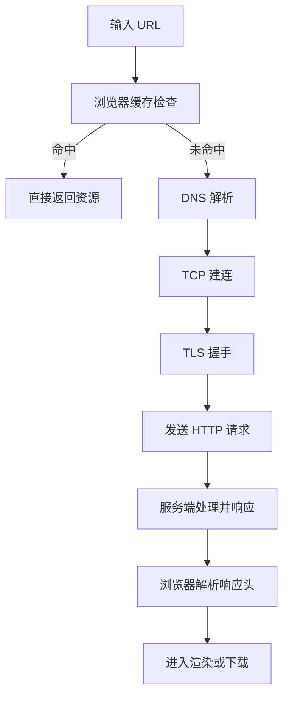

很多人把“发起请求”理解成一行 `fetch`，但浏览器底层实际经历了多层网络协议协作。

## 从 URL 到响应的主链路

## TCP 三次握手（建立连接）

目的是确认双方“收发能力都正常”，并同步初始序列号。

1. 客户端发送 `SYN`。  
2. 服务端回复 `SYN + ACK`。  
3. 客户端回复 `ACK`，连接建立。

:::details 为什么不是两次
如果只有两次，服务端无法确认“客户端是否收到了自己发出的确认包”，连接状态就不可靠。
:::

## TLS 握手（以 HTTPS 为例）

TLS 是“在 TCP 之上”建立的安全层，不是替代 TCP。

### TLS 1.2（经典）

通常可理解为：

1. 协商协议版本与密码套件。  
2. 服务端发送证书。  
3. 客户端校验证书并协商会话密钥。  
4. 双方切换到加密通信。

### TLS 1.3（更快）

相对 1.2，往返次数更少，握手延迟更低，并默认前向安全。

## HTTP 请求与响应阶段

建立安全连接后才进入应用层：

1. 请求行、请求头、请求体发送到服务端。  
2. 服务端返回状态码、响应头、响应体。  
3. 浏览器按状态码与 `Content-Type` 选择后续处理路径。

## TCP 四次挥手（断开连接）

关闭连接时是“双向独立关闭”，所以通常会看到四步：

1. 客户端发送 `FIN`。  
2. 服务端回复 `ACK`。  
3. 服务端处理完剩余数据后发送 `FIN`。  
4. 客户端回复 `ACK`，连接结束。

:::details TIME_WAIT 是什么
主动关闭连接的一方会进入 `TIME_WAIT` 一段时间，用于确保最后的 ACK 可达并避免旧连接报文干扰新连接。
:::

## 性能补充：为什么 Keep-Alive 重要

如果每个请求都重新走“DNS + TCP + TLS”，延迟会非常高。
`Keep-Alive`、HTTP/2 多路复用、HTTP/3（QUIC）都是在减少这个连接成本。

## 诊断建议

当你遇到“首包慢”“请求排队长”时，优先按层排查：

1. DNS 是否慢。  
2. TCP/TLS 握手是否慢。  
3. 服务端 TTFB 是否慢。  
4. 主线程是否阻塞导致响应虽到但处理慢。
