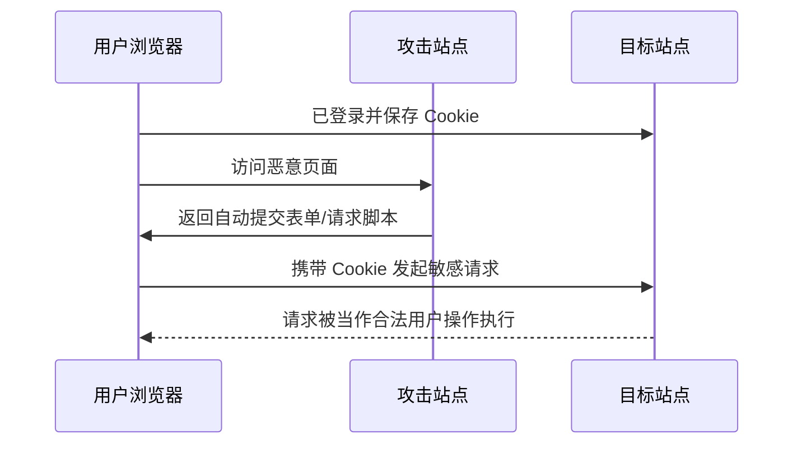

CSRF（Cross-Site Request Forgery）的关键不在“读数据”，而在“借你的身份发请求”。

它常见于：用户已登录目标站点，浏览器自动携带 Cookie；
攻击站点诱导用户访问一个恶意页面，这个页面向目标站点发起请求。

## 攻击路径（简化）



## 为什么 SOP 防不住 CSRF

同源策略限制的是“读”，不是“发”。
攻击页面即使读不到响应，也可能成功发出状态变更请求。

## 防护组合（推荐同时使用）

### 1. CSRF Token

服务端给页面下发随机 Token，提交敏感请求时必须带上并校验。

```js
// 前端示意
await fetch('/api/profile', {
  method: 'POST',
  headers: {
    'Content-Type': 'application/json',
    'X-CSRF-Token': csrfToken
  },
  body: JSON.stringify(payload),
  credentials: 'include'
})
```

### 2. SameSite Cookie

通过 Cookie 属性限制跨站请求携带 Cookie。

```http
Set-Cookie: sid=xxx; Path=/; HttpOnly; Secure; SameSite=Lax
```

### 3. 校验 Origin / Referer

服务端对敏感接口校验请求来源域，作为额外防线。

### 4. 敏感操作二次确认

例如转账、改密等高风险操作增加二次验证（验证码/二次密码）。

## 与 XSS 的关系

XSS 与 CSRF 经常联动：

1. XSS 可以绕过部分 CSRF 防护（例如窃取或伪造请求上下文）。  
2. CSRF 防护不能替代 XSS 防护。

所以线上治理应当把两者放在同一安全基线里统一设计。
