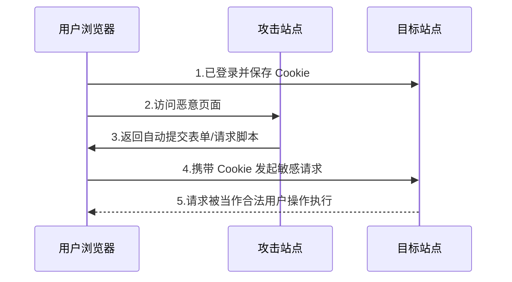

跨站请求伪造 CSRF（Cross-Site Request Forgery）指攻击者利用了用户的身份信息，执行了非用户本意的操作。常见于用户已登录目标站点，浏览器自动携带 Cookie 的情况下，攻击站点诱导用户访问一个恶意页面，这个页面向目标站点发起请求



## 防护基线

### 1. CSRF Token

服务端给页面下发随机 Token，提交敏感请求时必须带上并校验

```js
// 前端示意
await fetch('/api/profile', {
  method: 'POST',
  headers: {
    'Content-Type': 'application/json',
    'X-CSRF-Token': csrfToken
  },
  body: JSON.stringify(payload),
  credentials: 'include'
})
```

### 2. SameSite Cookie

通过 Cookie 属性限制跨站请求携带 Cookie

:::table full-width

| 属性 | 描述 |
| --- | --- |
| Secure | 仅 HTTPS 传输 |
| SameSite=Lax | 默认值。同站携带；顶级导航（如点击链接）跨站携带；跨站子请求（img/fetch/表单 POST）不携带 |
| SameSite=Strict | 仅同站请求携带 Cookie |
| SameSite=None | 允许所有请求携带 Cookie |

:::

```http
Set-Cookie: sid=xxx; Path=/; HttpOnly; Secure; SameSite=Lax
```

### 3. 校验 Origin / Referer

服务端对敏感接口校验请求来源域，作为额外防线

### 4. 敏感操作二次确认

例如转账、改密等高风险操作增加二次验证（验证码/二次密码）
