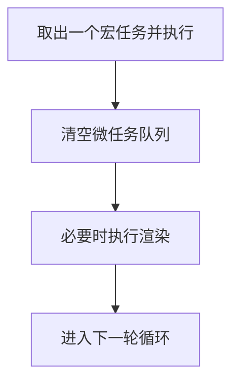

只说“事件循环”还不够，真正影响时序的是三件事：

1. 任务由谁产生（`WebAPI`）。  
2. 任务进入哪个队列（宏任务/微任务）。  
3. 每轮循环的执行顺序。

## WebAPI 在哪里

`setTimeout`、DOM 事件、`fetch` 这些能力都不属于 ECMAScript 语言本体。
它们由浏览器提供，通常称为 `WebAPI`。

当 WebAPI 结果就绪时，会把回调投递到对应任务队列。

## 宏任务 vs 微任务

:::table
| 类型 | 常见来源 | 何时执行 |
| --- | --- | --- |
| 宏任务（Task） | `setTimeout`、`setInterval`、UI 事件、`MessageChannel` | 每轮事件循环取 1 个执行 |
| 微任务（Microtask） | `Promise.then/catch/finally`、`queueMicrotask`、`MutationObserver` | 当前宏任务结束后立即清空 |
:::

## 一轮事件循环的简化顺序



## 为什么微任务看起来“插队”

因为微任务不是“下一轮再执行”，而是在当前宏任务尾部立即清空。

```js
console.log('A')

setTimeout(() => {
  console.log('B: timeout')
}, 0)

Promise.resolve().then(() => {
  console.log('C: microtask')
})

console.log('D')

// 输出顺序：A D C B
```

## 演示：宏/微任务执行先后

:::demo
```html
<!doctype html>
<html lang="zh-CN">
  <body>
    <button id="run">运行</button>
    <pre id="out"></pre>

    <script>
      const out = document.getElementById('out')

      function log(msg) {
        out.textContent += msg + '\n'
      }

      document.getElementById('run').addEventListener('click', () => {
        out.textContent = ''

        log('1. click handler start')

        setTimeout(() => {
          log('4. macrotask: setTimeout')
        }, 0)

        Promise.resolve().then(() => {
          log('3. microtask: Promise.then')
        })

        queueMicrotask(() => {
          log('3.1 microtask: queueMicrotask')
        })

        log('2. click handler end')
      })
    </script>
  </body>
</html>
```
:::

## 渲染与任务调度的关系

浏览器不会在任意时刻都渲染。一个常见实践结论是：

1. JS 长任务会阻塞渲染。  
2. 微任务队列过长也会推迟渲染。  
3. 动画逻辑优先使用 `requestAnimationFrame` 与分片计算。

## 实战排查建议

当你看到“页面卡但 CPU 不满”时，优先检查：

1. 是否有超长宏任务。  
2. 是否有微任务链式递归导致饥饿。  
3. 是否把重计算放在了输入事件处理函数里。
