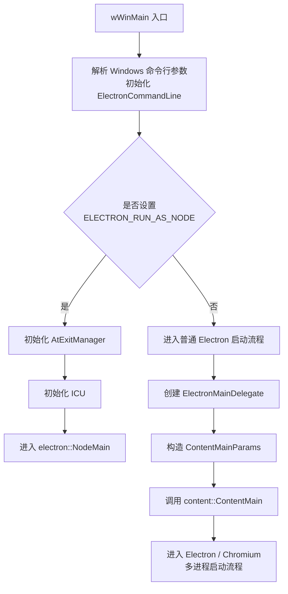

[+能力]: 包括渲染 UI 和 调用本地能力
[+wWinMain]: 该函数位于 `shell/app/electron_main_win.cc`，是 Windows 操作系统下的入口函数
[+ElectronMainDelegate]: 位于 `shell/app/electron_main_delegate.cc`。它是 Electron 提供给 Chromium `content::ContentMain` 的启动委托类，用来介入和定制 Chromium 的启动流程
[+ElectronBrowserMainParts]: 它继承于 Chromium 的 `BrowserMainParts` 类，包含了 Chromium 启动过程中的一系列事件
[+CreateContentBrowserClient]: 该方法是通过 `ElectronMainDelegate` 复写的 Chromium 的 `ContentBrowserClient` 方法

Electron 的 Node.js 执行环境主要分为两类：主进程中的 Node.js 环境，以及渲染进程侧用于 preload、IPC 和受控能力暴露的执行环境。

主进程拥有完整的 Node.js 能力，可以访问文件系统、创建窗口、管理应用生命周期、调用系统能力等。

渲染进程本质上仍然是 Chromium 的页面执行环境。早期 Electron 可以通过 `nodeIntegration` 让页面脚本直接使用 Node.js API，但这种方式安全风险较高。现代 Electron 更推荐关闭页面脚本的 Node 能力，通过 `preload + contextBridge + IPC` 暴露有限、安全的接口。

## 主进程 Node 环境

当启动 Electron 应用时，会执行整个应用的入口函数 `wWinMain`[+wWinMain]。该函数会对命令行指令进行处理、初始化环境变量等操作。

```c++
int APIENTRY wWinMain(HINSTANCE instance, HINSTANCE, wchar_t* cmd, int) {
  // 1. 解析 Windows 命令行参数
  int argc = 0;
  wchar_t** argv = ::CommandLineToArgvW(::GetCommandLineW(), &argc);

  base::CommandLine::Init(0, nullptr);
  electron::ElectronCommandLine::Init(argc, argv);
  LocalFree(argv);

  // 2. 判断是否以 Node.js 模式运行
  bool run_as_node =
      electron::fuses::IsRunAsNodeEnabled() &&
      IsEnvSet(electron::kRunAsNode);

  // 3. 将标准输出绑定到控制台，保证日志可以正常打印
  if (run_as_node || !IsEnvSet("ELECTRON_NO_ATTACH_CONSOLE"))
    base::RouteStdioToConsole(false);

  // 4. 如果是 ELECTRON_RUN_AS_NODE，则直接启动 Node.js
  if (run_as_node) {
    base::AtExitManager atexit_manager;
    base::i18n::InitializeICU();
    return electron::NodeMain();
  }

  // 5. 普通 Electron 应用启动流程
  electron::ElectronMainDelegate delegate;
  content::ContentMainParams params(&delegate);
  params.instance = instance;
  params.sandbox_info = &sandbox_info;

  return content::ContentMain(std::move(params));
}
```

:::details 流程示意



:::

### ContentMain 的代理机制

#### 代理对象注入

`ContentMain` 方法主要是用于启动 Chromium。该方法接受一个代理对象 `ElectronMainDelegate` 作为参数。**`ElectronMainDelegate` 继承于 Chromium 的 `ContentMainDelegate` 类，==通过覆写其生命周期方法==，Electron 能够在 Chromium 启动的不同阶段注入自己的代码**

:::code-tabs

@tab electron_main_delegate.h

```c++
// shell/app/electron_main_delegate.h
// ElectronMainDelegate 继承自 Chromium 的 ContentMainDelegate
class ElectronMainDelegate : public content::ContentMainDelegate {
public:
  // ... 其他成员

protected:
  // 覆写生命周期方法：创建 BrowserClient（主进程客户端）
  content::ContentBrowserClient* CreateContentBrowserClient() override;
  // 覆写生命周期方法：创建 RendererClient（渲染进程客户端）
  content::ContentRendererClient* CreateContentRendererClient() override;
  // 覆写生命周期方法：基本初始化完成后触发
  void BasicStartupComplete() override;
};
```

@tab electron_main_delegate.cc

```c++
// shell/app/electron_main_delegate.cc
// 通过覆写 CreateContentBrowserClient，注入 Electron 的浏览器进程逻辑
content::ContentBrowserClient*
ElectronMainDelegate::CreateContentBrowserClient() {
  // 创建 Electron 自定义的 BrowserClient，替代 Chromium 默认行为
  browser_client_ = std::make_unique<ElectronBrowserClient>();
  return browser_client_.get();
}

// 通过覆写 CreateContentRendererClient，注入 Electron 的渲染进程逻辑
content::ContentRendererClient*
ElectronMainDelegate::CreateContentRendererClient() {
  // 创建 Electron 自定义的 RendererClient，替代 Chromium 默认行为
  renderer_client_ = std::make_unique<ElectronRendererClient>();
  return renderer_client_.get();
}
```

:::

:::tip
Electron 工程师正是利用了该代理对象，注入了自己的逻辑，从而达到对 Chromium 进行二次开发的目的
:::

#### 创建 `ElectronBrowserClient` 对象

通过 Electron 自定义的代理对象注入代码后，会继续调用 `CreateContentBrowserClient`[+CreateContentBrowserClient] 方法创建 `ElectronBrowserClient` 对象，在该对象中定义了 Electron 对 Chromium 浏览器进程的定制逻辑

:::code-tabs

@tab electron_browser_client.h

```c++
// shell/browser/electron_browser_client.h
// ElectronBrowserClient 继承自 Chromium 的 ContentBrowserClient
class ElectronBrowserClient : public content::ContentBrowserClient {
public:
  // ... 其他成员

protected:
  // 覆写：判断浏览器是否启动完成
  bool IsBrowserStartupComplete() override;
  // 覆写：判断是否正在关闭
  bool IsShuttingDown() override;
  // 覆写：渲染进程即将启动时触发
  void RenderProcessWillLaunch(
      content::RenderProcessHost* host) override;
};
```

@tab electron_browser_client.cc

```c++
// shell/browser/electron_browser_client.cc
// 判断浏览器核心是否完全启动
bool ElectronBrowserClient::IsBrowserStartupComplete() {
  // 返回浏览器启动状态，用于控制某些功能的启用时机
  return is_browser_startup_complete_;
}

// 判断浏览器核心是否被关闭
bool ElectronBrowserClient::IsShuttingDown() {
  // 返回关闭状态，用于阻止新的任务启动
  return is_shutting_down_;
}

// 渲染进程即将启动时触发，可用于注入渲染进程的初始化逻辑
void ElectronBrowserClient::RenderProcessWillLaunch(
    content::RenderProcessHost* host) {
  // 为新创建的渲染进程添加扩展 API 或预加载脚本
  // 例如：向渲染进程注入 Electron 的 IPC 通信能力
  extensions::ExtensionsClient::Get()
      ->RenderProcessWillLaunch(host);
}
```

:::

> [!IMPORTANT]
> 它相当于 Electron 在浏览器进程中的核心适配层。Chromium 在处理窗口创建、页面导航、权限申请、网络请求、协议注册、Renderer 进程启动等行为时，会回调到这个对象，由 Electron 决定具体的处理策略

#### 创建 `ElectronBrowserMainParts` 对象

前面提到，Electron 通过 `ElectronMainDelegate` 覆写 `CreateContentBrowserClient`，创建了自己的 `ElectronBrowserClient`。但 `ElectronBrowserClient` 本身不会主动执行，它只是被注册给 Chromium 的一个代理对象。真正驱动启动流程的，仍然是 Chromium 内部的 `content::ContentMain`。

当主进程调用：

```cpp
content::ContentMain(std::move(params));
```

之后，Chromium 会根据当前进程类型进入不同的启动流程。如果当前是浏览器主进程，就会进入 Browser 进程的主流程，并在内部创建和启动 `BrowserMainLoop`。

可以简化理解为：

```txt
content::ContentMain
  └── 进入 Browser 进程启动流程
      └── 创建 BrowserMainLoop
          └── BrowserMainLoop::Init
              └── 通过 ContentBrowserClient 创建 BrowserMainParts
```

当 Chromium 的 `BrowserMainLoop` 进入初始化阶段后，会通过当前注册的 `ContentBrowserClient` 创建 `BrowserMainParts`。由于 Electron 在前面已经创建并注册了 `ElectronBrowserClient`，因此这里实际调用的是：

```cpp
ElectronBrowserClient::CreateBrowserMainParts()
```

该方法会创建并返回一个 `ElectronBrowserMainParts` 对象。

`ElectronBrowserMainParts` 继承自 Chromium 的 `BrowserMainParts`，它可以参与 Chromium 浏览器主进程的多个启动阶段，例如早期初始化、消息循环创建、主循环运行前后等。

执行流程如下：

```txt
wWinMain
  └── content::ContentMain
      └── ElectronMainDelegate
          └── CreateContentBrowserClient
              └── ElectronBrowserClient
      └── 进入 Browser 进程启动流程
          └── 创建 BrowserMainLoop
              └── BrowserMainLoop::Init
                  └── ElectronBrowserClient::CreateBrowserMainParts
                      └── ElectronBrowserMainParts
                          └── PostEarlyInitialization
                              └── 初始化主进程 Node.js 环境
```

> [!IMPORTANT]
> 主进程中的 Node.js 环境，主要就是在 `ElectronBrowserMainParts` 的 `PostEarlyInitialization` 阶段完成初始化的。类似的事件还有：
>
> :::table full-width
>
> | 事件名称 | 触发时机 | 说明 |
> | --- | --- | --- |
> | `PreCreateMainMessageLoop` | 浏览器主进程消息循环开始前 | 早期初始化阶段 |
> | `PostEarlyInitialization` | 早期初始化完成后 | **Node.js 环境在此初始化** |
> | `PostCreateMainMessageLoop` | 浏览器主进程消息循环开始后 | 消息循环准备就绪 |
> | `OnFirstIdle` | 主进程第一次进入空闲时 | 空闲阶段 |
>
> :::

### Node.js 环境初始化流程

主进程中 Node.js 环境的初始化并不是几个割裂的小节，而是一条连续执行的启动链路，可以按下面几个步骤理解：

::::: steps

1. 创建 JavaScript 运行环境

    首先使用 `node_bindings_->uv_loop()` 创建 `JavascriptEnvironment` 实例，这是后续运行 Node.js 的基础环境。

    ```c++
    // shell/browser/electron_browser_main_parts.cc
    // 使用 Node 的 uv_loop 创建 JavaScript 环境
    js_env_ = std::make_unique<JavascriptEnvironment>(node_bindings_->uv_loop());
    ```

2. 初始化 Node 绑定

   接着调用 `NodeBindings::Initialize`，把 Electron 在操作系统层面提供的能力注册进来，比如剪贴板、系统菜单、托盘图标等。

   :::code-tabs

   @tab electron_browser_main_parts.cc

   ```c++
   // shell/browser/electron_browser_main_parts.cc
   // 初始化 Node 绑定，传入 V8 isolate 和当前上下文
   node_bindings_->Initialize(isolate, isolate->GetCurrentContext());
   ```

   @tab node_bindings.cc

   ```c++
   // shell/common/node_bindings.cc
   // RegisterBuiltinModules 注册 Electron 为 Node.js 提供的扩展模块
   void NodeBindings::Initialize(v8::Isolate* isolate,
                                 v8::Local<v8::Context> context) {
     // 注册内置模块，如 clipboard、crash-reporter 等
     RegisterBuiltinModules();
   }
   ```

   :::

3. 创建 Node 全局环境

   完成基础绑定后，调用 `CreateEnvironment` 创建真正的 Node.js 全局环境，后续的 `process`、事件循环和上下文都依赖它。

   ```c++
   // shell/browser/electron_browser_main_parts.cc
   // 创建 Node.js 全局环境
   node_env_ = node_bindings_->CreateEnvironment(
       isolate, isolate->GetCurrentContext(), js_env_->platform(),
       js_env_->max_young_generation_size_in_bytes());
   ```

4. 绑定 Electron 扩展 API

   然后通过 `electron_bindings_->BindTo` 把 Electron 扩展能力挂到 `process` 对象上，例如 `getCPUUsage`、`crash`、`getCreationTime` 等方法。

   :::code-tabs

   @tab electron_browser_main_parts.cc

   ```c++
   // shell/browser/electron_browser_main_parts.cc
   // 将 Electron 扩展 API 绑定到 process 对象
   electron_bindings_->BindTo(isolate, node_env_->process_object());
   ```

   @tab electron_bindings.cc

   ```c++
   // shell/common/electron_bindings.cc
   // BindTo 方法为 process 对象添加扩展方法
   void ElectronBindings::BindTo(v8::Isolate* isolate,
                                 v8::Local<v8::Object> process) {
     // 绑定 getCPUUsage 方法
     // 绑定 crash 方法
     // 绑定 getCreationTime 方法
   }
   ```

   :::

5. 加载环境并等待应用代码执行

   最后调用 `LoadEnvironment` 真正加载 Node.js 运行环境，并通过 `JoinAppCode` 等待主进程应用代码执行完成。到这里，主进程里的 Node.js 环境才算初始化完毕。

   :::code-tabs

   @tab electron_browser_main_parts.cc

   ```c++
   // shell/browser/electron_browser_main_parts.cc
   // 加载 Node.js 环境，执行初始化脚本
   node_bindings_->LoadEnvironment(node_env_.get());
   ```

   @tab electron_browser_main_parts.cc

   ```c++
   // shell/browser/electron_browser_main_parts.cc
   // 等待应用主代码执行完成
   node_bindings_->JoinAppCode();
   ```

   :::

:::::

## 渲染进程 Node 环境

渲染进程的主要职责是渲染页面 UI，它本质上仍然接近 Chromium 的普通网页执行环境。

早期 Electron 为了开发方便，允许通过 `nodeIntegration` 让页面脚本直接使用 Node.js API，例如在页面中调用 `fs` 读取本地文件。但这种方式安全风险较高，一旦页面发生 XSS，攻击者就可能借助 Node.js API 访问本地文件、执行系统命令或窃取用户数据。

```js
const fs = require('fs');

const content = fs.readFileSync('example.txt', 'utf-8');
```

不过这种方式安全风险较高。因为一旦页面发生 XSS，攻击者就可能借助 Node.js API 访问本地文件、执行系统命令或窃取用户数据。因此，现代 Electron 更推荐让渲染进程保持页面属性，只负责 UI；需要访问本地能力时，通过 `preload`、`contextBridge` 和 IPC 暴露有限接口。

```js
// preload.js
const { contextBridge, ipcRenderer } = require('electron')

contextBridge.exposeInMainWorld('api', {
  readConfig: () => ipcRenderer.invoke('read-config')
})
```

页面中只使用暴露出来的安全接口：

```js
window.api.readConfig()
```

**`preload` 会在网页脚本执行前加载。它运行在渲染进程侧，可以访问 DOM，并根据 `sandbox`、`contextIsolation` 等配置访问有限的 Node.js / Electron 能力。Electron 20 之后，preload 默认处于 sandbox 模式，不再拥有完整 Node.js 环境。**

### 渲染进程的初始化时机

主进程中的 Node.js 环境是在 `ElectronBrowserMainParts::PostEarlyInitialization` 阶段初始化的。

渲染进程则不同。渲染进程的 JavaScript 执行环境是在页面加载过程中创建的，因此 Electron 会通过 `ElectronRendererClient` 参与渲染进程生命周期。

可以简化理解为：

```txt
content::ContentMain
  └── 进入 Renderer 进程启动流程
      └── ElectronMainDelegate::CreateContentRendererClient
          └── 创建 ElectronRendererClient
              └── 页面创建 V8 ScriptContext
                  └── ElectronRendererClient::DidCreateScriptContext
                      └── 根据配置初始化 renderer 侧 Node / preload 环境
```

其中关键回调是：

:::table full-width

| 生命周期方法 | 触发时机 | 作用 |
| --- | --- | --- |
| `DidCreateScriptContext` | 渲染进程的 JS Context 创建完成后 | 初始化 renderer 侧 Node 环境、preload、Electron 扩展能力 |
| `WillReleaseScriptContext` | JS Context 即将释放时 | 清理对应的 Node 环境和资源 |

:::

### 和主进程的区别

主进程 Node 环境是应用级别的，随着 Electron 应用启动而初始化。

渲染进程 Node 环境是页面级别的，它和具体的页面、frame、script context 相关。每当渲染进程创建新的 JavaScript 执行上下文时，Electron 都有机会在 `DidCreateScriptContext` 阶段注入自己的逻辑。

:::table full-width

| 进程 | 初始化入口 | 初始化粒度 | 主要作用 |
| --- | --- | --- | --- |
| 主进程 | `PostEarlyInitialization` | 应用级别 | 启动主进程 Node 环境，执行应用主入口 |
| 渲染进程 | `DidCreateScriptContext` | 页面 / frame / context 级别 | 为页面侧准备 preload、IPC、受控 Node 能力 |

:::
