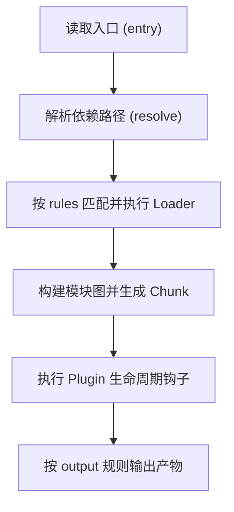

> [!IMPORTANT]
> 浏览器原生只能直接理解和运行 HTML + CSS + JavaScript，但现代前端开发中会遇到以下几个非常现实的痛点
> 1. 代码被拆分成很多模块/文件后，浏览器本身并不会处理复杂的依赖关系和加载顺序
> 2. 使用高阶语法、新的浏览器 API 时需要让旧浏览器也能正常运行
> 3. 各种静态资源（图片、字体、图标、less/sass 等）需要被合理组织、管理、优化
> 4. 开发环境、生产环境、测试环境需要不同的构建行为、资源处理方式和优化策略

Webpack 的核心价值就在于它把在开发过程中 =="分散的、面向开发者的各种资源通过一套配置和插件体系，有组织地处理、转换、打包、优化，最终产出浏览器能够高效理解和加载的“生产级运行产物"==


## 核心概念

::: table title="核心概念与配置映射" full-width
| 概念 | 解决的问题 | 对应配置 |
| --- | --- | --- |
| `entry` | 从哪里开始构建依赖图 | `entry` |
| `output` | 产物输出到哪里、叫什么 | `output.path` / `output.filename` |
| `loader` | 非 JS 或高阶语法如何转换 | `module.rules` |
| `plugin` | 如何扩展编译生命周期能力 | `plugins` |
| `mode` | 当前构建目标是开发还是生产 | `mode` |
| `resolve` | 模块路径如何解析 | `resolve.alias` / `resolve.extensions` |
| `optimization` | 如何做拆包、压缩、摇树 | `optimization.*` |
:::

### 输入与输出

Webpack 中最基础、最核心的三个字段 -- `entry`、`output`、`context` 本质上就一个表明 "从哪来到哪去" 的过程

如果把 Webpack 看成一条流水线的话，那么 `entry` 就是原料入口，`output` 是成品出口，而 `context` 是整条流水线默认工作的基准目录

#### entry

`entry` 用来声明 "依赖图从哪里开始构建"，通常用一个字符串作为入口；在**多页面或多应用壳项目中**，也会采用对象形式，并通过 `dependOn` 抽离共享依赖

> [!NOTE]
> 多入口时 `output.filename` 必须带 `[name]`，否则产物会互相覆盖

:::code-tabs
@tab single-entry.cjs
```cjs
module.expores = {
  entry: './src/app.js'
}
```

@tab multi-entries.cjs
```cjs
module.exports = {
  entry: {
    app: {
      import: './src/app.js',
      dependOn: 'shared',
    },
    admin: {
      import: './src/admin.js',
      dependOn: 'shared',
    },
    shared: ['axios'],
  },
};
```
:::

#### output

`output` 用来决定 "构建结果写到哪里、叫什么名字、资源如何被引用"，因此它需要以一个对象的形式进行配置。==它将会直接影响部署和缓存策略==

> [!IMPORTANT]
> - `path` 必须是绝对路径
> - 生产环境优先 `contenthash`，提升浏览器缓存命中率
> - `publicPath` 要和真实部署路径一致，否则容易出现静态资源 404

::: table
| 字段 | 作用 | 常见配置建议 |
| --- | --- | --- |
| `path` | 指定打包产物输出目录 | 必须是绝对路径，通常用 `path.resolve` |
| `filename` | 入口 chunk 的文件名规则 | 生产环境建议用 `[name].[contenthash:8].js` |
| `chunkFilename` | 异步 chunk（懒加载）的文件名规则 | 建议与 `filename` 保持同类命名策略 |
| `assetModuleFilename` | Asset Modules（图片/字体等）默认命名规则 | 建议统一到 `assets/` 目录，便于部署和缓存 |
| `publicPath` | 运行时资源加载前缀 | 子路径部署或 CDN 场景必须显式配置 |
| `clean` | 每次构建前清空输出目录 | 建议开启，避免历史无效产物残留 |
:::

:::code-tabs
@tab webpack.config.js
```js
const path = require('node:path');

module.exports = {
  output: {
    path: path.resolve(__dirname, 'dist'),
    filename: 'js/[name].[contenthash:8].js',
    chunkFilename: 'js/[name].[contenthash:8].chunk.js',
    assetModuleFilename: 'assets/[name].[contenthash:8][ext]',
    publicPath: '/',
    clean: true,
  },
};
```
:::

#### context

`context` 是 Webpack 解析入口和 loader 的 "基准目录"

如果已经在配置里全部使用了明确绝对路径，那么 `context` 不是必需项；但在多配置、多子目录场景里，显式声明会更清晰

```js
const path = require('node:path');

module.exports = {
  context: path.resolve(__dirname),
  entry: './src/main.js', // 基于 context 解析
};
```

### 模块处理

当输入和输出边界确定后，下一步就是 "模块的被识别与转换"，这一层决定了 Webpack 能否正确理解代码与资源，包括路径解析规则、Loader 处理链路，以及哪些依赖需要被排除在打包之外

#### resolve

`resolve` 负责模块路径解析策略。目的是让同一份代码在不同机器或成员环境中能够保持一致的解析结果

::: table full-width
| 字段 | 作用 | 常见配置建议 |
| --- | --- | --- |
| `extensions` | 自动补全可解析后缀 | 只保留必要后缀，避免解析开销过大 |
| `alias` | 配置路径别名 | 统一 `@` 指向 `src`，减少相对路径层级 |
| `modules` | 指定模块查找目录顺序 | 常见为 `[src, 'node_modules']` |
| `mainFields` | 指定优先读取包入口字段 | 前端常见 `['browser', 'module', 'main']` |
| `fallback` | 为 Node 内置模块提供浏览器兜底 | 仅在确有兼容需求时按需配置 |
| `symlinks` | 是否解析软链接到真实路径 | Monorepo 场景可按实际链路调整 |
:::

```js
const path = require('node:path');

module.exports = {
  resolve: {
    extensions: ['.js', '.ts', '.json'],
    alias: {
      '@': path.resolve(__dirname, 'src'),
    },
    modules: [path.resolve(__dirname, 'src'), 'node_modules'],
    mainFields: ['browser', 'module', 'main'],
  },
};
```

#### module

`module.rules` 用于定义 "什么文件交给什么 loader 处理"。是 Webpack 处理非原生资源的核心配置

:::details 不常用配置
在 Webpack 5 中，`module` 常见扩展字段还有：

- `noParse`：指定某些库不做依赖解析，减少构建开销（适合稳定的、无依赖变化的大库）
- `parser`：控制模块解析行为（如 `javascript` 下是否处理某些语法特性）
- `generator`：控制资源模块（asset）输出行为（如文件名、`publicPath`）
- `defaultRules`：覆盖或扩展 Webpack 内置默认规则
- `unsafeCache`：启用/调整模块解析缓存策略（偏性能调优场景）

:::

:::code-tabs
@tab webpack.config.js
```js
module.exports = {
  module: {
    rules: [
      {
        oneOf: [
          {
            test: /\.m?jsx?$/,
            exclude: /node_modules/,
            use: 'babel-loader',
          },
          {
            test: /\.s?css$/,
            use: ['style-loader', 'css-loader', 'sass-loader'],
          },
          {
            test: /\.(png|jpe?g|gif|svg)$/i,
            type: 'asset',
            parser: {
              dataUrlCondition: { maxSize: 8 * 1024 },
            },
          },
        ],
      },
    ],
  },
};
```
:::

更多内容在 <a href="./5.loader.md"> Loader </a>中说明

#### externals

`externals` 用于声明 =="不参与打包，运行时从外部获取"== 的依赖。它通常用于 CDN、宿主环境注入或微前端共享依赖场景

> [!NOTE]
> - dev 阶段依赖 CDN 容易受网络影响，影响联调稳定性，因此只建议在 prod 才开启此选项

> [!IMPORTANT]
>   1. 该配置这能减少打包体积，但要确保 HTML 或宿主环境已经提前注入对应全局变量，否则运行时会报 `xxx is not defined`
> 2. 代码中仍然正常 `import`，`externals` 只影响 "是否打进 bundle"，不影响源码写法
> 3. 生产环境可给 CDN `<script>` 增加 `integrity` + `crossorigin`，提升安全性


:::code-tabs
@tab webpack.config.js
```js
const HtmlWebpackPlugin = require('html-webpack-plugin');

const isProd = process.env.NODE_ENV === 'production';

module.exports = {
  // external 变量从 window 上读取
  externalsType: 'window',
  // 用函数式写法显式覆盖子路径/变体包
  externals: isProd
    ? [
        ({ request }, callback) => {
          /**
           * callback 是 Node 回调风格
           * 第一参数通常表示 Error 如果为 null 
           * 表明若这个请求处理成功了，直接把它映射到第二个参数
           */

          if (request === 'react') return callback(null, 'React');
          if (request === 'react-dom') return callback(null, 'ReactDOM');
          if (request === 'axios') return callback(null, 'axios');

          // 子路径包：必须单独映射
          if (request === 'react/jsx-runtime') {
            return callback(null, '__APP_JSX_RUNTIME__');
          }

          // 变体包：lodash-es 及其子路径都映射到全局 _
          if (/^lodash-es(\/.+)?$/.test(request)) {
            return callback(null, '_');
          }

          // 其他依赖继续按正常方式打包
          return callback();
        },
      ]
    : undefined,
  plugins: [
    new HtmlWebpackPlugin({
      template: './public/index.html',
      templateParameters: { isProd },
    }),
  ],
};
```

@tab index.html
```html
<html lang="zh-CN">
  <head>
    <meta charset="UTF-8" />
    <title>App</title>

    <% if (htmlWebpackPlugin.options.templateParameters.isProd) { %>
    <script>
      // 加载 CDN，失败时回退本地文件；两者都失败则提示错误
      function loadScriptWithFallback(cdnSrc, localSrc, testFn, name) {
        return new Promise((resolve, reject) => {
          const cdn = document.createElement('script');
          cdn.src = cdnSrc;
          cdn.defer = true;
          cdn.onload = () => (testFn() ? resolve() : reject(new Error(name + ' global missing')));
          cdn.onerror = () => {
            const local = document.createElement('script');
            local.src = localSrc;
            local.defer = true;
            local.onload = () => (testFn() ? resolve() : reject(new Error(name + ' fallback global missing')));
            local.onerror = () => reject(new Error(name + ' fallback load failed'));
            document.head.appendChild(local);
          };
          document.head.appendChild(cdn);
        });
      }

      function showExternalError(message) {
        const el = document.getElementById('external-error');
        if (!el) return;
        el.hidden = false;
        el.textContent = message;
      }

      // 注意顺序：React -> ReactDOM -> Lodash -> Axios
      loadScriptWithFallback(
        'https://cdn.jsdelivr.net/npm/react@18/umd/react.production.min.js',
        '/vendor/react.production.min.js',
        () => !!window.React,
        'React'
      )
        .then(() =>
          loadScriptWithFallback(
            'https://cdn.jsdelivr.net/npm/react-dom@18/umd/react-dom.production.min.js',
            '/vendor/react-dom.production.min.js',
            () => !!window.ReactDOM,
            'ReactDOM'
          )
        )
        .then(() =>
          loadScriptWithFallback(
            'https://cdn.jsdelivr.net/npm/lodash@4/lodash.min.js',
            '/vendor/lodash.min.js',
            () => !!window._,
            'Lodash'
          )
        )
        .then(() =>
          loadScriptWithFallback(
            'https://cdn.jsdelivr.net/npm/axios/dist/axios.min.js',
            '/vendor/axios.min.js',
            () => !!window.axios,
            'Axios'
          )
        )
        .then(() => {
          // 给 react/jsx-runtime 提供全局映射（供 externals 引用）
          window.__APP_JSX_RUNTIME__ = {
            Fragment: window.React.Fragment,
            jsx(type, props, key) {
              return window.React.createElement(type, { ...props, key });
            },
            jsxs(type, props, key) {
              return window.React.createElement(type, { ...props, key });
            },
          };
        })
        .catch((error) => {
          console.error(error);
          showExternalError('关键外部依赖加载失败，请稍后重试或联系管理员。');
        });
    </script>
    <% } %>
  </head>
  <body>
    <div
      id="external-error"
      hidden
      style="padding: 12px; margin: 12px; border: 1px solid #fecaca; background: #fff1f2; color: #991b1b;"
    ></div>
    <div id="app"></div>
  </body>
</html>

```

@tab index.js
```js
// 业务代码照常导入
import axios from 'axios';
import React from 'react';
import { jsx as _jsx } from 'react/jsx-runtime';
import { debounce } from 'lodash-es';

axios.get('/api/user');

const fn = debounce(() => console.log('debounced'), 200);
fn();

const vnode = _jsx('div', { children: 'hello externals' });
console.log(React, vnode);
```
:::

### 后处理

这一层配置关注的是 "如何让产物更适合目标环境、更小、更稳、更易缓存"，通常和生产可用性、性能表现直接相关

#### target

`target` 用于决定生成产物的运行环境

```js
module.exports = {
  target: 'web', // 常见值：web / node / electron-renderer
};
```

#### mode

`mode` 是环境总开关，用于声明开发环境与生产环境

```js
module.exports = (env, argv) => {
  const isProd = argv.mode === 'production';

  return {
    mode: isProd ? 'production' : 'development',
    devtool: isProd 
      ? 'hidden-source-map' 
      : 'eval-cheap-module-source-map',
  };
};
```

#### optimization

`optimization` 负责产物层面的后处理：拆包、压缩、运行时代码抽离、模块/Chunk id 稳定化等

```js
const TerserPlugin = require('terser-webpack-plugin');
const CssMinimizerPlugin = require('css-minimizer-webpack-plugin');

module.exports = {
  optimization: {
    splitChunks: { chunks: 'all' },
    runtimeChunk: 'single',
    moduleIds: 'deterministic',
    chunkIds: 'deterministic',
    usedExports: true,
    minimize: true,
    minimizer: [new TerserPlugin(), new CssMinimizerPlugin()],
  },
};
```

## 编译流程


