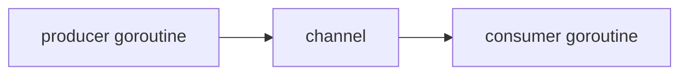

> [!IMPORTANT]
> Go 并发设计背后的思想不是“先上线程，再加锁”，而是更接近 CSP：==通过通信来组织并发，而不是通过共享内存来组织并发==。

## 什么是 CSP

CSP 是 `Communicating Sequential Processes` 的缩写，通常翻译为“通信顺序进程”。

它的核心思想是：

- 系统由多个独立执行单元组成
- 每个执行单元各自顺序执行
- 执行单元之间通过通信协作

在 Go 里，这种思想的映射非常直接：

:::table title="CSP 在 Go 里的映射" full-width
| CSP 概念 | Go 中的对应物 |
| --- | --- |
| Process | goroutine |
| Communication | channel |
| Coordination | select / context / channel 组合 |
:::

所以 Go 并发不是单纯“支持 goroutine”，而是整套语言工具都在围绕 CSP 思路设计。

## Go 为什么强调 CSP

Go 官方最经典的一句话是：

> Do not communicate by sharing memory; instead, share memory by communicating.

意思是：

==不要通过共享内存来通信，而应该通过通信来共享内存。==

这句话不是说锁不能用，而是在提醒你：

- 如果多个 goroutine 的协作本质是“任务流转”和“数据传递”
- 那么 channel 往往比共享变量 + 锁更自然

## 一个直观对比

### 共享内存思路

```go
var (
    mu sync.Mutex
    queue []int
)

func producer(v int) {
    mu.Lock()
    queue = append(queue, v)
    mu.Unlock()
}
```

这里的重点是：

- 共享状态 `queue`
- 谁读谁写都要小心加锁

### CSP 思路

```go
func producer(out chan<- int) {
    out <- 1
}

func consumer(in <-chan int) {
    v := <-in
    fmt.Println(v)
}
```

这里的重点是：

- 数据不放在共享结构里竞争
- 直接沿着 channel 流动



## CSP 的核心收益

:::table title="CSP 风格的收益" full-width
| 收益 | 说明 |
| --- | --- |
| 降低共享状态竞争 | 更少直接共享数据 |
| 代码语义更像数据流 | 谁生产、谁消费、谁退出更清晰 |
| 更容易表达流水线和任务分发 | channel 天然适合 |
| 配合 `select` 更易控制超时与取消 | 组合能力强 |
:::

### 让并发结构更接近业务结构

如果业务本身就是：

- 生产任务
- 分发任务
- 聚合结果

那么 channel 写出来的代码，常常和业务图本身是一致的。

### 把“同步”嵌进通信里

channel 不只是传值，它还顺带表达：

- 谁在等谁
- 谁准备好了
- 谁什么时候结束

这比“到处共享变量 + 手动加锁 + 手动协调时序”更自然。

## 但 CSP 不是“不要锁”

这也是很常见的误解。

:::warning
CSP 强调的是优先思路，不是绝对禁令。  
当问题本质上是“保护共享状态”时，锁往往比 channel 更直接。
:::

例如：

- 一个共享 map 的并发读写保护
- 一个计数器的高频更新
- 一个缓存对象的状态一致性维护

这类问题本质上是共享内存同步问题，锁可能比 channel 更合适。

## channel 适合什么，锁适合什么

:::table title="CSP 风格与锁风格的选择" full-width
| 场景 | 更推荐 |
| --- | --- |
| 任务传递、结果回传 | channel |
| 生产者-消费者 | channel |
| pipeline / fan-out / fan-in | channel |
| 共享对象并发读写保护 | Mutex / RWMutex |
| 高频原子计数 | atomic |
| 少量共享状态的简单临界区 | Mutex |
:::

## Go 的 CSP 风格一般怎么落地

在真实代码里，常见组合是：

::::steps

1. 用 goroutine 拆出独立执行单元
2. 用 channel 传递任务、结果、结束信号
3. 用 `select` 同时等待多个事件
4. 用 `context` 把取消和超时贯穿调用链

::::

这几者一起才构成 Go 的并发表达能力。

## 一个典型的 CSP 风格例子

```go
package main

import "fmt"

func producer(out chan<- int) {
    defer close(out)
    for i := 1; i <= 3; i++ {
        out <- i
    }
}

func consumer(in <-chan int) {
    for v := range in {
        fmt.Println("consume:", v)
    }
}

func main() {
    ch := make(chan int)
    go producer(ch)
    consumer(ch)
}
```

这里的业务流就是：

- producer 顺序产生数据
- 数据通过 channel 流向 consumer
- producer 结束后关闭 channel
- consumer 通过 `range` 自然结束

## CSP 的边界

再强调一次，CSP 很强，但不是万能。

::::details 什么时候不要强行 CSP 化
- 只是一个很简单的共享字段保护
- 用 channel 会让逻辑拐很多弯
- 为了“政治正确”把简单的互斥问题改得很难读
- 任务本身并不是流式通信模型
::::

好的 Go 代码不是“绝不加锁”，而是：

- 数据流问题用通信表达
- 共享状态问题用同步原语表达

## 总结

CSP 在 Go 里的价值可以总结成四点：

- 它是 Go 并发设计的思想底座
- goroutine + channel 是 CSP 在 Go 里的直接映射
- 它鼓励通过通信来组织协作，而不是让大量 goroutine 争抢共享内存
- 但它不是排斥锁，而是帮助你先判断问题本质到底是“通信”还是“共享状态”
