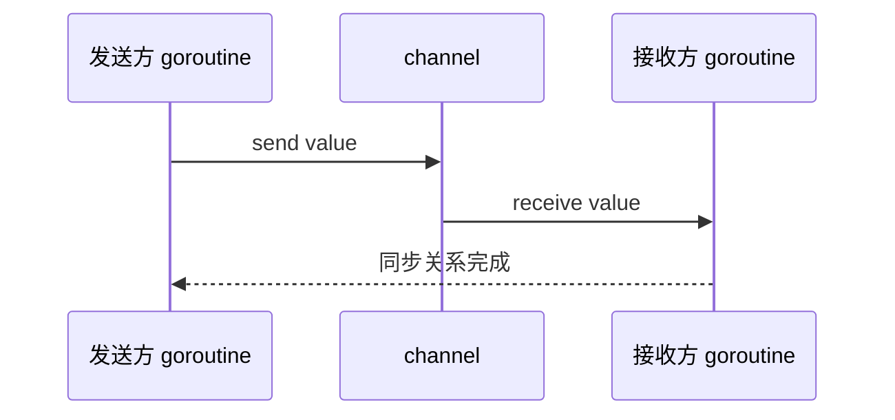
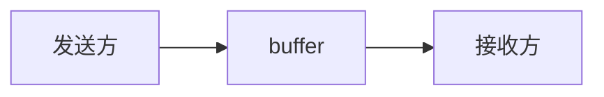

> [!IMPORTANT]
> channel 是 Go 并发模型里最核心的通信原语。它的价值不只是“传数据”，更重要的是 ==在传递数据的同时建立同步关系==。

## 什么是 channel

channel 可以理解为 ==goroutine 之间通信的管道==。

```go
ch := make(chan int)
```

上面这行代码表示：

- 创建一个元素类型为 `int` 的 channel
- 它既可以写入 `int`
- 也可以从中读取 `int`

最基本的发送和接收：

```go
ch <- 10   // 发送
v := <-ch  // 接收
```

## channel 解决的到底是什么问题

如果多个 goroutine 之间需要协作，通常会遇到两个问题：

1. 数据怎么传过去
2. 双方如何知道“什么时候可以继续执行”

channel 一次性把这两件事都解决了。



所以 channel 不是普通“队列”的简单替代，它还携带同步语义。

## 无缓冲 channel

无缓冲 channel 要求发送和接收同时就绪，才能完成传递。

```go
package main

import "fmt"

func main() {
    ch := make(chan string)

    go func() {
        ch <- "hello"
    }()

    msg := <-ch
    fmt.Println(msg)
}
```

对于无缓冲 channel：

- 发送方准备好，但接收方没准备好，发送会阻塞
- 接收方准备好，但发送方没准备好，接收会阻塞

:::card title="一句话理解无缓冲 channel" icon="mdi:swap-horizontal"
无缓冲 channel 更像一次“面对面交接”。
:::

## 有缓冲 channel

有缓冲 channel 可以在缓冲区未满时先发送，在缓冲区非空时先接收。

```go
package main

import "fmt"

func main() {
    ch := make(chan int, 2)

    ch <- 1
    ch <- 2

    fmt.Println(<-ch)
    fmt.Println(<-ch)
}
```

这里的 `2` 表示缓冲区容量。

### 有缓冲 channel 的行为

:::table title="有缓冲 channel 的阻塞规则" full-width
| 操作 | 条件 | 是否阻塞 |
| --- | --- | --- |
| 发送 | 缓冲区未满 | 不阻塞 |
| 发送 | 缓冲区已满 | 阻塞 |
| 接收 | 缓冲区非空 | 不阻塞 |
| 接收 | 缓冲区为空 | 阻塞 |
:::



:::tip
无缓冲 channel 更强调“同步”，有缓冲 channel 更强调“解耦 + 削峰”。
:::

## channel 的声明方式

### 普通双向 channel

```go
ch := make(chan int)
```

可读可写。

### 只读 channel

```go
var recvOnly <-chan int
```

只能接收，不能发送。

### 只写 channel

```go
var sendOnly chan<- int
```

只能发送，不能接收。

方向限制常用于函数参数，让 API 语义更清晰。

```go
func producer(out chan<- int) {
    out <- 1
}

func consumer(in <-chan int) {
    fmt.Println(<-in)
}
```

## 关闭 channel

`close(ch)` 的含义是：

- 告诉接收方“后面不会再有新数据了”
- 不是“销毁 channel 对象”

```go
package main

import "fmt"

func main() {
    ch := make(chan int, 2)
    ch <- 1
    ch <- 2
    close(ch)

    for v := range ch {
        fmt.Println(v)
    }
}
```

### 关闭后的行为

:::table title="close 后的规则" full-width
| 操作 | 结果 |
| --- | --- |
| 从已关闭 channel 接收 | 还能继续收到剩余数据 |
| 已关闭且数据已读空，再接收 | 立即返回零值 |
| 向已关闭 channel 发送 | `panic` |
| 重复关闭同一个 channel | `panic` |
:::

接收时也可以用第二个返回值判断：

```go
v, ok := <-ch
```

- `ok == true`：读到了有效值
- `ok == false`：channel 已关闭且没有剩余数据

:::warning
一般遵循“谁发送，谁关闭”的原则。  
接收方通常不应该主动关闭一个自己不拥有发送权的 channel。
:::

## nil channel 的行为

零值 channel 是 `nil`：

```go
var ch chan int
```

它的行为很特殊：

- 向 `nil channel` 发送：永久阻塞
- 从 `nil channel` 接收：永久阻塞
- 关闭 `nil channel`：`panic`

这个特性在 `select` 里非常有用，因为可以用 `nil` 动态禁用某个分支。

## 常见使用场景

### 结果回传

```go
func sum(a, b int, out chan<- int) {
    out <- a + b
}
```

### 通知完成

```go
done := make(chan struct{})

go func() {
    // do something
    close(done)
}()

<-done
```

这里用 `struct{}` 是因为它不占实际数据空间，适合只表示“事件发生了”。

### 任务队列

```go
jobs := make(chan int, 100)
```

可用于生产者-消费者模型。

## `for range channel`

如果发送方会在结束时关闭 channel，那么接收方可以非常自然地写成：

```go
for v := range ch {
    fmt.Println(v)
}
```

当 channel 被关闭且数据被读完后，循环自动结束。

::::details 为什么 `range ch` 很常用
因为它天然表达了：

- 持续消费
- 直到对方明确告诉我“没有更多数据”

这比自己手写 `for { v, ok := <-ch ... }` 更简洁。
::::

## 常见错误

### 无人接收导致发送阻塞

```go
ch := make(chan int)
ch <- 1 // 死锁
```

因为没有接收方。

### 无人发送导致接收阻塞

```go
ch := make(chan int)
fmt.Println(<-ch) // 死锁
```

### 忘记关闭导致 `range` 永不结束

```go
for v := range ch {
    fmt.Println(v)
}
```

如果发送方永远不关闭，接收方会一直等。

### 多个发送方竞争关闭

多个 goroutine 都试图 `close(ch)` 时，几乎一定会出错。

## 什么时候用 channel，什么时候用锁

:::table title="channel 和锁的选择" full-width
| 场景 | 更适合的工具 |
| --- | --- |
| goroutine 之间传数据、串联任务流 | `channel` |
| 共享状态读写保护 | `Mutex` / `RWMutex` |
| 表达事件完成、取消、超时 | `channel` / `context` |
| 高频共享计数、状态更新 | 锁或原子操作通常更直接 |
:::

不要机械地认为“Go 一律用 channel 不用锁”。  
正确理解是：==数据流协作用 channel，共享内存保护用锁。==

## 总结

channel 的核心要点有五个：

- 它是 goroutine 之间通信和同步的管道
- 无缓冲强调同步交接，有缓冲强调解耦和削峰
- `close` 表示“不会再发送新值”，不是销毁
- `range` 和 `v, ok := <-ch` 是读取关闭 channel 的常用方式
- 用对了 channel 会让并发逻辑很清晰，用错了就很容易阻塞和死锁
