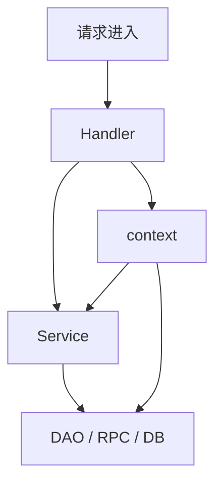
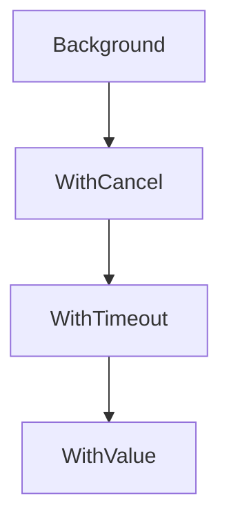

> [!IMPORTANT]
> `context` 不是“万能参数包”，它的核心职责只有三类：==取消传播、超时控制、请求范围内的上下文数据传递==。真实项目里，`context` 主要解决的是“这一整条调用链什么时候该停”。

## 为什么需要 context

想象一个请求要经过：

- HTTP Handler
- Service
- DAO
- 下游 RPC / 数据库

如果用户断开连接，或者请求已经超时，后面的 goroutine 和 I/O 其实都应该尽快停掉。  
否则就会出现：

- 无意义的资源消耗
- goroutine 泄漏
- 后台任务继续跑但结果再也没人关心

这就是 `context` 要解决的问题。



## context 是什么

`context.Context` 是一个接口，通常用来在调用链中传递：

:::table title="context 三大职责" full-width
| 能力 | 说明 |
| --- | --- |
| 取消 | 主动取消整条调用链 |
| 超时 / 截止时间 | 到时间自动取消 |
| 值传递 | 请求范围内的元数据传递 |
:::

它不是拿来做的事情：

- 不是可选参数容器
- 不是全局状态仓库
- 不是业务字段大杂烩

## context 的来源

### `context.Background()`

通常作为根上下文使用。

```go
ctx := context.Background()
```

### `context.TODO()`

表示“这里以后也应该传 context，但当前还没确定用哪个”。

```go
ctx := context.TODO()
```

:::note
`TODO()` 不是正式业务逻辑的长期方案，它更多是开发阶段的占位符。
:::

## 最常用的四种派生方式

### `WithCancel`

手动取消。

```go
ctx, cancel := context.WithCancel(context.Background())
defer cancel()
```

### `WithTimeout`

超时自动取消。

```go
ctx, cancel := context.WithTimeout(context.Background(), 2*time.Second)
defer cancel()
```

### `WithDeadline`

到某个确定时间点取消。

```go
ctx, cancel := context.WithDeadline(context.Background(), time.Now().Add(2*time.Second))
defer cancel()
```

### `WithValue`

携带请求级数据。

```go
ctx := context.WithValue(context.Background(), traceKey{}, "trace-123")
```

## context 取消是怎么传播的

`context` 是树状结构，子 context 会继承父 context 的取消信号。



传播规则：

- 父 context 被取消，子 context 全部一起取消
- 子 context 被取消，不影响父 context

:::card title="关键理解" icon="mdi:source-branch"
context 的取消是“从上往下传”的，不是双向同步。
:::

## 最常见的使用方式

### 在 goroutine 中监听取消

```go
package main

import (
    "context"
    "fmt"
    "time"
)

func worker(ctx context.Context) {
    for {
        select {
        case <-ctx.Done():
            fmt.Println("worker stop:", ctx.Err())
            return
        default:
            fmt.Println("working...")
            time.Sleep(300 * time.Millisecond)
        }
    }
}

func main() {
    ctx, cancel := context.WithTimeout(context.Background(), time.Second)
    defer cancel()

    go worker(ctx)

    time.Sleep(2 * time.Second)
}
```

这里的关键是：

- `ctx.Done()` 返回一个只读 channel
- 一旦取消或超时，这个 channel 会被关闭
- goroutine 就可以感知退出

### 在函数调用链中层层传递

```go
func handler(ctx context.Context) error {
    return service(ctx)
}

func service(ctx context.Context) error {
    return repository(ctx)
}
```

这也是 Go 里很经典的函数签名风格。

## `ctx.Done()`、`ctx.Err()`、`Deadline()`

:::table title="context 常用方法" full-width
| 方法 | 作用 |
| --- | --- |
| `Done()` | 返回一个在取消时关闭的 channel |
| `Err()` | 返回取消原因，如 `context.Canceled`、`context.DeadlineExceeded` |
| `Deadline()` | 返回截止时间及是否存在截止时间 |
| `Value(key)` | 读取上下文中的值 |
:::

一个典型判断：

```go
select {
case <-ctx.Done():
    return ctx.Err()
case msg := <-ch:
    _ = msg
}
```

## `WithValue` 应该怎么用

这是 `context` 最容易被滥用的地方。

适合放进去的值：

- trace id
- request id
- 鉴权后的用户标识
- 与整条请求链都有关的小型元数据

不适合放进去的值：

- 大对象
- 可选业务参数
- 数据库连接、日志器、配置对象等依赖注入内容

:::warning
不要把 `context` 当成“万能 map”来塞业务字段。  
它的值传递能力应该只服务于请求边界上的元数据传播。
:::

### key 的推荐写法

为了避免 key 冲突，通常不直接用裸字符串，而是自定义类型：

```go
type traceKey struct{}

ctx := context.WithValue(context.Background(), traceKey{}, "trace-123")
```

## 使用规范

Go 社区里对 `context` 的使用有比较稳定的约定：

::::table title="context 使用约定" full-width
| 约定 | 说明 |
| --- | --- |
| 作为函数第一个参数 | `func Do(ctx context.Context, ...)` |
| 不要存进结构体长期持有 | 避免语义混乱和生命周期失控 |
| 调用 `WithCancel/Timeout/Deadline` 后要记得 `cancel()` | 及时释放资源 |
| 不要传 `nil context` | 不确定时用 `context.Background()` |
| 不要把业务参数塞进 `WithValue` | 保持上下文职责单一 |
::::

## 典型业务场景

### HTTP 请求超时

收到请求时派生超时 context，超过时间就取消后续查询。

### 批量 goroutine 统一收口

多个 worker 共享一个 `ctx`，一旦上层取消，全部一起停。

### 数据库 / RPC 调用链透传

把同一个 `ctx` 继续往下传，让整个调用链共享同一份取消信号和 trace 信息。

## 常见误区

:::warning
1. `context` 不是并发安全问题的替代品，它不能代替锁。
2. `context` 不负责等待 goroutine 结束，它只负责发出取消信号。
3. `cancel()` 不只是“礼貌调用”，很多时候它还负责释放计时器等资源。
4. `WithValue` 不是参数包，滥用会让代码难读且难维护。
:::

### 只传 context，不监听 context

这是表面上“用了 context”，实际上没用上：

```go
func worker(ctx context.Context) {
    for {
        doHeavyWork()
    }
}
```

如果函数内部不检查 `ctx.Done()`，取消信号根本起不到作用。

### cancel 了，但 goroutine 还没停

`cancel()` 只是发信号，不会强行杀 goroutine。  
goroutine 必须自己在合适位置检查并退出。

## 总结

`context` 的本质是调用链生命周期控制器：

- 上层可以统一发出取消或超时信号
- 下层通过 `Done()` 感知并尽快退出
- `WithValue` 只用来传递请求级元数据
- 它通常和 `goroutine`、`select`、`channel` 一起使用
