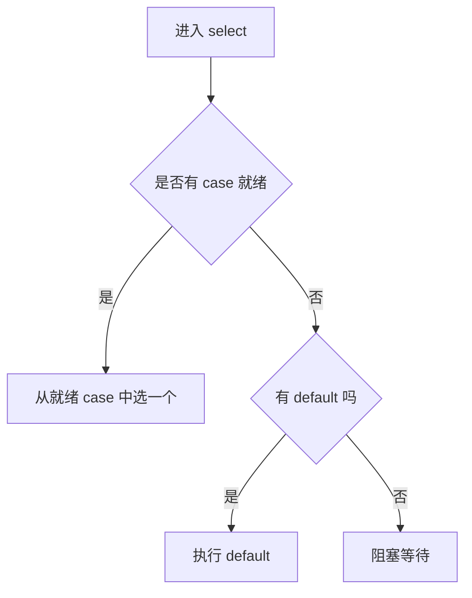
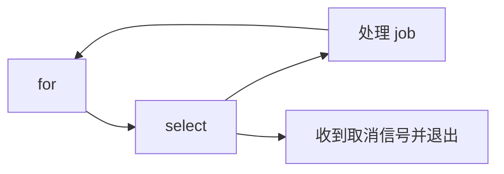

> [!IMPORTANT]
> `select` 是 Go 用来处理“多个 channel 操作竞争就绪”的语法。它让 goroutine 能同时等待多个通信事件，是 Go 并发控制里非常关键的多路复用工具。

## 什么是 select

`select` 的作用是：

- 同时监听多个 channel 操作
- 哪个先就绪，就执行哪个分支
- 如果都没准备好，可以阻塞等待，也可以走 `default`

```go
select {
case v := <-ch1:
    fmt.Println("from ch1:", v)
case v := <-ch2:
    fmt.Println("from ch2:", v)
default:
    fmt.Println("no channel ready")
}
```

## select 和 switch 的区别

语法上它像 `switch`，但语义完全不一样。

:::table title="select vs switch" full-width
| 对比项 | `select` | `switch` |
| --- | --- | --- |
| 判断对象 | channel 通信操作 | 普通表达式 |
| 执行条件 | 分支对应的通信已就绪 | case 条件匹配 |
| 无就绪分支时 | 阻塞或走 `default` | 直接找 `default` |
| 典型用途 | 并发控制、超时、取消 | 分支判断 |
:::

## select 的执行规则

`select` 的核心规则可以概括为：

::::steps

1. 检查所有 `case` 中的 channel 操作
2. 如果有一个或多个已经就绪
3. 从已就绪的分支中选择一个执行
4. 如果没有任何分支就绪：
   - 有 `default`：立即执行 `default`
   - 没有 `default`：阻塞等待

::::



:::note
当多个 case 同时就绪时，Go 会从中选一个执行。你不能依赖某个固定优先级顺序。
:::

## 最常见的四种用法

### 监听多个 channel

```go
select {
case msg := <-msgCh:
    fmt.Println("message:", msg)
case err := <-errCh:
    fmt.Println("error:", err)
}
```

### 非阻塞尝试

```go
select {
case v := <-ch:
    fmt.Println("recv:", v)
default:
    fmt.Println("channel not ready")
}
```

加了 `default` 之后，`select` 就不会阻塞。

### 超时控制

```go
select {
case v := <-resultCh:
    fmt.Println("result:", v)
case <-time.After(2 * time.Second):
    fmt.Println("timeout")
}
```

### 取消控制

```go
select {
case <-ctx.Done():
    fmt.Println("cancel:", ctx.Err())
case job := <-jobCh:
    fmt.Println("job:", job)
}
```

## `time.After` 和超时模式

超时是 `select` 的标配场景。

```go
package main

import (
    "fmt"
    "time"
)

func main() {
    ch := make(chan int)

    select {
    case v := <-ch:
        fmt.Println(v)
    case <-time.After(1 * time.Second):
        fmt.Println("timeout")
    }
}
```

这里 `time.After` 会在指定时间后返回一个可读 channel。  
一旦超时分支先就绪，就会直接结束等待。

:::tip
业务代码里如果已经有 `context.Context`，通常更推荐统一使用 `ctx.Done()` 管理超时和取消，而不是在每层都散落 `time.After`。
:::

## `select` + `for`：事件循环

`select` 经常会和 `for` 配合，形成一个持续处理消息的循环。

```go
for {
    select {
    case job := <-jobCh:
        fmt.Println("job:", job)
    case <-ctx.Done():
        return
    }
}
```

这是 Go 里非常典型的事件循环写法。



## 关闭 channel 时的 select 行为

如果某个 channel 已关闭：

- 对它的接收操作会立刻就绪
- 所以对应 `case <-ch` 往往会持续命中

例如：

```go
select {
case v, ok := <-ch:
    if !ok {
        fmt.Println("channel closed")
    } else {
        fmt.Println(v)
    }
}
```

如果你已经知道一个 channel 不该再参与后续选择，常见做法是把它置为 `nil`：

```go
if !ok {
    ch = nil
}
```

因为：

- 已关闭 channel 的接收总是可立即返回
- `nil channel` 的收发永远阻塞

这个技巧可以用来“禁用一个 select 分支”。

## nil channel 在 select 里的价值

这算是 `select` 最实用的技巧之一。

```go
var ch1 <-chan int
var ch2 <-chan int = realCh

select {
case v := <-ch1:
    fmt.Println(v) // 永远不会走到
case v := <-ch2:
    fmt.Println(v)
}
```

因为 `ch1` 是 `nil`，它的接收操作永远不会就绪。  
这可以动态控制某个分支是否参与竞争。

## 常见场景

:::table title="select 的典型应用" full-width
| 场景 | 写法思路 |
| --- | --- |
| 超时处理 | `case <-time.After(...)` |
| 取消传播 | `case <-ctx.Done()` |
| 多个结果源竞争 | 同时监听多个 channel |
| 非阻塞读写 | 配合 `default` |
| 事件循环 | `for + select` |
| 动态启停某个分支 | 把 channel 设为 `nil` |
:::

## 常见误区

:::warning
1. `select` 不是轮询语句，它只在当前时刻检查通信是否就绪。
2. 有 `default` 的 `select` 不会阻塞，写进死循环里很容易空转打满 CPU。
3. 多个 case 同时就绪时，不要依赖固定执行顺序。
4. 已关闭 channel 的接收分支会持续就绪，忘记处理很容易形成逻辑 bug。
:::

### `for + select + default` 导致空转

```go
for {
    select {
    case msg := <-ch:
        fmt.Println(msg)
    default:
    }
}
```

如果没有任何消息，这个循环会疯狂执行 `default`，CPU 飙高。

### 把 `select` 当“优先级队列”

如果多个 case 同时就绪，`select` 不保证某个 case 永远先执行。  
需要严格优先级时，应该自己设计调度逻辑，而不是靠 `select` 的顺序。

## 总结

`select` 的本质是多路 channel 等待器：

- 它让一个 goroutine 能同时等待多个通信事件
- 它常用来做超时、取消、非阻塞尝试和事件循环
- 它和 `for`、`channel`、`context` 经常一起出现
- 用得好可以把并发控制写得非常自然，用不好就会出现空转和隐藏 bug
