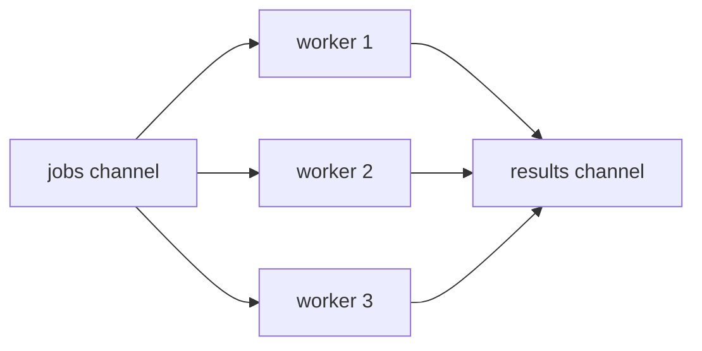
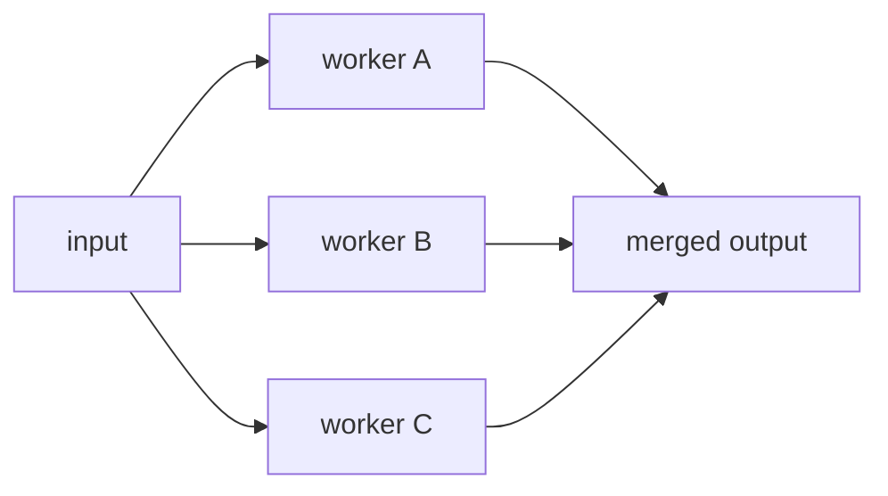
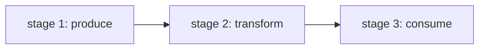

> [!IMPORTANT]
> 学会 goroutine、channel、select 只是入门；真正把 Go 并发写得稳定、可维护，关键在于掌握一批稳定可复用的并发模式。

## 为什么要学“并发模式”

因为真实业务里，很少只是“起一个 goroutine 然后打印一下”。

你更常见到的是：

- 一批任务并行处理
- 一个结果流经过多个处理阶段
- 多个结果源合并到一个出口
- 任务要支持取消、超时、收尾

这些问题如果每次都临时拼接，很容易写出：

- goroutine 泄漏
- channel 关闭混乱
- 结果丢失
- 死锁和阻塞

并发模式的价值，就是把这些常见结构抽象成可复用套路。

## Worker Pool（工作池）

### 适用场景

当你有很多独立任务，但不希望无限制地开 goroutine 时，就适合工作池。

比如：

- 批量处理文件
- 批量请求接口
- 批量消费消息

### 结构图



### 示例

```go
package main

import (
    "fmt"
    "sync"
)

func worker(id int, jobs <-chan int, results chan<- int, wg *sync.WaitGroup) {
    defer wg.Done()
    for job := range jobs {
        fmt.Printf("worker %d handle job %d\n", id, job)
        results <- job * 2
    }
}

func main() {
    jobs := make(chan int, 5)
    results := make(chan int, 5)
    var wg sync.WaitGroup

    for i := 1; i <= 3; i++ {
        wg.Add(1)
        go worker(i, jobs, results, &wg)
    }

    for i := 1; i <= 5; i++ {
        jobs <- i
    }
    close(jobs)

    wg.Wait()
    close(results)

    for r := range results {
        fmt.Println("result:", r)
    }
}
```

### 关键点

- `jobs` 通常由生产方关闭
- worker 通常不关闭 `jobs`
- `results` 一般在所有 worker 都退出后统一关闭

## Fan-out / Fan-in

### Fan-out：一个输入，多个并行处理者

一个输入源被多个 goroutine 并行消费。

### Fan-in：多个输出，合并成一个输出

多个 goroutine 的结果统一汇总到一个 channel。



### 适用场景

- 并发调用多个下游
- 并发处理一批同构任务
- 汇总多个结果源

### 核心关注点

- 谁负责关闭最终输出 channel
- 合并器如何知道“所有输入都结束了”

通常会配合 `WaitGroup` 做收口。

## Pipeline（流水线）

流水线适合“数据分阶段处理”的场景。

例如：

- 读取数据
- 转换数据
- 聚合结果



### 示例

```go
package main

import "fmt"

func gen(nums ...int) <-chan int {
    out := make(chan int)
    go func() {
        defer close(out)
        for _, n := range nums {
            out <- n
        }
    }()
    return out
}

func square(in <-chan int) <-chan int {
    out := make(chan int)
    go func() {
        defer close(out)
        for n := range in {
            out <- n * n
        }
    }()
    return out
}

func main() {
    for v := range square(gen(1, 2, 3, 4)) {
        fmt.Println(v)
    }
}
```

### Pipeline 的优点

- 每个阶段职责单一
- 易于复用与组合
- 非常贴近数据流处理问题

### Pipeline 的风险

如果后续阶段不再消费，但前面的 goroutine 还在继续发送，就很容易泄漏。

所以 pipeline 常常需要：

- `context` 取消
- `done channel`
- 合理关闭输出 channel

## Producer-Consumer（生产者-消费者）

这其实是最基础、最常见的模式之一，本质上就是：

- 生产者往 channel 写任务
- 消费者从 channel 取任务

```go
jobs := make(chan Job, 100)
```

适合：

- 消息处理
- 任务队列
- 日志异步落盘

如果再加上固定数量 worker，它就会演化成 `Worker Pool`。

## Broadcast / Cancellation（广播退出）

有时候你不是要传数据，而是要告诉一批 goroutine：

“别干了，全部退出。”

这类场景通常用：

- `context.Context`
- 关闭 `done channel`

### done channel 示例

```go
done := make(chan struct{})

go func() {
    <-done
    fmt.Println("worker stop")
}()

close(done)
```

关闭 channel 的好处是：

- 所有监听 `<-done` 的 goroutine 都能同时感知

但如果系统里已经有 `context`，更推荐统一用 `context`。

## Semaphore（并发数限制）

有些任务可以并发，但不能无限并发，比如：

- 最多同时请求 10 个下游接口
- 最多同时处理 4 个大文件

这时常见做法是用带缓冲 channel 做信号量。

```go
sem := make(chan struct{}, 3)

for i := 0; i < 10; i++ {
    sem <- struct{}{}
    go func(n int) {
        defer func() { <-sem }()
        fmt.Println("handle", n)
    }(i)
}
```

:::card title="为什么这能限制并发" icon="mdi:traffic-cone"
缓冲区容量等于“许可证”数量。拿到一个位置才允许执行，执行完归还位置。
:::

## Future / Result Channel

有些任务虽然异步执行，但调用方最终还要拿结果，这时可以把结果包装成一个 channel。

```go
func asyncAdd(a, b int) <-chan int {
    out := make(chan int, 1)
    go func() {
        defer close(out)
        out <- a + b
    }()
    return out
}
```

调用方以后再取：

```go
result := <-asyncAdd(1, 2)
```

这是一种很实用的“未来结果”模式。

## 模式选择建议

:::table title="常见并发模式怎么选" full-width
| 问题类型 | 推荐模式 |
| --- | --- |
| 大量独立任务，需要限流并发 | Worker Pool / Semaphore |
| 一份输入，多人并行处理 | Fan-out |
| 多路结果汇总 | Fan-in |
| 分阶段流式处理 | Pipeline |
| 异步任务后续取结果 | Result Channel |
| 统一取消多个 goroutine | context / done channel |
:::

## 设计这些模式时要注意什么

:::warning
1. 先约定 channel 由谁关闭。
2. 明确 goroutine 的退出条件。
3. 明确谁负责等待所有 goroutine 收尾。
4. 如果消费者可能提前退出，生产者必须有取消机制。
5. 不要为了模式而模式化，能简单就简单。
:::

## 总结

常见并发模式的本质，不是背名字，而是识别结构：

- 一对多并发处理：`Worker Pool` / `Fan-out`
- 多对一结果汇总：`Fan-in`
- 多阶段处理：`Pipeline`
- 统一取消：`context`
- 限制并发：`Semaphore`

掌握这些模式后，你会发现很多 Go 并发代码其实都只是这些结构的不同组合。
