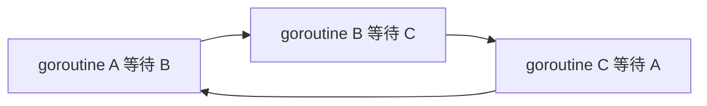

> [!IMPORTANT]
> 死锁的本质不是“程序慢了”，而是并发参与者之间形成了相互等待，而等待条件永远不会被满足。在 Go 里，最常见的死锁来自 channel 误用，其次是锁顺序问题和 goroutine 退出条件缺失。

## 什么是死锁

如果一组 goroutine 都在等待某个事件，而这个事件永远不会发生，就形成了死锁。

最直白的理解是：

:::card title="死锁本质" icon="mdi:lock-alert-outline"
大家都在等，但没人能继续推进系统状态。
:::

## Go 里死锁最常见的表现

Go 运行时在某些情况下会直接报：

```text
fatal error: all goroutines are asleep - deadlock!
```

它意味着：

- 当前没有 goroutine 能继续执行
- 大家都阻塞住了
- runtime 也看不到任何可推进的事件

:::note
这类报错主要针对“整个程序彻底卡死”的情况。  
如果程序里还有定时器、网络轮询或其他活跃事件，某些“逻辑死锁”未必会被 runtime 直接识别。
:::

## channel 死锁是最常见的

### 发送时没人接收

```go
func main() {
    ch := make(chan int)
    ch <- 1
}
```

无缓冲 channel 的发送会阻塞，因为没有接收方。

### 接收时没人发送

```go
func main() {
    ch := make(chan int)
    <-ch
}
```

因为没人往里写，接收永远等不到数据。

### `for range channel` 但发送方不关闭

```go
for v := range ch {
    fmt.Println(v)
}
```

如果发送方发送完数据后不关闭 channel，接收方会一直卡在下一次读取上。

## 一个等待环是怎么形成的



这就是死锁的经典形态：等待形成闭环。

## 锁导致的死锁

除了 channel，锁也很容易造成死锁。

### 重复加同一把互斥锁

```go
var mu sync.Mutex

func main() {
    mu.Lock()
    mu.Lock()
}
```

普通 `sync.Mutex` 不是可重入锁，同一个 goroutine 再次 `Lock()` 会把自己锁死。

### 多把锁顺序不一致

```go
// goroutine 1
muA.Lock()
muB.Lock()

// goroutine 2
muB.Lock()
muA.Lock()
```

这会形成经典 AB-BA 死锁。

:::warning
只要系统里有多把锁，就应该统一锁顺序，否则很容易在高并发下偶发死锁。
:::

## WaitGroup 使用不当也会卡死

### `Add` / `Done` 不匹配

```go
var wg sync.WaitGroup

wg.Add(1)
go func() {
    // 忘了 Done
}()
wg.Wait()
```

此时 `Wait()` 永远不会返回。

### goroutine 根本没启动成功或提前返回

如果你逻辑上认为会 `Done()`，但实际分支没走到，也会导致主流程一直卡在 `Wait()`。

## 典型死锁场景总结

:::table title="Go 中常见死锁来源" full-width
| 场景 | 表现 |
| --- | --- |
| 无缓冲 channel 发送无人接收 | 发送阻塞 |
| 无缓冲 channel 接收无人发送 | 接收阻塞 |
| `range` 读取但不关闭 channel | 消费方永不结束 |
| 多个 goroutine 相互等待结果 | 形成等待环 |
| 互斥锁重复加锁 | 自锁 |
| 多把锁顺序不一致 | 交叉死锁 |
| `WaitGroup` 没有正确 `Done()` | 主协程永远等待 |
:::

## 死锁和 goroutine 泄漏的区别

这两个概念经常被混用，但并不相同。

:::table title="死锁 vs goroutine 泄漏" full-width
| 对比项 | 死锁 | goroutine 泄漏 |
| --- | --- | --- |
| 系统是否还能推进 | 通常不能 | 可能还能 |
| 是否一定触发 runtime 死锁报错 | 不一定，但常见 | 通常不会 |
| 本质 | 相互等待且无解 | goroutine 一直活着但没有退出 |
:::

举例：

- 如果整个程序都卡住了，常是死锁
- 如果程序还能跑，但某些 goroutine 永远挂在 `<-ch` 上，那更像泄漏

## 怎么排查死锁

::::steps

1. 先看最后卡在哪个 channel / 锁 / `WaitGroup`
2. 反向找“谁应该唤醒它”
3. 再确认那个唤醒者自己是不是也在等待别的东西
4. 画出等待关系图，看是否形成环
5. 检查 channel 是否关闭、锁顺序是否统一、`Done()` 是否必达

::::

### channel 排查清单

::::collapse
- 谁负责发送？
- 谁负责接收？
- 发送和接收是否一定能配对？
- 如果是 `range ch`，谁负责关闭？
- 如果消费者提前退出，生产者是否还能感知？
::::

### 锁排查清单

::::collapse
- 是否存在重复 `Lock()`
- 多把锁是否有统一获取顺序
- 是否存在 `defer Unlock()` 被遗漏
- 是否在一个过大的临界区里又做了阻塞操作
::::

## 如何避免死锁

:::table title="避免死锁的实用原则" full-width
| 原则 | 说明 |
| --- | --- |
| 明确 channel 拥有者 | 谁发、谁关、谁收要清楚 |
| 每个 goroutine 都要有退出路径 | 避免永远等待 |
| `for range ch` 必须有关闭者 | 否则循环无法结束 |
| 多把锁统一顺序 | 避免交叉等待 |
| `WaitGroup` 的 `Add/Done` 要严格匹配 | 最好 `defer Done()` |
| 给长等待加超时 / 取消 | 用 `select + context` 提高容错 |
:::

### 用超时避免无限等待

```go
select {
case v := <-ch:
    fmt.Println(v)
case <-time.After(2 * time.Second):
    fmt.Println("timeout")
}
```

虽然超时不能“修好”设计错误，但能防止业务无限卡死。

## 一个更稳的思路

很多死锁来自“大家只知道等，不知道什么时候该停”。  
所以更稳的并发设计通常会同时明确：

- 数据流向
- channel 关闭规则
- goroutine 退出条件
- 上下游取消机制

也就是：

==不仅要设计“怎么开始”，还要设计“怎么结束”。==

## 总结

Go 里的死锁，最常见就是三类：

- channel 配对关系出错
- 锁获取顺序出错
- 等待收口逻辑出错

你可以用一句话记住：

> 任何一个等待点，都必须能明确回答“谁会让它继续”。

如果这个问题答不出来，代码离死锁通常已经不远了。
