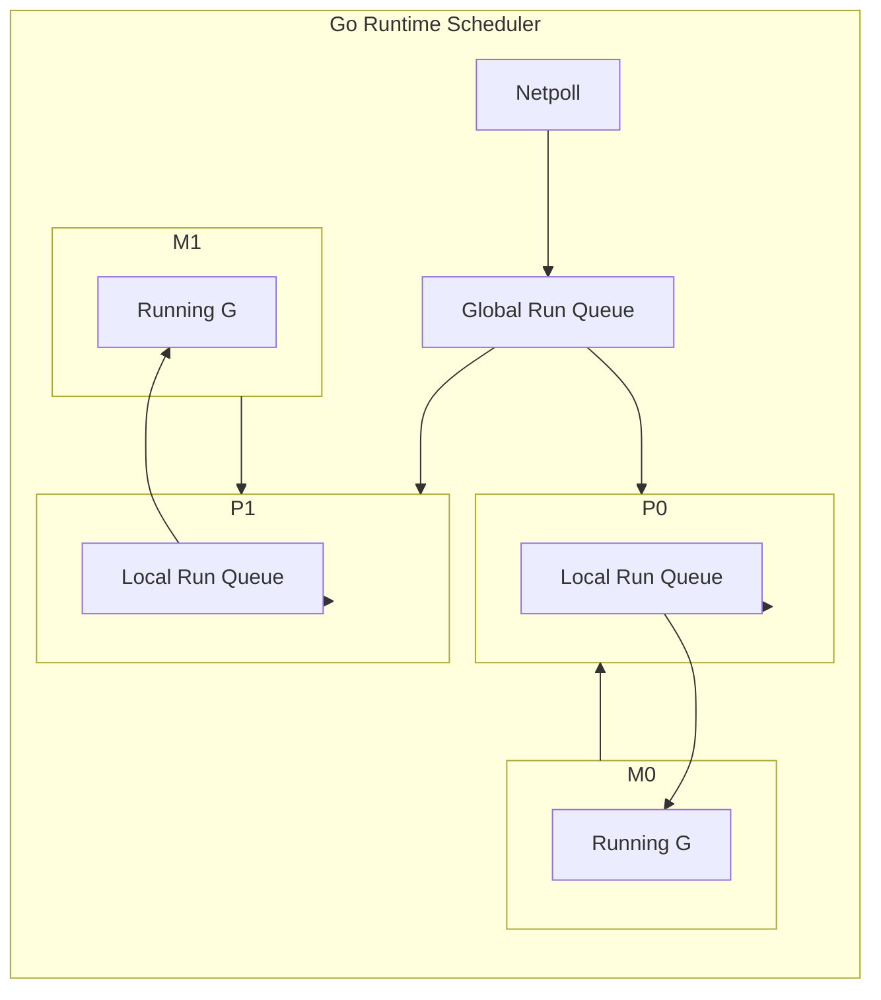
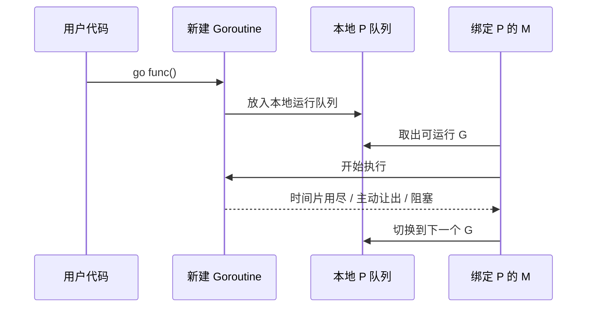
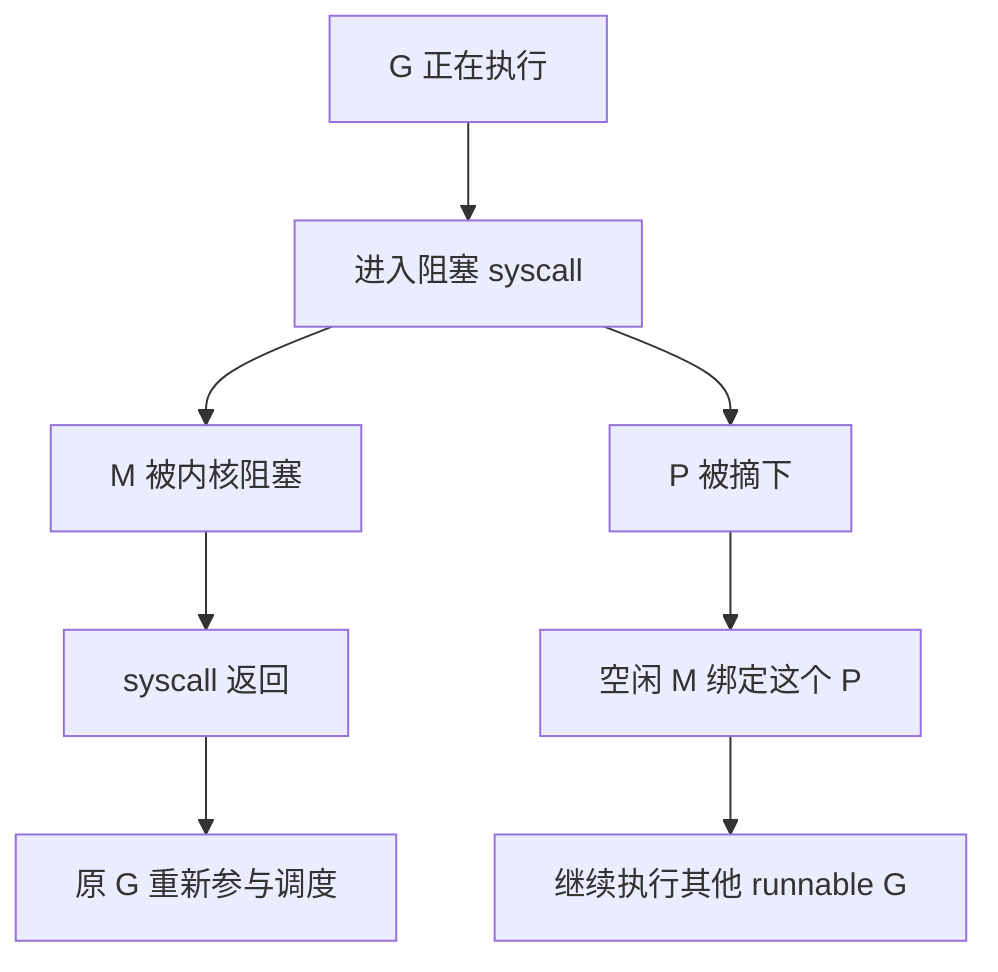

> [!IMPORTANT]
> GMP 不是三个“并列组件”的简单缩写，而是 Go runtime 用来把 ==海量 goroutine== 映射到 ==少量内核线程== 上的一套调度模型。理解它，才能真正明白 Go 为什么能高并发、为什么 goroutine 很轻量，以及阻塞、抢占、偷取任务这些行为为什么会发生。

## 什么是 GMP

GMP 是 Go 运行时调度器中的三个核心角色：

:::table title="G / M / P 角色速查" full-width

| 角色 | 全称 | 可以简单理解为 | 核心职责 |
| --- | --- | --- | --- |
| `G` | Goroutine | 待执行任务 | 保存协程栈、执行函数、状态等信息 |
| `M` | Machine | 内核线程 | 真正去执行代码的工作线程 |
| `P` | Processor | 调度上下文 | 持有本地运行队列、分配给 M 执行 G 的资格与资源 |
:::

先记住一句话：

:::card title="一句话理解 GMP" icon="mdi:lightbulb-on-outline"
`G` 是任务，`M` 是干活的人，`P` 是让这个人有资格干活的“工位和调度令牌”。
:::

如果没有 `P`，Go runtime 很难把“任务队列、内存缓存、调度状态”这些东西高效地绑定到有限个执行上下文上。

## 为什么 Go 不直接用“线程池 + 队列”

很多语言的并发模型接近：

`任务 -> 线程池中的线程 -> 执行`

Go 没有走这条简单路线，原因主要有三点：

::::steps

1. 线程太重

   内核线程创建、切换、销毁都比较贵，默认栈空间也远大于 goroutine。

2. goroutine 数量通常远超线程数

   一个 Go 服务里常常是几万、几十万个 goroutine，但线程不可能开这么多。

3. 需要用户态调度

   Go 想在 runtime 层自主决定“谁先跑、谁阻塞、谁被偷走、谁被抢占”，而不是把调度权完全交给操作系统。

::::

所以 Go 的设计目标是：

- 用少量线程承载大量 goroutine
- 尽量减少锁竞争
- 尽量让任务在本地队列中完成调度
- 遇到阻塞时快速切换，避免线程空转

## GMP 的整体关系

下面这张图可以先把全局结构建立起来：



可以这样理解：

- `P` 持有本地可运行 goroutine 队列
- `M` 必须先绑定一个 `P`，才能执行 `G`
- `G` 优先放在某个 `P` 的本地队列里
- 本地没活时，再去全局队列拿，或者去别的 `P` 那里偷
- 网络 I/O 就绪的 goroutine 会通过 `netpoll` 重新进入可运行队列

:::tip
默认情况下，`P` 的数量通常等于 `GOMAXPROCS`。它代表“可以并行执行 Go 代码的逻辑处理器数量”，不是 goroutine 数，也不是线程数。
:::

## G、M、P 分别是什么

### G：goroutine 的运行实体

`G` 对应一个 goroutine。它内部不只是“函数调用”这么简单，还会保存：

- 当前执行位置
- 栈信息
- 状态信息（`_Grunnable`、`_Grunning`、`_Gwaiting` 等）
- 与调度器交互所需的数据

```go
go func() {
    fmt.Println("hello gmp")
}()
```

这段代码并不是“立刻创建一个线程去执行”，而是：

1. 创建一个新的 `G`
2. 放入某个运行队列
3. 等待某个绑定了 `P` 的 `M` 来执行它

### M：真正执行代码的线程

`M` 对应操作系统线程。真正跑 CPU 指令的是 `M`，不是 `G`。

但 `M` 不能单独工作，它必须拿到一个 `P` 才能执行 Go 代码。  
没有 `P` 的 `M`，即使线程活着，也只是空转、休眠或执行阻塞系统调用。

### P：GMP 里最容易被忽略的核心

`P` 可以理解为“调度执行资格 + 本地调度资源集合”。

它至少承担了几件关键事：

- 维护本地运行队列
- 为 `M` 提供执行 Go 代码的资格
- 减少所有 goroutine 都竞争全局队列造成的锁开销
- 挂载一些调度和内存分配相关的本地缓存

::::details 为什么一定要有 P
如果只有 `G` 和 `M`：

- 所有 goroutine 都要进全局队列
- 所有线程都要竞争这一个全局队列
- 调度锁冲突会非常明显
- 本地性很差，缓存命中率也差

引入 `P` 后，相当于把调度拆成了“多个本地调度中心”，这样大部分操作都可以在本地完成。
::::

## 一个 goroutine 是怎么被调度起来的

把最常见的路径串起来看：



大致过程如下：

::::steps

1. 业务代码执行 `go func()`，runtime 创建新的 `G`
2. 新 `G` 尽量进入当前 `P` 的本地队列
3. 某个 `M` 绑定这个 `P` 后，从本地队列取出 `G`
4. `M` 在自己的线程上执行这个 `G`
5. 如果 `G` 执行完、阻塞、被抢占，调度器再切到别的 `G`

::::

## 调度器如何找“下一个要跑的 G”

Go 调度器不是只看一个队列，而是有明显优先级的。

:::table title="获取可运行 G 的常见顺序" full-width

| 优先级 | 来源 | 说明 |
| --- | --- | --- |
| 1 | 当前 `P` 的本地队列 | 最优先，开销最小 |
| 2 | `runnext` | 一个优先级更高的“下一个就跑”的位置 |
| 3 | 全局运行队列 | 本地没活时从全局拿 |
| 4 | 从其他 `P` 偷取一半任务 | 负载均衡核心机制 |
| 5 | `netpoll` 就绪事件 | I/O 完成后恢复相关 goroutine |
:::

### 本地队列优先

每个 `P` 都有自己的本地运行队列。调度器优先从本地取任务，原因很直接：

- 少一次全局锁竞争
- 更好的缓存局部性
- 调度延迟更低

### 全局队列兜底

有些 goroutine 会进入全局队列，比如：

- 本地队列满了
- 某些批量转移场景
- 调度器做全局均衡时

全局队列不是主战场，更像兜底缓冲区。

### Work Stealing：没活干就去偷

这是 GMP 很关键的一点。

如果某个 `P` 的本地队列空了，它不会马上让线程彻底闲着，而是会尝试从其他 `P` 的本地队列偷一半可运行 `G`。


:::note
“偷一半”不是随便定的，它能在减少偷取频率和保持负载均衡之间做一个比较好的折中。
:::

## goroutine 阻塞时会发生什么

GMP 的难点，不在“跑起来”，而在“阻塞之后如何不拖垮整个线程”。

### 阻塞在 channel / mutex / park

如果 goroutine 因为 channel、锁、条件等待等原因阻塞，通常是：

- 当前 `G` 进入等待状态
- `M` 释放当前执行权
- 调度器切换执行其他可运行 `G`

这种阻塞一般还在 Go runtime 可控范围内，调度器能比较平滑地处理。

### 阻塞在系统调用 syscall

如果一个 `G` 进入了可能长时间阻塞的系统调用，比如磁盘 I/O、某些同步网络调用，会更麻烦一些。

因为此时绑定它的 `M` 可能会被内核卡住。

Go 的处理思路是：

::::table title="syscall 场景下的关键动作" full-width

| 阶段 | 调度器动作 |
| --- | --- |
| 进入阻塞 syscall 前后 | 尝试把 `P` 从当前 `M` 身上摘下来 |
| 当前 `M` 被系统调用卡住 | 这个 `M` 暂时不可继续调度其他 G |
| 被摘下来的 `P` | 交给别的空闲 `M` 继续执行其他 goroutine |
| syscall 返回后 | 原线程上的 goroutine 再尝试重新进入调度体系 |
::::

这就是为什么 Go 能做到：  
==某个 goroutine 阻塞了，不代表整个逻辑处理器也跟着停摆。==



### 网络 I/O 为什么更轻

Go 的网络库大量依赖 `netpoll` 机制。  
这类 I/O 不一定把线程长期卡死，而是：

1. goroutine 发起 I/O
2. 当前 goroutine 挂起等待事件
3. runtime 通过网络轮询器等待 fd 就绪
4. 就绪后把对应 goroutine 放回可运行队列

所以很多网络并发场景里，goroutine 数量可以非常大，但线程数不需要同比例增长。

## 抢占式调度：为什么死循环不会彻底拖死程序

早期 Go 更偏向协作式调度，要求 goroutine 在函数调用、channel 操作、系统调用等位置较自然地让出执行权。

但如果用户代码写出这种逻辑：

```go
for {
}
```

它可能长期不主动让出 CPU。

因此从 Go 1.14 开始，Go 引入了更完善的异步抢占能力。  
这意味着一个运行太久的 goroutine，即使没有主动阻塞，也可能被 runtime 抢占下来，让其他 goroutine 获得执行机会。

:::warning
抢占式调度解决的是“公平性”和“避免长时间独占 CPU”，不是说 goroutine 会像操作系统线程那样由内核完全接管调度。Go 的主导调度者依然是用户态 runtime。
:::

## `GOMAXPROCS` 和并行度的关系

很多人会把 goroutine 数量和并行度混在一起，这是常见误区。

:::table title="几个容易混淆的概念" full-width

| 概念 | 含义 |
| --- | --- |
| goroutine 数量 | 任务数量，可以很多很多 |
| 线程（`M`）数量 | 操作系统线程数量，会按需要增长或休眠 |
| `P` 的数量 | 同一时刻可并行执行 Go 代码的上限，通常受 `GOMAXPROCS` 控制 |
| 并发 | 同一段时间内处理很多任务 |
| 并行 | 同一时刻真的有多个任务在 CPU 上同时执行 |
:::

例如：

- 你有 `100000` 个 goroutine，不代表会有 `100000` 个任务同时在 CPU 上跑
- 如果 `GOMAXPROCS=8`，通常同一时刻最多只有 `8` 个 goroutine 真正在并行执行 Go 代码

:::tip
CPU 密集型程序里，`GOMAXPROCS` 常常与 CPU 核数相关；I/O 密集型场景则更关注 goroutine 的阻塞与唤醒效率，而不是一味提高 `GOMAXPROCS`。
:::

## 面试里最常问的几个点

::::collapse

- `P` 是什么，为什么需要它？

  `P` 是调度上下文和本地资源持有者。它的存在让调度器可以把大量操作放到本地完成，减少全局锁竞争。

- 一个 `M` 为什么必须绑定 `P` 才能执行 Go 代码？

  因为执行 Go 代码不仅是“有线程就行”，还需要 runtime 提供本地队列、缓存与调度状态；这些能力在 `P` 上。

- goroutine 阻塞 syscall 时会怎样？

  当前 `M` 可能被阻塞，但 `P` 会尽量被摘走，交给别的 `M` 继续跑其他 goroutine。

- GMP 如何实现负载均衡？

  通过本地队列优先、全局队列兜底、work stealing 偷取其他 `P` 的任务来完成。

- goroutine 很轻量，轻量在哪里？

  栈小、按需增长、创建和切换主要发生在用户态 runtime，而不是每次都走昂贵的线程切换。

::::

## 常见误区

:::warning

1. `goroutine` 不是线程。
2. `P` 不是 CPU 核心本身，它是逻辑处理器和调度上下文。
3. goroutine 多不代表并行度高。
4. Go 不是“完全没有线程”，只是把 goroutine 调度到较少线程上执行。
5. GMP 不只解决性能问题，也是在解决阻塞隔离、负载均衡和调度控制权问题。

:::

## 总结

GMP 的核心价值，可以浓缩成四句话：

- `G` 表示 goroutine，是任务本身
- `M` 表示线程，是实际执行者
- `P` 表示调度上下文，让线程拥有执行 Go 代码的资格
- 调度器通过本地队列、全局队列、偷取任务、syscall 脱钩、netpoll 唤醒和抢占机制，把大量 goroutine 高效映射到少量线程上

如果你把这篇笔记里的三件事真正讲清楚，就算掌握了 GMP：

1. `P` 为什么存在
2. goroutine 是如何被取出并执行的
3. goroutine 阻塞时，调度器怎样避免整个系统跟着卡住
