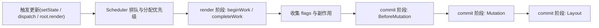

[+Scheduler]: 调度器，负责给更新分配优先级并安排执行时机
[+lane]: React 内部表示优先级的一种位掩码模型

如果说上一章回答的是“React 为什么要有 Fiber”，这一章回答的就是“Fiber 架构到底怎么跑起来”。

## React 更新的总流程

React 的渲染过程通常拆成两个阶段：

1. `render` 阶段：在内存里计算下一版 Fiber 树，找出变更点
2. `commit` 阶段：把这些变更同步到真实宿主环境



> [!IMPORTANT]
> `render` 阶段是==可中断==的，`commit` 阶段是==同步不可中断==的。因为一旦开始真正改宿主 UI，中断就会造成“数据和界面不一致”。

## Scheduler：先决定谁先做

React 16 之后引入了 Scheduler，本质上是为了处理两件事：

1. 不同更新要不要分优先级
2. 当前这段 JS 还该不该继续执行，还是应该把主线程让回给浏览器

::: table title="为什么需要 Scheduler" full-width
| 问题 | 没有 Scheduler 时 | 有 Scheduler 时 |
| --- | --- | --- |
| 更新优先级 | 默认一起排队 | 输入、点击等高优先级任务先执行 |
| 长任务阻塞 | 可能长时间占用主线程 | 可以在合适时机让出执行权 |
| 用户体验 | 卡顿明显 | 响应更平滑 |
:::

### React 为什么没有直接用 `requestIdleCallback`

:::details 原因
浏览器确实提供了 `requestIdleCallback`，但 React 没直接依赖它，主要原因是兼容性和行为可控性都不够理想。于是 React 自己实现了调度机制，底层会结合 `MessageChannel`、定时器等能力来驱动任务循环。
:::

### 一个简化版工作循环

```js
function workLoopConcurrent() {
  while (workInProgress !== null && !shouldYield()) {
    // 每次只处理一个工作单元
    performUnitOfWork(workInProgress);
  }
}

function shouldYield() {
  // 时间片快耗尽时，把主线程让给浏览器
  return getCurrentTime() >= deadline;
}
```

## 为什么源码里会出现最小堆、位运算和 lane

这三个看起来“很底层”的词，其实都在为调度服务。

::: table title="三种内部工具各自负责什么" full-width
| 机制 | 用途 |
| --- | --- |
| 最小堆 | 管理延时任务，快速找到最早过期的任务 |
| 位运算 | 用低成本方式表示多个优先级集合 |
| lane 模型 | 把 React 更新优先级编码成位掩码，便于合并、筛选、比较 |
:::

`lane` 的本质可以粗暴理解为“带位标记的优先级通道”。不同更新落在不同 lane 中，React 可以据此挑选当前最紧急的工作。

```js
const SyncLane = 0b0001;
const InputContinuousLane = 0b0010;
const DefaultLane = 0b0100;
const IdleLane = 0b1000;

// 合并多个优先级
const lanes = SyncLane | DefaultLane;

// 判断是否包含某个 lane
const hasSyncLane = (lanes & SyncLane) !== 0;
```

## Reconciler：beginWork 与 completeWork

协调器在 `render` 阶段工作。它会沿着 Fiber 树深度优先遍历，并在遍历过程中把“下一版 UI 需要做什么”算出来。

::: table title="render 阶段的两步" full-width
| 阶段 | 主要做什么 |
| --- | --- |
| `beginWork` | 根据当前 Fiber 和新 JSX，生成/复用子 Fiber |
| `completeWork` | 补全当前 Fiber，收集副作用，并向上冒泡 flags |
:::

### beginWork 在干什么

- 比较旧 Fiber 和新 ReactElement
- 决定这个节点是复用、替换还是新增
- 创建子 Fiber，并建立 `child / sibling / return` 链表关系

### completeWork 在干什么

- 补齐当前节点信息
- 对 Host 组件准备真实 DOM 相关数据
- 把子树上的副作用通过 `subtreeFlags` 向上冒泡

## diff 算法：React 不是全树暴力比对

React 为了把 diff 复杂度控制在可接受范围内，做了三个前提假设：

1. 只比较同层节点
2. 不同类型节点直接视为不可复用
3. `key` 可以帮助开发者声明“哪些节点是稳定的”

::: table title="diff 的关键规则" full-width
| 场景 | 结果 |
| --- | --- |
| `key` 相同、`type` 相同 | 复用旧 Fiber |
| `key` 相同、`type` 不同 | 旧节点删除，新节点重建 |
| `key` 不同 | 当前节点通常不能复用 |
:::

### 单节点 diff

单节点 diff 的判断很直接：先看 `key`，再看 `type`。两者都对得上才复用。

### 多节点 diff

React 的多节点 diff 会先做一轮顺序复用，只有顺序复用失败时，才进入更昂贵的第二轮处理。这也是为什么==稳定的 key 尤其重要==。

:::warning
不要用数组索引当作长期稳定的 `key`，特别是在列表会插入、删除、排序时。否则 React 可能错误复用节点，导致状态错位。
:::

## React 事件系统

课程里还单独讲了 React 事件。它的核心不是“换个 API 绑事件”，而是 React 希望把事件派发也纳入自己的协调体系中。

::: table title="原生事件与 React 合成事件" full-width
| 维度 | 原生 DOM 事件 | React SyntheticEvent |
| --- | --- | --- |
| 绑定方式 | 直接绑在 DOM 上 | 由 React 统一管理与派发 |
| 冒泡依据 | DOM 树 | React 组件树 |
| 目的 | 浏览器事件模型 | 统一跨浏览器行为，配合框架调度 |
:::

这也解释了为什么 Portal 虽然跳出了 DOM 结构，但事件仍然会沿 React 树冒泡。

## commit：真正改 UI 的阶段

当 `render` 阶段把工作都算完后，就会进入 `commit`。

::: table title="commit 的三个子阶段" full-width
| 子阶段 | 主要任务 |
| --- | --- |
| `BeforeMutation` | DOM 变更前做准备，读取旧布局、调度部分副作用 |
| `Mutation` | 插入、删除、移动、更新真实节点 |
| `Layout` | DOM 更新完成后执行布局相关副作用，如 `useLayoutEffect` |
:::

可以把它理解成：

- `render` 阶段回答“应该改什么”
- `commit` 阶段回答“现在就去改”

:::collapse
- 一条主线串起来

  - Scheduler 决定“谁先做”
  - Reconciler 决定“做什么”
  - Renderer 决定“怎么落到真实宿主环境”
:::
