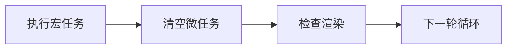

## 基本概念

浏览器主线程是单线程，但它要同时处理脚本执行、用户输入、网络回调、渲染更新。为了解决 "任务不断到达、但主线程一次只能做一件事" 的矛盾，==浏览器采用了 "Event Loop + Message Queue" 模型==

事件循环是一套调度机制，是由多个任务来源共同参与的待执行任务集合，而消息队列存放的是这些待执行任务的集合


当一个异步能力完成后（如计时器到点、网络完成、用户点击），渲染进程里的 IO/网络相关线程会接收来自浏览器进程、网络进程等的消息，然后把消息封装为任务投递到主线程，等待主线程空闲时执行

:::table full-width

| 来源 | 典型 API | 入队时机 |
| --- | --- | --- |
| 计时器 | `setTimeout`、`setInterval` | 到达触发时间后 |
| 用户交互 | `click`、`input`、`scroll` | 用户动作发生后 |
| 网络/通信 | `fetch`、`postMessage` | 数据就绪后 |
| DOM 观察 | `MutationObserver` | DOM 变化后（微任务时机） |

:::


## 具体流程



:::code-tabs
@tab mock-eventLoop.js

```js
let running = true
const macrotaskQueue = []
const microtaskQueue = []

function eventLoop() {
  while (running) {
    // 取出并执行一个宏任务
    const task = macrotaskQueue.shift()

    if (task) {
      task()
    }

    // 清空微任务队列
    while (microtaskQueue.length > 0) {
      const microtask = microtaskQueue.shift()
      microtask()
    }

    // 浏览器会在合适时机做渲染，不是每次都强制渲染
    maybeRender()
  }
}
```

:::

## 宏任务与微任务

:::table

| 类型 | 常见来源 | 何时执行 |
| --- | --- | --- |
| 宏任务（Task） | `setTimeout`、`setInterval`、UI 事件、`MessageChannel` | 每轮事件循环取 1 个执行 |
| 微任务（Microtask） | `Promise`、`queueMicrotask`、`MutationObserver` | 当前宏任务结束后立即清空 |

:::

微任务不是 "下一轮再执行"，而是在当前宏任务尾部立即清空

```js
console.log('A')

setTimeout(() => {
  console.log('B: timeout')
}, 0)

Promise.resolve().then(() => {
  console.log('C: microtask')
})

console.log('D')

// 输出顺序：A D C B
```

:::demo

```html
<!doctype html>
<html lang="zh-CN">
  <body>
    <button id="run">运行</button>
    <pre id="out"></pre>

    <script>
      const out = document.getElementById('out')

      function log(msg) {
        out.textContent += msg + '\n'
      }

      document.getElementById('run').addEventListener('click', () => {
        out.textContent = ''

        log('1. click handler start')

        setTimeout(() => {
          log('4. macrotask: setTimeout')
        }, 0)

        Promise.resolve().then(() => {
          log('3. microtask: Promise.then')
        })

        queueMicrotask(() => {
          log('3.1 microtask: queueMicrotask')
        })

        log('2. click handler end')
      })
    </script>
  </body>
</html>
```

:::
