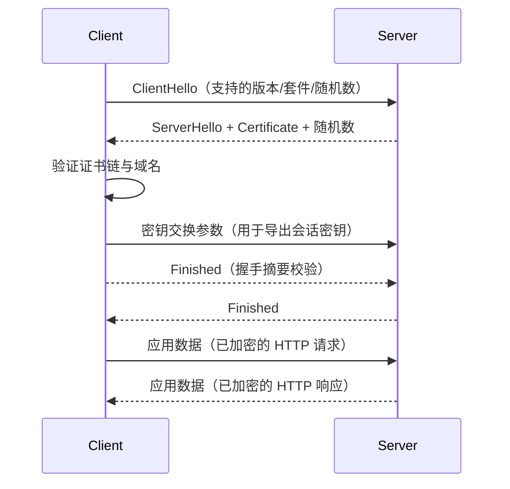

`HTTPS` 解决的是另一个基础问题：==数据在传输链路上是否安全==

## 为什么 HTTP 不够安全

HTTP 起初设计的目的就很单纯，就是为了传输超文本文件，所以采用明文传输，在经过公网链路时存在天然风险。在传输过程中的每一个环节，数据都有可能被窃取或者篡改，这也意味着你和服务器之间还可能有个中间人，你们在通信过程中的一切内容都在中间人的掌握中

:::table full-width

| 风险类型 | 发生方式 | 结果 |
| --- | --- | --- |
| 窃听 | 中间节点直接读取报文 | 账号、Token、业务数据泄露 |
| 篡改 | 中间节点修改响应内容 | 页面被插入恶意脚本/广告 |
| 冒充 | 攻击者伪装成目标站点 | 用户把敏感信息提交给假站点 |

:::

所以 HTTPS 的目标很直接：

1. 传输内容别人看不懂（机密性）
2. 传输内容别人改不了（完整性）
3. 访问的服务器身份可验证（身份认证）

## HTTPS 的本质

`HTTPS = HTTP + TLS`

- `HTTP` 负责应用层语义（请求方法、状态码、头、body）
- `TLS` 负责安全传输（加密、认证、完整性校验）

也就是说，HTTPS 没有改 HTTP 的业务语义，而是在发送 HTTP 数据之前，先建立一个安全信道

### 加密

在 HTTPS 里，加密不是只用一种算法，而是对称加密和非对称加密配合完成

> [!IMPORTANT]
> 非对称加密慢，成本高。HTTPS 的设计是握手阶段用非对称机制建立信任和密钥，数据传输阶段切换到对称加密，这样同时兼顾安全性和性能

:::table full-width

| 类型 | 密钥关系 | 优势 | 劣势 | 在 HTTPS 中的角色 |
| --- | --- | --- | --- | --- |
| 对称加密 | 加密和解密使用同一把密钥 | 速度快、吞吐高，适合大数据量传输 | 密钥分发困难 | 负责握手完成后的业务数据加密（请求体/响应体） |
| 非对称加密 | 公钥加密、私钥解密（或私钥签名、公钥验签） | 可用于身份认证与安全交换密钥 | 计算开销大，不适合全量业务数据 | 负责证书身份验证、密钥交换相关环节 |

:::

#### 对称加密

对称加密可以理解为 "双方提前约定一把相同钥匙"，加密和解密都靠它。在 TLS 会话里，这把钥匙通常是握手期间协商出来的 "会话密钥（session key）"

```txt
明文数据 --(会话密钥加密)--> 密文 --(会话密钥解密)--> 明文数据
```

它的核心价值是快，所以真正的 HTTP 业务数据传输阶段都依赖它

#### 非对称加密

非对称加密可以理解为 "一把公开的锁（公钥）+ 一把私有的钥匙（私钥）"。==客户端使用服务器公钥进行加密，只有服务器私钥可以解密==

:::note 在 HTTPS 里更常见的用途是：

1. 证书体系中的签名与验签（验证服务器身份）
2. 握手期间安全协商会话密钥

:::

### TLS 握手

握手阶段最核心的三件事：

1. 协商加密参数（协议版本、加密套件）
2. 校验服务端证书（确认 "你连的是谁"）
3. 用非对称机制完成密钥交换与握手签名校验
4. 生成本次会话密钥（对称密钥，后续用对称加密传输数据）



### 证书、CA、证书链

可以把证书理解成 "服务器公钥 + 身份信息 + 签名"。浏览器信任的是 "受信任根证书列表 + 证书链验证结果"，而不是某个站点自报身份。如果证书过期、域名不匹配、链不完整，浏览器会出现证书告警

:::table full-width

| 概念 | 作用 |
| --- | --- |
| 服务端证书 | 声明站点身份并携带公钥 |
| CA（证书颁发机构） | 对证书进行签名背书 |
| 证书链 | 从站点证书逐级追溯到受信任根证书 |
| 域名校验 | 证书里的域名必须匹配当前访问域名 |

:::

> [!IMPORTANT]
> HTTPS 只解决 "传输链路安全"，不直接解决业务逻辑漏洞
