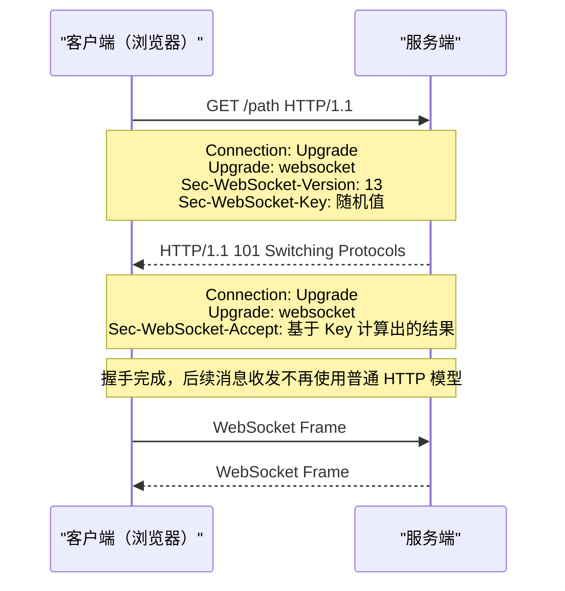

[+回压]: 发送速度 > 接收速度时产生的数据堆积问题
[+握手]: 这一次 "请求-响应" 就是 Websocket 握手，也叫 ==Upgrade 握手==

WebSocket 是建立在 TCP 之上的应用层协议。当客户端需要和服务器使用 Websocket 进行通信时，首先会使用 HTTP 协议完成一次特殊的 "请求-响应"[+握手]，握手后，连接会从 "请求-响应" 转为长期==双向通道==

:::::details 握手过程

整体时序：



::::steps

1. 客户端人会构建 HTTP 请求

   :::code-tabs

   @tab url

   ```txt
   ws://example.com/path
   wss://example.com/path
   ```

   @tab 请求头

   ```http
   GET /path HTTP/1.1
   Host: example.com
   Connection: Upgrade
   Upgrade: websocket
   Sec-WebSocket-Version: 13
   Sec-WebSocket-Key: x3JJHMbDL1EzLkh9GBhXDw==
   ```

   :::

   :::note 请求头含义
   - `Connection: Upgrade`：告诉服务端，这不是普通 HTTP 请求，我想升级协议
   - `Upgrade: websocket`：明确要升级到 `websocket`
   - `Sec-WebSocket-Version: 13`：声明使用的 WebSocket 协议版本，现代浏览器基本都是 `13`
   - `Sec-WebSocket-Key`：客户端生成的一个随机值，服务端会基于它计算响应值，用来确认这是一次合法的 WebSocket 升级握手
   :::

2. 服务端同意后返回 `101`

   如果服务端支持升级，并且校验通过，就不会返回普通的 `200 OK`，而是返回：

   ```http
   HTTP/1.1 101 Switching Protocols
   Connection: Upgrade
   Upgrade: websocket
   Sec-WebSocket-Accept: HSmrc0sMlYUkAGmm5OPpG2HaGWk=
   ```

   :::note 响应头含义
   - `101 Switching Protocols`：表示 "协议切换成功"
   - `Sec-WebSocket-Accept`：这是服务端基于客户端传来的 `Sec-WebSocket-Key` 计算出来的结果，浏览器会据此确认握手是否合法
   :::

3. 握手成功

   一旦浏览器收到合法的 `101` 响应，这条 TCP 连接就不再按照普通 HTTP 的 "发一个请求，等一个响应" 模式工作，而是切换成 WebSocket 的==全双工长连接==。这时会发生两件事：

   - 浏览器侧 `readyState` 从 `CONNECTING` 进入 `OPEN`
   - 后续双方传输的数据单位变成 **WebSocket Frame**，而不是 HTTP 报文

::::

:::::

## 连接状态

`WebSocket` 在浏览器里有 4 种连接状态

:::table full-width

| 常量 | 数值 | 含义 | 常见时机 |
| --- | --- | --- | --- |
| `WebSocket.CONNECTING` | `0` | 正在连接 | 刚 `new WebSocket(url)` |
| `WebSocket.OPEN` | `1` | 连接已建立，可收发消息 | `onopen` 之后 |
| `WebSocket.CLOSING` | `2` | 正在关闭 | 调用 `close()` 后到真正关闭前 |
| `WebSocket.CLOSED` | `3` | 连接已关闭 | `onclose` 之后 |

:::

正常状态下，状态流转通常是：`CONNECTING(0) -> OPEN(1) -> CLOSING(2) -> CLOSED(3)`。如果握手失败或网络出现问题也可能出现：`CONNECTING(0) -> CLOSED(3)`

在实际开发中，最好总是先判断是否处于 `OPEN` 状态，避免在握手中或断开后发送导致异常

:::details 代码示例

```ts
function safeSend(ws, data) {
  if (ws.readyState !== WebSocket.OPEN) {
    return false
  }
  ws.send(JSON.stringify(data))
  return true
}
```

:::

## API

### 构造函数

浏览器端通过 `new WebSocket(...)` 发起握手

```js
const ws = new WebSocket('wss://example.com/socket?token=xxx')
// 可选：传子协议数组
// const ws = new WebSocket('wss://example.com/socket', ['json.v1'])
```

### 常用属性

连接建立后，通常使用如下属性来获取连接状态、协商结果、发送队列等核心信息

:::table full-width

| 属性 | 类型 | 说明 |
| --- | --- | --- |
| `ws.readyState` | `number` | 当前连接状态（`0/1/2/3`） |
| `ws.url` | `string` | 当前连接 URL |
| `ws.protocol` | `string` | 与服务端协商后的子协议 |
| `ws.extensions` | `string` | 与服务端协商后的扩展 |
| `ws.binaryType` | `'blob' \| 'arraybuffer'` | 二进制消息的接收类型 |
| `ws.bufferedAmount` | `number` | 已调用 `send` 但尚未发出的字节数 |

:::

### 方法

方法层面非常集中，核心就是 `send` 和 `close`

:::table full-width

| 方法 | 作用 | 使用建议 |
| --- | --- | --- |
| `ws.send(data)` | 发送文本或二进制数据 | 先判断 `readyState === WebSocket.OPEN` |
| `ws.close(code?, reason?)` | 主动关闭连接 | 正常关闭建议 `1000` |

:::

```js
if (ws.readyState === WebSocket.OPEN) {
  ws.send(JSON.stringify({ type: 'chat', payload: { text: 'hello' } }))
}

ws.close(1000, 'normal close')
```

### 事件

:::table full-width

| 事件 | 触发时机 | 常见用途 |
| --- | --- | --- |
| `open` | 握手成功后 | 初始化会话、重置重连计数 |
| `message` | 收到服务端消息 | 协议分发、更新 UI |
| `error` | 连接或传输异常 | 记录日志，交给 `close` 做收口 |
| `close` | 连接关闭 | 清理资源、触发重连 |

:::

```js
ws.addEventListener('open', () => {
  console.log('connected')
})

ws.addEventListener('message', (event) => {
  console.log('message:', event.data)
})

ws.addEventListener('error', (event) => {
  console.error('ws error', event)
})

ws.addEventListener('close', (event) => {
  console.log('closed', event.code, event.reason)
})
```

## 心跳机制

心跳机制的核心目的是保持长连接稳定，避免连接被意外断开，最常见的实现是通过客户端定时发送 `ping`，服务端回复 `pong` 来实现

:::::steps

1. 定义心跳参数和定时器状态

   目的：把 "发送频率" 和 "超时阈值" 配置化，避免硬编码散落在代码里

   ```ts
   const HEARTBEAT_INTERVAL = 15000
   const HEARTBEAT_TIMEOUT = 10000

   let heartbeatTimer: ReturnType<typeof setInterval> | null = null
   let pongTimeoutTimer: ReturnType<typeof setTimeout> | null = null
   ```

2. 封装 `sendPing`，发送探测并开启超时检测

   目的：每次发 `ping` 后都开启一次 "等待 `pong`" 倒计时；如果超时，主动关闭连接触发重连流程

   ```ts
   function sendPing(ws: WebSocket) {
     ws.send(JSON.stringify({ type: 'ping', at: Date.now() }))

     // 如果存在 pongTimeoutTimer 则清除并重新设置超时时间
     if (pongTimeoutTimer) clearTimeout(pongTimeoutTimer)

     pongTimeoutTimer = setTimeout(() => {
       // 如果超时，主动关闭连接触发重连流程
       ws.close(4000, 'heartbeat timeout')
     }, HEARTBEAT_TIMEOUT)
   }
   ```

3. 封装 `startHeartbeat` / `stopHeartbeat`

   目的：统一管理定时器生命周期，避免重复启动导致多个心跳并发，或断开后定时器泄漏

   ```ts
   function startHeartbeat(ws: WebSocket) {
     stopHeartbeat()

     // 不间断发送心跳
     heartbeatTimer = setInterval(() => {
       if (ws.readyState === WebSocket.OPEN) {
         sendPing(ws)
       }
     }, HEARTBEAT_INTERVAL)
   }

   function stopHeartbeat() {
     if (heartbeatTimer) clearInterval(heartbeatTimer)
     if (pongTimeoutTimer) clearTimeout(pongTimeoutTimer)

     heartbeatTimer = null
     pongTimeoutTimer = null
   }
   ```

4. 在消息处理里消费 `pong`

   目的：收到 `pong` 即表示连接当前可用，应立即取消超时关闭任务

   ```ts
   function handleHeartbeatMessage(raw: string) {
     const msg = JSON.parse(raw)
     if (msg.type === 'pong') {
       if (pongTimeoutTimer) clearTimeout(pongTimeoutTimer)
       pongTimeoutTimer = null
       return true
     }
     return false
   }
   ```

5. 接入连接生命周期

   目的：只在连接可用期间保活；断开时立即清理，避免无意义任务占用资源

   ```ts
   ws.onopen = () => {
     startHeartbeat(ws)
   }

   ws.onclose = () => {
     stopHeartbeat()
   }

   ws.onmessage = (e) => {
     if (handleHeartbeatMessage(String(e.data))) return
     // 其他业务消息
   }
   ```

:::::

## 重连与断线恢复

[+指数退避重连]: "退避" 是指失败后先 "后退一步，等更久再试"，而 "指数" 是指它的等待时间按 "指数" 增长，而不是线性增长

重连的核心是 "让连接可持续可恢复"，断线恢复的核心是 "让业务状态不中断"。需要处理重新建立连接，还要处理消息补发、鉴权恢复和订阅恢复

:::::steps

1. 先定义状态和配置

   重连这一层本质上是在管理 "连接生命周期"。所以第一步不是急着写 `connect`，而是先把状态、重试参数、心跳参数、离线队列这些运行时边界描述清楚

   :::tip 关键点

   把 "连接控制" 和 "业务恢复" 相关的配置都集中放进一个 options 里，后面每一步都围绕这个配置工作
   :::

   :::details 代码

   ```ts
   type ReliableStatus =
     | 'idle'
     | 'connecting'
     | 'open'
     | 'reconnecting'
     | 'closed'

   interface ReliableWSOptions<TOutgoing = unknown, TIncoming = unknown> {
     url: string
     protocols?: string | string[]
     maxRetries?: number
     baseDelay?: number
     maxDelay?: number
     jitter?: number
     queueLimit?: number
     heartbeatInterval?: number
     heartbeatTimeout?: number
     getAuthPayload?: () => TOutgoing | null
     getResubscribePayloads?: () => TOutgoing[]
     onMessage?: (message: TIncoming, event: MessageEvent) => void
     onStatusChange?: (status: ReliableStatus) => void
   }
   ```

   :::

2. 把建连和事件绑定收口到 `connect`

   `connect()` 不只是创建原生 `WebSocket`，还要把四个核心事件统一绑定进去。这样后面不管是首次连接还是重连，入口都始终只有一个

   :::tip 关键点

   每次重连本质上都是重新执行一次 `connect()`，所以连接建立和事件绑定必须是可重复执行、可完整收口的
   :::

   :::details 代码

   ```ts
   connect() {
     this.manualClose = false
     this.clearReconnectTimer()
     this.updateStatus(this.retryCount > 0 ? 'reconnecting' : 'connecting')

     this.ws = new WebSocket(this.opts.url, this.opts.protocols)

     this.ws.onopen = () => {
       this.retryCount = 0

       // 更新 Socket 状态
       this.updateStatus('open')
       // 开始心跳
       this.startHeartbeat()
       // 重新鉴权
       this.restoreSession()
       // 补发消息队列
       this.flushQueue()
     }

     this.ws.onmessage = (event) => {
       if (this.consumePong(event)) return
       const parsed = this.parseMessage(event.data)
       if (parsed.ok) {
         this.opts.onMessage?.(parsed.value as TIncoming, event)
       }
     }

     this.ws.onerror = () => {
       this.ws?.close()
     }

     this.ws.onclose = () => {
       this.stopHeartbeat()
       if (this.manualClose) {
         this.updateStatus('closed')
         return
       }

       // 控制重试次数和调度
       this.scheduleReconnect()
     }
   }
   ```

   :::

3. 用 `close` 统一收口异常和断线

   浏览器里的 `error` 事件信息通常很少，而且同一次异常往往还会继续触发 `close`。如果两边都各自处理重连，很容易出现重复调度

   :::tip 关键点

   不在 `error` 里直接做重连，而是统一把异常导向 `close`，再由 `close` 判断是否进入重连流程
   :::

   :::details 代码

   ```ts
   this.ws.onerror = () => {
     this.ws?.close()
   }

   this.ws.onclose = () => {
     this.stopHeartbeat()
     if (this.manualClose) {
       this.updateStatus('closed')
       return
     }
     this.scheduleReconnect()
   }
   ```

   :::

4. 在 `scheduleReconnect` 里控制重试次数和调度

   断线之后不是马上无脑重新连，而是应该先判断还能不能重试，再决定多久后重连

   :::tip 关键点

   `scheduleReconnect()` 只负责三件事：判断是否超过最大次数、计算延迟、安排下一次 `connect()`
   :::

   :::details 代码

   ```ts
   private scheduleReconnect() {
     const maxRetries = this.opts.maxRetries ?? 8

     if (this.retryCount >= maxRetries) {
       this.updateStatus('closed')
       return
     }

     const delay = this.calcDelay(this.retryCount)
     this.retryCount += 1
     this.updateStatus('reconnecting')
     this.reconnectTimer = setTimeout(() => this.connect(), delay)
   }
   ```

   :::

5. 用指数退避控制重连节奏

   如果断线后每次都立即重连，客户端数量一多就很容易把服务端冲垮。因此重连通常要做成==指数退避重连==[+指数退避重连]

   :::tip 关键点

   延迟公式通常是：`min(baseDelay × 2^attempt, maxDelay) + random(0, jitter)`，也就是 "越失败等越久，再加一点随机抖动"
   :::

   :::details 代码

   ```ts
   private calcDelay(attempt: number) {
     const baseDelay = this.opts.baseDelay ?? 1000
     const maxDelay = this.opts.maxDelay ?? 30000
     const jitter = this.opts.jitter ?? 300

     const exp = Math.min(baseDelay * 2 ** attempt, maxDelay)
     return exp + Math.floor(Math.random() * jitter)
   }
   ```

   :::

6. 重连成功后恢复会话和补发消息

   连接重新建立以后，业务层通常不能只停在 "连上了"，还要继续恢复鉴权、恢复订阅，并把断线期间排队的消息补发出去

   :::tip 关键点

   恢复顺序通常是：`startHeartbeat` -> `restoreSession` -> `flushQueue`。也就是先确认连接活着，再恢复状态，最后补发业务消息
   :::

   :::code-tabs
   @tab restoreSession.ts

   ```ts
   private restoreSession() {
     const authMsg = this.opts.getAuthPayload?.()
     if (authMsg) this.send(authMsg)

     const subscriptions = this.opts.getResubscribePayloads?.() ?? []
     for (const msg of subscriptions) {
       this.send(msg)
     }
   }
   ```

   @tab flushQueue.ts

   ```ts
   private flushQueue() {
     while (this.queue.length > 0 && this.ws?.readyState === WebSocket.OPEN) {
       this.ws.send(this.queue.shift()!)
     }
   }
   ```

   @tab send.ts

   ```ts
   send(data: TOutgoing) {
     const text = JSON.stringify(data)

     // 处于 open 状态时直接发送即可
     if (this.ws?.readyState === WebSocket.OPEN) {
       this.ws.send(text)
       return true
     }

     if (this.queue.length >= (this.opts.queueLimit ?? 100)) {
       this.queue.shift()
     }

     // 添加到消息队列
     this.queue.push(text)
     return false
   }
   ```

   :::

7. 用心跳检测僵尸连接

   仅仅 "浏览器没有立刻报错" 并不意味着连接真的可用。有些场景下连接已经失效，但客户端还没收到关闭事件，这时就需要心跳来主动探测

   :::tip 关键点

   周期性发 `ping`，同时给 `pong` 设置截止时间；如果截止前没收到 `pong`，就主动关闭连接，把它交给重连流程处理
   :::

   :::details 代码

   ```ts
   private startHeartbeat() {
     this.stopHeartbeat()
     const interval = this.opts.heartbeatInterval ?? 15000

     this.heartbeatTimer = setInterval(() => {
       if (this.ws?.readyState !== WebSocket.OPEN) return
       this.ws.send(JSON.stringify({ type: 'ping', at: Date.now() }))
       this.armPongDeadline()
     }, interval)
   }

   private armPongDeadline() {
     if (this.pongTimeoutTimer) clearTimeout(this.pongTimeoutTimer)
     const timeout = this.opts.heartbeatTimeout ?? 8000
     this.pongTimeoutTimer = setTimeout(() => {
       this.ws?.close(4000, 'heartbeat timeout')
     }, timeout)
   }

   private consumePong(event: MessageEvent) {
     const parsed = this.parseMessage(event.data)
     if (!parsed.ok) return false

     const payload = parsed.value as { type?: string }
     if (payload?.type !== 'pong') return false

     if (this.pongTimeoutTimer) clearTimeout(this.pongTimeoutTimer)
     this.pongTimeoutTimer = null
     return true
   }
   ```

   :::

8. 收口清理和辅助方法

   重连之外还要考虑主动关闭、消息解析、定时器清理和状态派发，这些方法本身不复杂，但如果没有统一收口，连接生命周期就会变得很乱

   :::tip 关键点

   把“资源清理”和“状态变更”封装成独立方法，保证任何路径下都能复用，而不是把 `clearTimeout`、`clearInterval` 之类的逻辑散落到各处
   :::

   :::details 代码

   ```ts
   close(code = 1000, reason = 'manual close') {
     this.manualClose = true
     this.clearReconnectTimer()
     this.stopHeartbeat()
     this.ws?.close(code, reason)
     this.ws = null
     this.updateStatus('closed')
   }

   private parseMessage(raw: unknown): { ok: true; value: unknown } | { ok: false } {
     if (typeof raw !== 'string') return { ok: false }
     try {
       return { ok: true, value: JSON.parse(raw) }
     } catch {
       return { ok: false }
     }
   }

   private stopHeartbeat() {
     if (this.heartbeatTimer) clearInterval(this.heartbeatTimer)
     if (this.pongTimeoutTimer) clearTimeout(this.pongTimeoutTimer)
     this.heartbeatTimer = null
     this.pongTimeoutTimer = null
   }

   private clearReconnectTimer() {
     if (this.reconnectTimer) clearTimeout(this.reconnectTimer)
     this.reconnectTimer = null
   }

   private updateStatus(status: ReliableStatus) {
     this.opts.onStatusChange?.(status)
   }
   ```

   :::

9. 完整实现

   ::: code-tree title="完整实现与使用示例" entry="src/reliable-ws.ts" height="720px"

   ```ts title="src/types.ts"
   type ReliableStatus =
     | 'idle'
     | 'connecting'
     | 'open'
     | 'reconnecting'
     | 'closed'

   interface ReliableWSOptions<TOutgoing = unknown, TIncoming = unknown> {
     url: string
     protocols?: string | string[]
     maxRetries?: number
     baseDelay?: number
     maxDelay?: number
     jitter?: number
     queueLimit?: number
     heartbeatInterval?: number
     heartbeatTimeout?: number
     getAuthPayload?: () => TOutgoing | null
     getResubscribePayloads?: () => TOutgoing[]
     onMessage?: (message: TIncoming, event: MessageEvent) => void
     onStatusChange?: (status: ReliableStatus) => void
   }
   ```

   ```ts title="src/message-types.ts"
   export type Outgoing =
     | { type: 'auth'; payload: { token: string } }
     | { type: 'subscribe'; payload: { roomId: string } }
     | { type: 'chat.send'; payload: { text: string } }

   export type Incoming =
     | { type: 'pong' }
     | { type: 'chat.message'; payload: { text: string; from: string } }
   ```

   ```ts title="src/reliable-ws.ts"
   import type { ReliableStatus, ReliableWSOptions } from './types'

   export class ReliableWS<TOutgoing = unknown, TIncoming = unknown> {
     private ws: WebSocket | null = null
     private reconnectTimer: ReturnType<typeof setTimeout> | null = null
     private heartbeatTimer: ReturnType<typeof setInterval> | null = null
     private pongTimeoutTimer: ReturnType<typeof setTimeout> | null = null
     private retryCount = 0
     private manualClose = false
     private readonly queue: string[] = []

     constructor(private readonly opts: ReliableWSOptions<TOutgoing, TIncoming>) {}

     connect() {
       this.manualClose = false
       this.clearReconnectTimer()
       this.updateStatus(this.retryCount > 0 ? 'reconnecting' : 'connecting')

       this.ws = new WebSocket(this.opts.url, this.opts.protocols)

       this.ws.onopen = () => {
         this.retryCount = 0
         this.updateStatus('open')
         this.startHeartbeat()
         this.restoreSession()
         this.flushQueue()
       }

       this.ws.onmessage = (event) => {
         if (this.consumePong(event)) return
         const parsed = this.parseMessage(event.data)
         if (parsed.ok) {
           this.opts.onMessage?.(parsed.value as TIncoming, event)
         }
       }

       this.ws.onerror = () => {
         this.ws?.close()
       }

       this.ws.onclose = () => {
         this.stopHeartbeat()
         if (this.manualClose) {
           this.updateStatus('closed')
           return
         }
         this.scheduleReconnect()
       }
     }

     send(data: TOutgoing) {
       const text = JSON.stringify(data)
       if (this.ws?.readyState === WebSocket.OPEN) {
         this.ws.send(text)
         return true
       }

       if (this.queue.length >= (this.opts.queueLimit ?? 100)) {
         this.queue.shift()
       }
       this.queue.push(text)
       return false
     }

     close(code = 1000, reason = 'manual close') {
       this.manualClose = true
       this.clearReconnectTimer()
       this.stopHeartbeat()
       this.ws?.close(code, reason)
       this.ws = null
       this.updateStatus('closed')
     }

     private scheduleReconnect() {
       const maxRetries = this.opts.maxRetries ?? 8
       if (this.retryCount >= maxRetries) {
         this.updateStatus('closed')
         return
       }

       const delay = this.calcDelay(this.retryCount)
       this.retryCount += 1
       this.updateStatus('reconnecting')
       this.reconnectTimer = setTimeout(() => this.connect(), delay)
     }

     private calcDelay(attempt: number) {
       const baseDelay = this.opts.baseDelay ?? 1000
       const maxDelay = this.opts.maxDelay ?? 30000
       const jitter = this.opts.jitter ?? 300
       const exp = Math.min(baseDelay * 2 ** attempt, maxDelay)
       return exp + Math.floor(Math.random() * jitter)
     }

     private restoreSession() {
       const authMsg = this.opts.getAuthPayload?.()
       if (authMsg) this.send(authMsg)

       const subscriptions = this.opts.getResubscribePayloads?.() ?? []
       for (const msg of subscriptions) {
         this.send(msg)
       }
     }

     private flushQueue() {
       while (this.queue.length > 0 && this.ws?.readyState === WebSocket.OPEN) {
         this.ws.send(this.queue.shift()!)
       }
     }

     private startHeartbeat() {
       this.stopHeartbeat()
       const interval = this.opts.heartbeatInterval ?? 15000

       this.heartbeatTimer = setInterval(() => {
         if (this.ws?.readyState !== WebSocket.OPEN) return
         this.ws.send(JSON.stringify({ type: 'ping', at: Date.now() }))
         this.armPongDeadline()
       }, interval)
     }

     private armPongDeadline() {
       if (this.pongTimeoutTimer) clearTimeout(this.pongTimeoutTimer)
       const timeout = this.opts.heartbeatTimeout ?? 8000
       this.pongTimeoutTimer = setTimeout(() => {
         this.ws?.close(4000, 'heartbeat timeout')
       }, timeout)
     }

     private consumePong(event: MessageEvent) {
       const parsed = this.parseMessage(event.data)
       if (!parsed.ok) return false

       const payload = parsed.value as { type?: string }
       if (payload?.type !== 'pong') return false

       if (this.pongTimeoutTimer) clearTimeout(this.pongTimeoutTimer)
       this.pongTimeoutTimer = null
       return true
     }

     private parseMessage(raw: unknown): { ok: true; value: unknown } | { ok: false } {
       if (typeof raw !== 'string') return { ok: false }
       try {
         return { ok: true, value: JSON.parse(raw) }
       } catch {
         return { ok: false }
       }
     }

     private stopHeartbeat() {
       if (this.heartbeatTimer) clearInterval(this.heartbeatTimer)
       if (this.pongTimeoutTimer) clearTimeout(this.pongTimeoutTimer)
       this.heartbeatTimer = null
       this.pongTimeoutTimer = null
     }

     private clearReconnectTimer() {
       if (this.reconnectTimer) clearTimeout(this.reconnectTimer)
       this.reconnectTimer = null
     }

     private updateStatus(status: ReliableStatus) {
       this.opts.onStatusChange?.(status)
     }
   }
   ```

   ```ts title="src/main.ts"
    import { ReliableWS } from './reliable-ws'
    import type { Incoming, Outgoing } from './message-types'

    const client = new ReliableWS<Outgoing, Incoming>({
      url: 'wss://api.example.com/ws',
      getAuthPayload: () => ({
        type: 'auth',
        payload: { token: localStorage.getItem('token') || '' },
      }),
      getResubscribePayloads: () => [
        { type: 'subscribe', payload: { roomId: 'room-1001' } },
      ],
      onStatusChange: (status) => {
        console.log('ws status =>', status)
      },
      onMessage: (msg) => {
        if (msg.type === 'chat.message') {
          console.log('收到消息:', msg.payload.text)
        }
      },
    })

    client.connect()
    client.send({ type: 'chat.send', payload: { text: 'hello' } })

    window.addEventListener('beforeunload', () => {
      client.close()
    })
    ```

   :::

:::::
