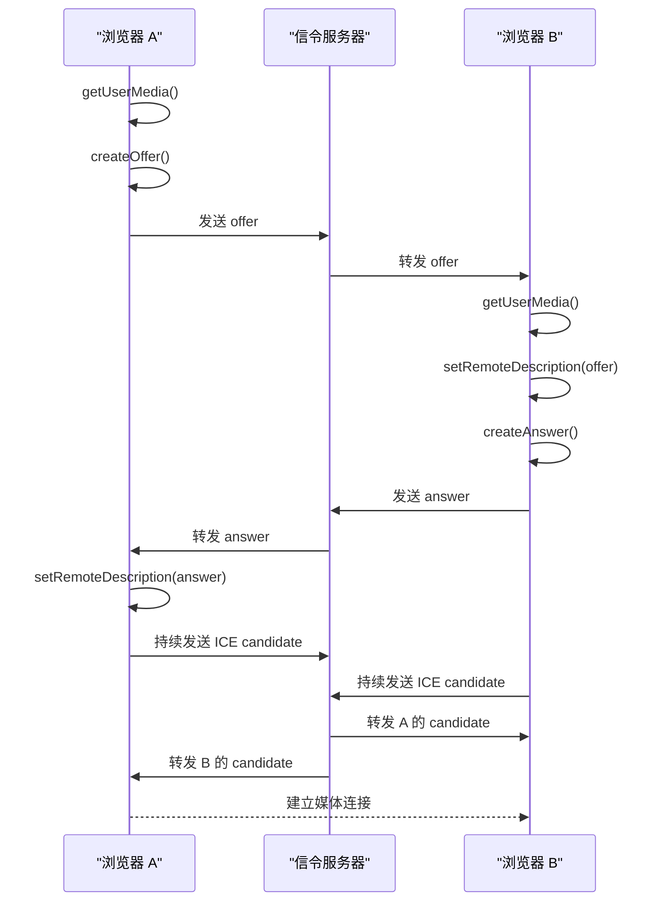

如果说 RTSP 更偏设备侧，RTMP 更偏直播推流入口，那么 WebRTC 就更像是浏览器实时通信能力的答案。它要解决的问题非常明确：

> 不装插件，浏览器之间也能进行低延迟的音视频和数据通信。

这也是为什么只要你一提到：

- 视频会议
- 在线课堂
- 屏幕共享
- 远程协作
- 语音通话
- 浏览器里的低延迟互动

最后几乎都会走到 WebRTC。

## WebRTC 的起源

2010 年前后，Google 收购了 Global IP Solutions（GIPS），并开始推动“让浏览器原生具备实时音视频通信能力”这件事。后面 WebRTC 逐步走向标准化，最终同时成为：

- W3C 的 Web API 标准
- IETF 的底层通信协议标准

所以 WebRTC 不是单一协议，而是一整套技术体系。

## WebRTC 要解决的核心问题

### 超低延迟

WebRTC 追求的是端到端低延迟，典型目标通常是 200ms 左右，而不是直播里那种几秒级延迟。

### 浏览器原生实时通信

它不依赖 Flash，也不依赖额外插件，而是直接把实时通信能力内建进浏览器。

### P2P 优先

理想情况下，两个浏览器会直接建立点对点连接，这样可以：

- 减少中间转发
- 降低延迟
- 节省服务器带宽

### 安全强制开启

WebRTC 的设计默认就是安全优先，媒体和数据传输都建立在加密之上。

### 不只传音视频

除了音频和视频，WebRTC 还支持通过 DataChannel 传输：

- 文本消息
- 文件
- 二进制数据
- 游戏状态同步数据

所以它本质上也是一个低延迟数据通信框架。

## 从客户端架构看，实时音视频系统要处理什么

如果完全自研一个实时音视频客户端，至少要面对下面几类模块：

- 采集
- 编码
- 网络传输
- 解码
- 渲染 / 播放

把音视频拆开看会更清楚：

```txt
麦克风 -> PCM -> 编码 -> 传输 -> 解码 -> 扬声器
摄像头 -> YUV -> 编码 -> 传输 -> 解码 -> 屏幕渲染
```

这还只是最基础的一层。真正工程里还要继续面对：

- 跨平台采集差异
- 音视频同步
- 丢包与抖动
- 回声消除、降噪、自动增益
- 不同编解码器兼容
- NAT 穿透

也正因为这些问题太多，WebRTC 才有存在价值。它的意义不是“让你少写几个 API”，而是“把大量实时通信底层问题封装掉”。

## WebRTC 的技术栈

WebRTC 可以粗略拆成两部分：

### W3C：浏览器暴露给开发者的 API

常见的就是：

- `getUserMedia`
- `getDisplayMedia`
- `RTCPeerConnection`
- `RTCDataChannel`

### IETF：底层通信协议

常见的包括：

- ICE
- STUN
- TURN
- RTP / RTCP
- DTLS
- SRTP

所以平时写前端代码时，你直接接触的是浏览器 API；但真正让连接跑起来的，是底层这套协议栈。

## WebRTC 的核心 API

### 媒体采集

#### `getUserMedia`

用来获取摄像头和麦克风。

```ts
const stream = await navigator.mediaDevices.getUserMedia({
  video: true,
  audio: true,
});
```

返回值是 `MediaStream`。

#### `getDisplayMedia`

用来获取屏幕共享流。

```ts
const screenStream = await navigator.mediaDevices.getDisplayMedia({
  video: true,
});
```

### `MediaStream` 和 `MediaStreamTrack`

- `MediaStream`：一组媒体轨道的集合
- `MediaStreamTrack`：其中单独一条轨道，比如一条视频轨或一条音频轨

这也是为什么你会看到：

- 把一整个 `MediaStream` 赋给 `video.srcObject`
- 或者把单个 `track` 添加到 `RTCPeerConnection`

### `RTCPeerConnection`

这是 WebRTC 的核心对象。它负责：

- 管理连接
- 交换本地和远端描述
- 收集 ICE 候选
- 管理媒体轨道
- 管理网络路径

WebRTC 建连过程中最核心的 API 基本都围绕它展开。

常见操作包括：

- `addTrack()`
- `createOffer()`
- `createAnswer()`
- `setLocalDescription()`
- `setRemoteDescription()`
- `onicecandidate`
- `ontrack`

### `RTCDataChannel`

如果你需要的不只是音视频，而是低延迟数据传输，就会用到 DataChannel。

它适合：

- 聊天
- 文件传输
- 白板同步
- 房间状态广播

## 为什么还需要信令服务器

很多人第一次接触 WebRTC 时，都会有一个疑问：

> 既然它是 P2P，那为什么还需要服务端？

原因是：

P2P 建立连接之前，双方还需要先交换“我要怎么连你”的信息，比如：

- SDP Offer / Answer
- ICE Candidate

而这些信息本身并不是 WebRTC 自动替你交换的。  
交换这些描述信息的过程，就叫 **信令（signaling）**。

所以信令服务器的职责通常是：

- 转发 Offer / Answer
- 转发 ICE Candidate
- 做房间管理、用户管理或会话管理

但要注意：

> 信令服务器不是媒体服务器，它通常不负责承载最终音视频流本身。

## 一对一连接的建立过程

一对一连接的基本流程可以概括成这样：



你可以把它拆成三件事：

1. 获取本地媒体流
2. 交换会话描述（SDP）
3. 交换网络候选（ICE）

其中第二步和第三步，通常都要借助信令服务器完成。

## SDP 是什么

SDP 可以理解成“这次会话的能力说明书”。它会描述：

- 我支持哪些编解码方式
- 我准备收发哪些媒体轨道
- 我的媒体协商信息是什么

所以：

- 发起方创建 `offer`
- 接收方基于它创建 `answer`

双方把这些描述互相交换完，才算把“怎么谈”说清楚。

## ICE、STUN、TURN 是做什么的

### 为什么需要它们

现实网络里，两个浏览器往往都在 NAT 或防火墙后面，彼此并不能直接知道对方真正可达的地址。

所以 WebRTC 建连时要做的，不只是“知道对方是谁”，还要知道：

> 到底通过哪条网络路径，双方才能真正连上。

这就是 ICE 的任务。

### ICE

ICE 是一整套候选路径收集和协商机制。它会尝试找到双方之间最可用的一条连接路径。

### STUN

STUN 主要用来帮助客户端发现自己的公网映射地址。

通俗一点说，它是在回答：

> “我从外网看起来到底是谁？”

### TURN

当两端无法直接打通时，就需要 TURN 服务器做中继。  
也就是说，数据不再直连，而是：

```txt
A -> TURN -> B
```

这会增加服务器带宽成本和一定延迟，但能显著提高连接成功率。

## coturn 是什么

在 WebRTC 工程里，经常会听到 `coturn`。它本质上是一个非常常见的 TURN / STUN 服务实现。

它通常承担的角色是：

- 提供 STUN 能力，帮助发现公网地址
- 提供 TURN 中继能力，在直连失败时兜底

所以它不是 WebRTC 客户端 API 的一部分，而是 WebRTC 系统部署里经常需要的基础设施。

## 一对一连接常见的三种路径

可以把 WebRTC 一对一连接想成三种常见情况：

### 1. 局域网或公网可直连

双方很容易直接打通，连接最理想。

### 2. 借助 STUN 后直连

双方原本都在 NAT 后面，但通过 STUN 发现公网映射地址后，ICE 成功找到了一条可直连路径。

### 3. 直连失败，改走 TURN

如果 NAT 类型复杂、网络环境受限，最终就只能通过 TURN 中继。

这也是为什么真实项目里，通常不会只配 STUN，而是：

- 先尝试 STUN
- 不行再退回 TURN

## 多人通信为什么更复杂

一对一场景里，两个浏览器直接连起来就够了。  
但多人场景里，如果还沿用最简单的点对点全互连模式，就会迅速遇到问题。

### Mesh

每个人和房间里其他所有人都建立连接。

优点：

- 架构简单
- 没有中心媒体转发

缺点：

- 连接数迅速增长
- 上行带宽压力很大
- 房间人数一多就不现实

### SFU

每个人只把媒体流发给 SFU，再由 SFU 转发给其他参与者。

优点：

- 更适合多人会议
- 浏览器负担明显下降
- 是现代视频会议系统里非常常见的方案

缺点：

- 服务端复杂度和带宽成本会上升

### MCU

服务端不仅转发，还会把多路流混成一路再发给客户端。

优点：

- 客户端压力最小

缺点：

- 服务端转码和混流成本最高
- 灵活性较差

所以如果只是从原理上理解多人通信，核心是这句话：

> 一对一关注的是“怎么建立连接”，多人关注的是“怎么设计拓扑”。

## 小结

到这里，可以先把 WebRTC 理解成下面这套主线：

- 它是浏览器原生的低延迟实时通信方案
- 它通过 `getUserMedia`、`RTCPeerConnection`、`RTCDataChannel` 暴露核心能力
- 它需要信令服务器来交换 SDP 和 ICE 信息
- 它通过 ICE / STUN / TURN 解决复杂网络下的连通性问题
- 在一对一场景里，它优先追求直连
- 在多人场景里，通常需要进一步引入 Mesh / SFU / MCU 等拓扑设计

所以 WebRTC 最难的地方不在于记几个 API 名字，而在于把下面这三件事放在一起看：

- 采集和媒体能力
- 建连和网络协商
- 房间规模扩大后的拓扑设计
